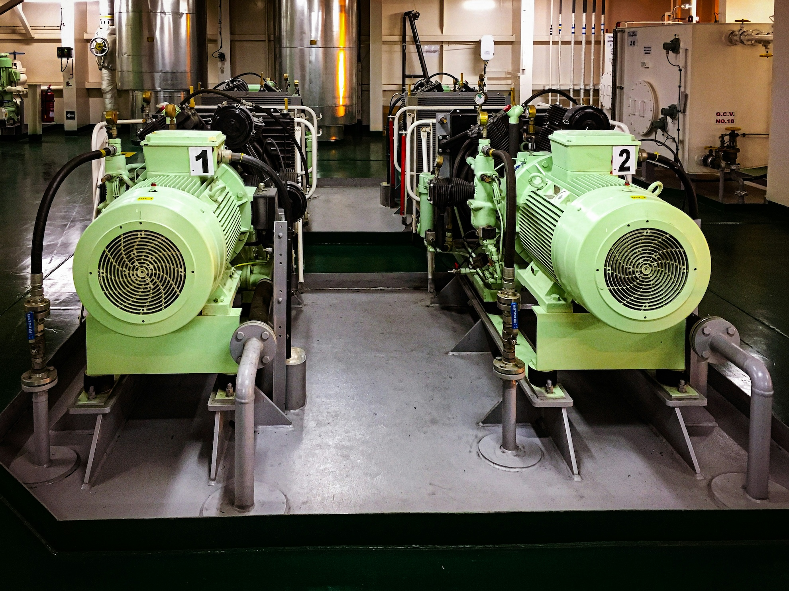
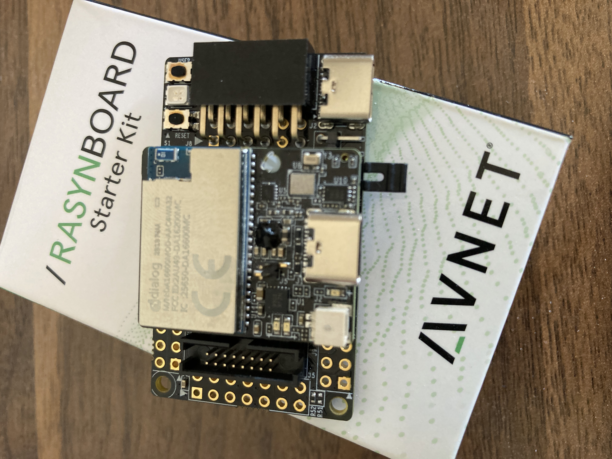
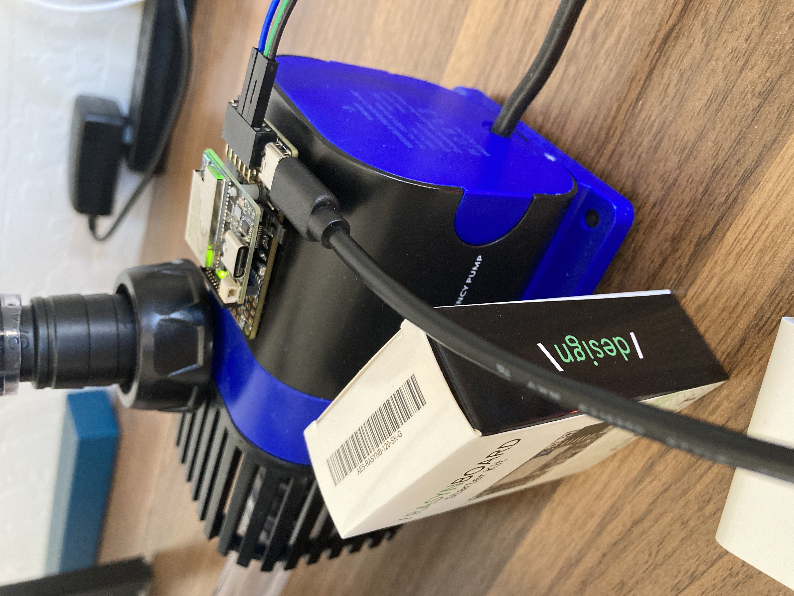
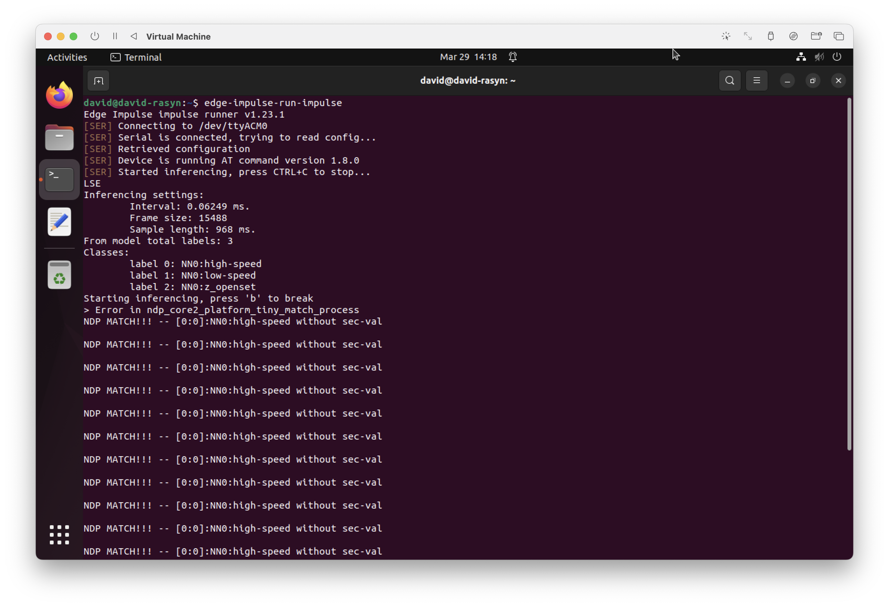

# Determining Compressor State with Audio Classification - Avnet RaSynBoard

Created By: David Tischler

Public Project Link: [https://studio.edgeimpulse.com/public/343756/latest](https://studio.edgeimpulse.com/public/343756/latest)

## Introduction

Most industrial settings such as pumping facilities, heating, ventilation, and air conditioning (HVAC) machinery, datacenter infrastructure rooms, manufacturing and heavy industry sites will have proprietary, expensive, critical machinery to maintain.  On-site workers with experience near the machinery or equipment, are generally quick to identify when a machine doesn't seem to "sound right", "feel right", or "look right".  Previous experience helps them to understand the "normal” state of the equipment, and this intuition and early warning can allow for scheduled repairs or proper planning for downtime.  However, facilities that don't have 24/7 staffing or on-site workers could be more prone to equipment failures, as there is no one to observe and take action on warning signs such as irregular sounds, movements, or visual indicators.

*Image credit [hdbernd](https://unsplash.com/@hdbernd) on Unsplash.

Predictive Maintenance using machine learning aims to solve for this problem, by identifying and acting upon anomalies in machinery health.

## Hardware 

To demonstrate the concept, we'll use the [Avnet RaSynBoard](https://www.avnet.com/wps/portal/us/products/avnet-boards/avnet-board-families/rasynboard/), which is a low-cost, small device that contains a [Renesas RA6 microcontroller](https://www.renesas.com/us/en/products/microcontrollers-microprocessors/ra-cortex-m-mcus/ra6m4-200mhz-arm-cortex-m33-trustzone-high-integration-ethernet-and-octaspi), and a [Syntiant NDP120 Neural Decision Processor](https://www.syntiant.com/hardware) to accelerate machine learning inferencing.  The RaSynBoard is available to [purchase easily directly from Avnet](https://www.avnet.com/shop/us/products/avnet-engineering-services/aes-rasynb-120-sk-g-3074457345651740186/), and makes prototyping audio classification, accelerometer and motion detection projects simple.

We'll use the onboard microphone of the RaSynBoard to create a machine learning model that understands a "low-speed" sound made by a small pump, and a "high-speed" noise  from the pump.  For the purposes of this demo, we will consider the "high-speed" noise to be a bad sign, indicating there is a problem.

Reasons for a pump to speed up and attempt to push more liquid could vary, depending on the use-case:
- Liquid cooling, perhaps temperatures are rising and automation has increased the pump flow to try to extract more heat from the system.
- Flow has been restricted, and the pump is trying to achieve the same total volume of throughput but through a smaller diameter.
- Liquid levels are rising, and the pump is trying to reduce the volume of water in a tank, lake, or other holding area.

## Dataset Collection

Getting started, we will need to collect audio samples from the pump, running at both low-speed and at high-speed, as well as a variety of “other” background noises that will form an “Unknown” classification, helping us filter out random everyday noises that occur.  To collect the data, we’ll first need to prepare the RaSynBoard.
 
### Hardware Setup

The RaSynBoard comes with default firmware from Avnet out-of-the-box, so that it is ready to use and quick to get started with machine learning exploration.  But we'll need to add Edge Impulse firmware to the board instead, in order to interface with the Edge Impulse Studio or API.  To flash the board with the necessary firmware, you will need two Renesas flashing applications installed, as well as the Edge Impulse CLI.  Links to the needed software, as well as the firmware that needs to be flashed, are located in the documentation here:  [https://docs.edgeimpulse.com/docs/edge-ai-hardware/mcu-+-ai-accelerators/avnet-rasynboard#installing-dependencies](https://docs.edgeimpulse.com/docs/edge-ai-hardware/mcu-+-ai-accelerators/avnet-rasynboard#installing-dependencies).  Download and install each of the three applications, and download the firmware .zip file, and unzip it.

Once you have the Renesas bits installed, and the firmware downloaded and extracted on your laptop or desktop, you can flash the RaSynBoard by removing the SD Card, removing the Jumper from pins 1-2, and then connecting a USB-C cable from your computer to the USB-C port on the I/O Board.  This is shown in detail in the excellent [Avnet documentation located here](https://avtinc.sharepoint.com/teams/ET-Downloads/Shared%20Documents/Forms/AllItems.aspx?ga=1&id=%2Fteams%2FET%2DDownloads%2FShared%20Documents%2Fprojects%2FRASynBoard%2FTraining%2FLabDocuments%2FCurrentLabs%2FLab1%2FAvnetRASynBoardHandsOnLab1%5Fv06%2E1%2Epdf&parent=%2Fteams%2FET%2DDownloads%2FShared%20Documents%2Fprojects%2FRASynBoard%2FTraining%2FLabDocuments%2FCurrentLabs%2FLab1).

With the board connected to the computer, inside the extracted .zip file, run the `flash_linux.sh` or `flash_win.bat` file depending upon whether you are on Linux or Windows, and the Edge Impulse firmware will be flashed to the board.  When completed, you can disconnect the RaSynBoard from the computer.

Next, insert the SD Card into your laptop or desktop, and copy the `config.ini`, mcu_fw_120.synpkg`, `dsp_firmware.synpkg`, and `ei_model.synpkg` files from the unzipped firmware directory to the SD Card.  Upon completion, eject the SD Card from your computer.

Return the Jumper to pins 1-2, and insert the SD Card into the RaSynBoard.  Power it back on, and reconnect it to the computer once again.

### Connect to Studio

Now that the RaSynBoard is running Edge Impulse firmware, you can use the `edge-impulse-daemon` command (which got installed as part of the CLI installation) on your desktop or laptop to connect the RaSynBoard to Edge Impulse.  The board will then show up in the “Devices” page, and over on the Data Acquisition page you can use the drop-down menus to choose your device, choose the Microphone, enter a sample length of 1000 milliseconds (1 second), and provide a label for the type of data you are collecting.  Once ready you will simply click “Start sampling”.  (The IMU is also available, for projects that might make us of accelerometer data).

With the pump running in what we’ll call our “normal” condition, low-speed, I’ve collected about 50 audio samples with the RaSynBoard placed on top of the pump motor, each 1 second in length.  My label is entered as `low-speed`, but you can use another term if you prefer.  You’ll want to keep the location of the RaSynBoard consistent, so that the data used to train the model is representative of what will be experienced once the model is built and deployed back to the board.

Next, I’ve increased the speed of the pump from 10% to 85%, which still gives some excess pumping capacity, but could be a cause for concern in those use-cases outlined above.  The same process is followed, with individual audio samples collected and labeled as `high-speed`, about 50 samples should be enough.

## Building a Model

Once a dataset has been collected, a machine learning model can be built that identifies or recognizes these same sounds in the field.  So in this project, we should be able to identify and classify the sound of our pump running at low-speed, and the sound of our pump running at high-speed.

On the left, click on “Impulse design”, and in the first block, “Time Series Data” should already be selected.  Add a Processing block, and choose **Audio (Syntiant)**.  Then add a Learning block, and choose **Classification**.  Finally, the Output features should already be selected, thus you can click **Save Impulse**.

Next, on the left navigation, choose **Syntiant**, to configure the Processing block.  This is where Features will be extracted, and you will see a Spectrogram visualization of the processed features for each data sample (chosen from a drop-down menu at the top-right of the raw data).  You should be able to leave the default MFE configuration alone, and simply click on **Save parameters** at the bottom.  However, each option has a help tip, should you need to fine-tune these settings.  On the next page, click on **Generate features** to create a Feature explorer that will plot a graph, allowing you to examine how your Features cluster.

Choose **Classifier** on the left navigation to proceed to the neural network settings for the Learning block, where you can choose the number of training cycles (epochs), learning rate, and other settings (again the defaults will likely work fine, but help text can guide any fine-tuning you may want to perform).  Once you are ready, you can click on **Start training** to begin the model build process.

 

Upon completion, you will see another visual representation, this time evaluating the validation performance of your model and the Accuracy against a validation set.

## Deploying a Model

To deploy this newly-built audio classification machine learning model onto the RaSynBoard, there are a few options.  The quickest way to test if your model is functional and determine accuracy in the real world, is to simply choose a ready-made firmware binary that can be flashed and run immediately on the RaSynBoard.  However, when building a full-featured application intended for production use, you’ll instead want to choose either the Syntiant NDP120 library or Custom Block export options, as you can then leverage the machine learning model in your application code as necessary, depending on your use-case or product.

For now though, I will just use the binary download as an easy way to test out the model.

On the left navigation, click on **Deployment**, and type “RaSynBoard” in the search box.  From the options, choose **RaSynBoard** and then click on the **Find posterior parameters** button, which will enable you to choose the keywords or sounds from your labels that you want to detect.  Choose “low-speed” and “high-speed”, then click on **Find parameters**.

Next, click on **Build**, and the firmware will be generated and downloaded to your computer.  Once downloaded, unzip the file, and we’ll follow a similar method as earlier.

Power down the RaSynBoard if it is still running, remove the SD Card from the board and insert the SD Card into your laptop or desktop, and copy the `config.ini`, `mcu_fw_120.synpkg`, `dsp_firmware.synpkg`, and `ei_model.synpkg` files from the unzipped download to the SD Card.  Upon completion, eject the SD Card from your computer and return it to the RaSynBoard.

## Inference Results

We can now power the RaSynBoard back on, the board will boot up and automatically start running the model.  To see the results, we need to attach to a serial console and can view the output of any inference results.  Using a standard UART adapter, connect Ground, TX, and RX to pins 2,4, and 6 on the I/O Board, as shown here:

Then in a terminal, you will see the output of the model running.  I have placed the RaSynBoard back on the pump, set the speed to low, and sure enough, the model is able to predict the pump is running at `low-speed`.  Increasing the compressor power to 85%, the RaSynBoard now recognizes that the pump is running at `high-speed`. 

## Going Further

Using machine learning and an embedded development kit, we were able to successfully identify and classify pump behavior by listening to the sound of the compressor.  This demonstration validated the approach as feasible, and when wrapped into a larger application and alerting system, an audio classification model could be used for remote infrastructure facilities, factory equipment, or building HVAC equipment that is not continually monitored by workers or other human presence.  The Renesas RA6 MCU combined with the Syntaint NDP120 neural decision processor in the Avnet RaSynBoard create a low-power, cost-effective solution for predictive maintenance or intervention as needed, prior to a failure or accident occurring.

 

