# Car Detection and Tracking System for Toll Plazas - Raspberry Pi AI Kit

Created By: Naveen Kumar

Public Project Link: [https://studio.edgeimpulse.com/studio/203881](https://studio.edgeimpulse.com/studio/203881)

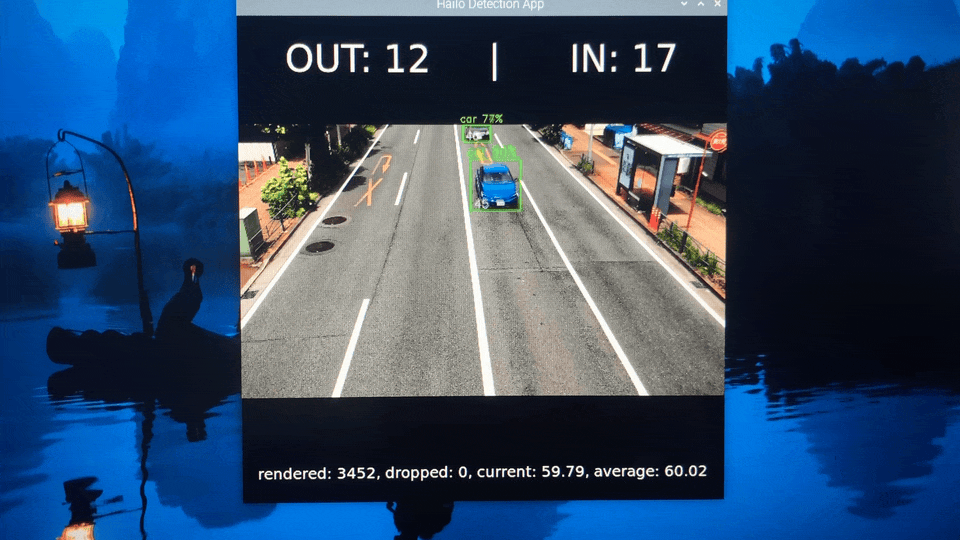

## Introduction

Toll plazas serve as critical points for traffic management and revenue collection. However, manual counting and tracking of vehicles can lead to errors and inefficiencies. An automated system can improve accuracy, reduce human error, and streamline operations.

Needs for the project:

- **Accuracy**: Manual counting is prone to errors, especially during peak hours. An automated system ensures accurate vehicle counts.

- **Efficiency**: Automating the process reduces the need for human intervention, speeds up toll collection, and reduces congestion.

- **Data Acquisition**: Accurate data about vehicle flow is crucial for effective traffic management, urban planning, and infrastructure development.

- **Security**: Tracking vehicles enhances security by identifying suspicious activities and ensuring compliance with toll payments.

- **Cost-Effective**: Reducing the requirement for manual labor can lead to decreased operational costs in the long term.

This project aims to create and implement an automated system for identifying and monitoring cars at toll plazas to tally the number of vehicles entering and exiting accurately. The system will utilize a model trained using **Edge Impulse Studio** and image processing algorithms to count cars, delivering real-time data to toll operators.

## Hardware Selection

For this project, we will use the latest **Raspberry Pi 5** and the **Raspberry Pi Camera Module 3 Wide**. We opted for a wide lens because it can capture a larger area, allowing the camera to monitor multiple lanes simultaneously.


The Camera Module 3 Wide features an ultra-wide 120-degree angle of view.

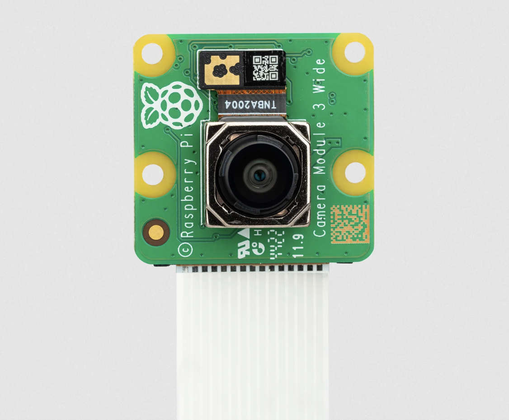

Although the Raspberry Pi 5 is capable of running ML models directly on the CPU, it will have higher latency and lower frames per second (FPS) for the model we will be using to detect and track cars. Thus, we will use a **Raspberry Pi AI Kit** that includes the **Raspberry Pi M.2 HAT+** and a **Hailo AI acceleration module** designed for use with Raspberry Pi 5. The AI module features a 13 tera-operations per second (TOPS) neural network inference accelerator built around the **Hailo-8L** chip. The AI accelerator reduces latency and bandwidth usage, allowing for quicker response times and more efficient traffic management.

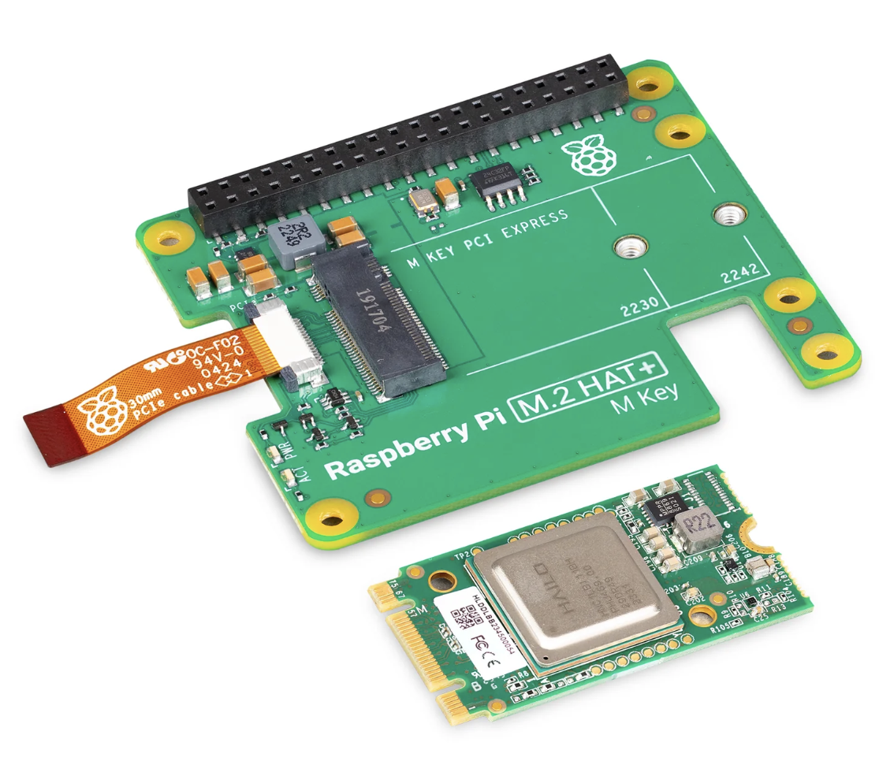

For mounting the AI Kit to the Raspberry Pi 5, please follow the instructions provided in the official documentation, here:

[https://www.raspberrypi.com/documentation/accessories/ai-kit.html](https://www.raspberrypi.com/documentation/accessories/ai-kit.html)

## Data Collection

A few video clips of the vehicle traffic were recorded from a pedestrian bridge using an iPhone camera. We used the following Python script to extract every 20th frame from the video clips to eliminate redundant frames.

```
import cv2
import sys

videoCapture = cv2.VideoCapture('./data/videos/video.MOV')
    
if not videoCapture.isOpened():
    logging.error("Cannot open video file")
    sys.exit(-1)
   
i = 0
j = 0
while True:
    success, frame = videoCapture.read()
    if success:
        cv2.imshow('Display', frame)
        i += 1
        if i % 20 == 0:
            j += 1
            cv2.imwrite(f'./data/images/img_{j:04d}.jpg', frame)
    
        key = cv2.waitKey(1) & 0xFF
        if key == ord('q'):
            cv2.destroyAllWindows()
            break
```

To upload the dataset, follow the instructions in the [Edge Impulse documentation](https://docs.edgeimpulse.com/docs/cli-installation) to install the **Edge Impulse CLI**, and then execute the command below:

```
$ edge-impulse-uploader --category split data/images/*.jpg
```

The command above will upload the images to Edge Impulse Studio and split them into "Training" and "Testing" datasets. Once the upload is finished successfully, the datasets will be visible on the **Data Acquisition** page in Edge Impulse Studio.

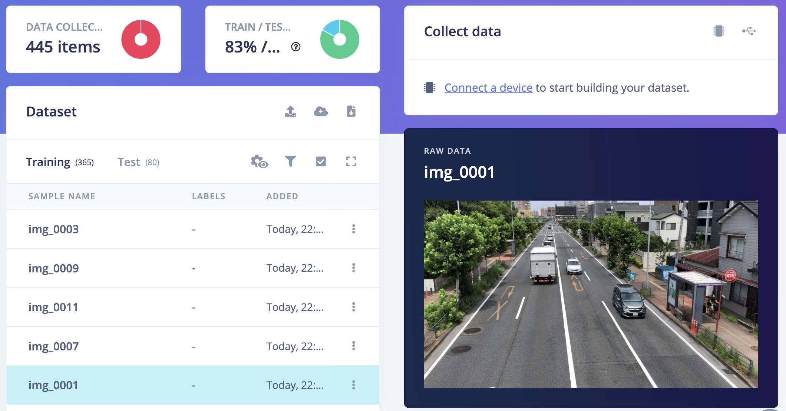

We can now label the data using bounding boxes in the **Labeling Queue** tab, as demonstrated in the GIF below.

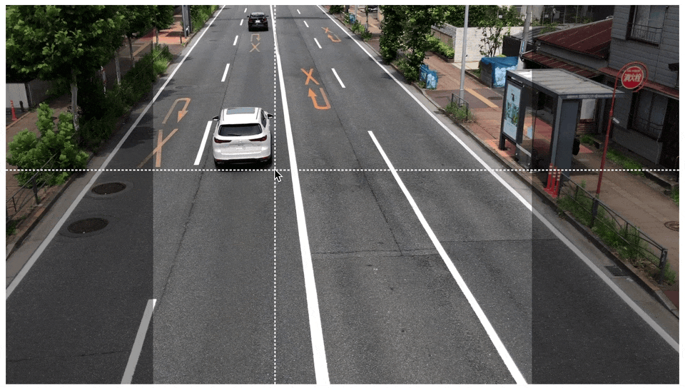

To better train the model to recognize and identify cars, we intentionally annotated only cars among the various vehicles in the scene. This approach allows us to focus solely on the specific object of interest, which will improve the accuracy and effectiveness of the model.

## Model Training

To create an Impulse, follow these steps:

1. Go to the **Impulse Design** section, then select the **Create Impulse** page. Since the Hailo AI accelerator enables us to select high-resolution images while still maintaining a high FPS, we have opted for a 640x640 pixel image size in the "Image Data" form fields to achieve better accuracy.
2. Click on "Add a processing block" and choose "Image".  This step will pre-process and normalize the image data while also giving us the option to choose the color depth.
3. Click on "Add a learning block" and choose "Object Detection (Images)". 
4. Finally, click on the "Save Impulse" button to complete the process.

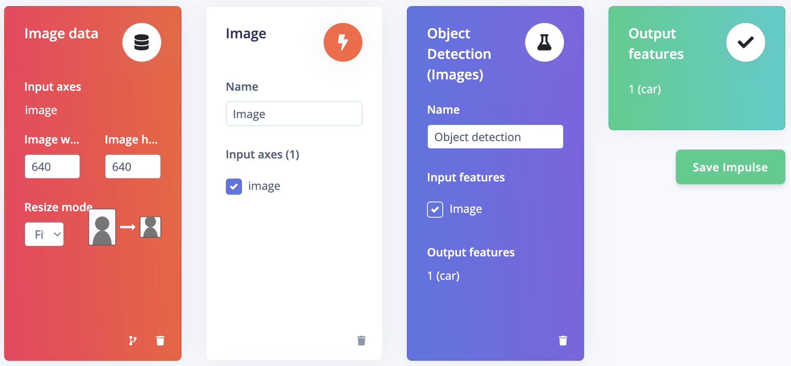

On the **Image** page, choose *RGB* as color depth and click on the **Save parameters** button. The page will be redirected to the **Generate Features** page.

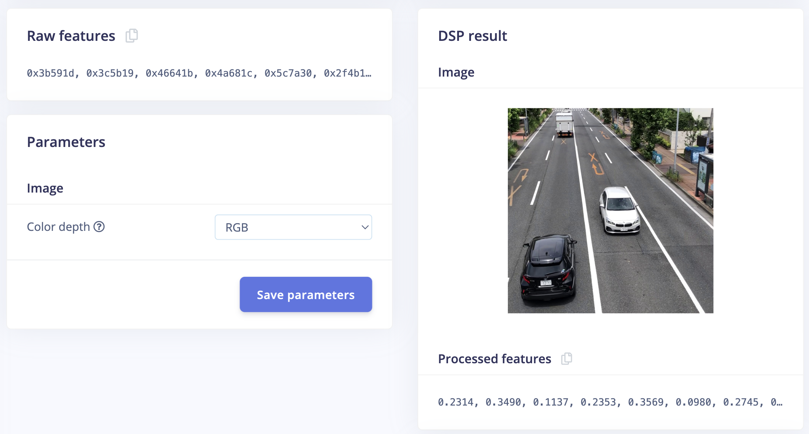

Now we can initiate feature generation by clicking on the **Generate features** button. Once the feature generation is completed, the data visualization will be visible in the **Feature Explorer** panel.

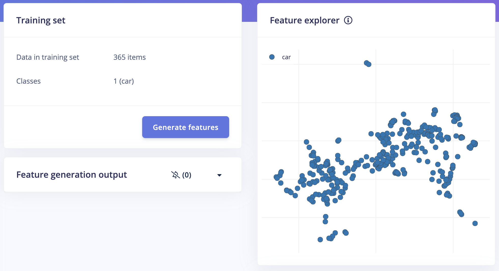

Go to the **Object Detection** page, then click "Choose a different model" and select the **YOLOv5** model. There are 4 variations of the model size available, and we selected the **Small** version with 7.2 million parameters. Afterward, click the "Start training" button. The training process will take a few minutes to complete.


Once the training is completed we can see the precision score and metrics as shown below. 


Additionally, it provides on-device performance data for the Raspberry Pi 4. The inference time on a Raspberry Pi 5 (CPU) is expected to be slightly better. We will later assess the performance improvements achieved with the Hailo AI Accelerator.

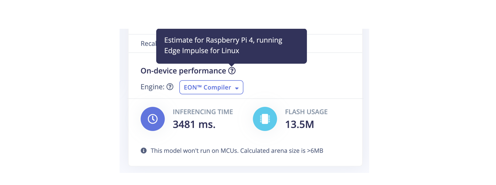

## Model Testing

On the **Model testing** page, click on the "Classify All" button which will initiate model testing with the trained float32 model. The testing accuracy is **97.5%**.

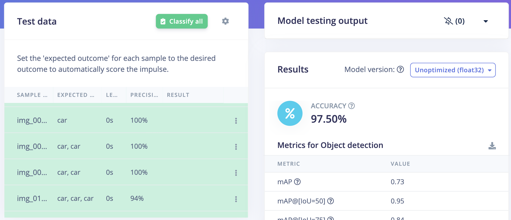

## Model Conversion to HEF

We need to convert the model to a Hailo Executable Format (HEF) to run inferencing.  First download the ONNX model (highlighted by a rectangular in the image below) from the Edge Impulse Studio **Dashboard**. After downloading, copy the the ONNX model (`ei-car-yolov5s.onnx` in this example) to an x86 Linux machine, which is required for the model conversion toolkit provided by Hailo.

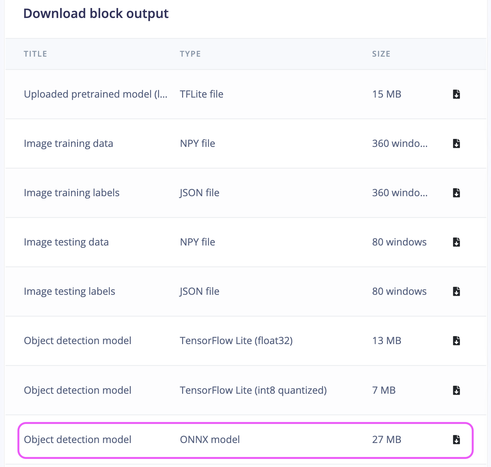

Now, sign up for a free account at the Hailo Developer Zone: [https://hailo.ai/developer-zone](https://hailo.ai/developer-zone). Navigate to the "Software Downloads" section and get the **Dataflow Compiler** version 3.27.0.

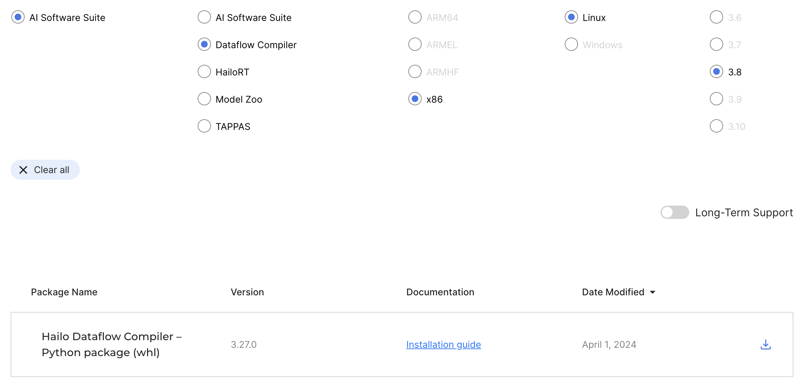

Execute the following commands to set up a virtual environment and install the compiler.

```
$ python3 -mvenv hailo_dfc && cd hailo_dfc
$ source bin/activate
$ pip3 install hailo_dataflow_compiler-3.27.0-py3-none-linux_x86_64.whl
$ pip3 install opencv-python
```

We can verify whether the installation was successful.

```
$ hailo -h
[info] First time Hailo Dataflow Compiler is being used. Checking system requirements... (this might take a few seconds)
[info] Current Time: 22:19:56, 07/14/24
[info] System info: OS: Linux, Kernel: 5.15.0-113-generic
[info] Hailo DFC Version: 3.27.0
```

The compilation process requires calibration image datasets, which can be obtained from the Edge Impulse Studio (Training) Dataset page by clicking on the “Export” button.


The model conversion process is broken down into four steps:

### 1. Make Calibration Dataset

The following Python script saves the calibration datasets in the NumPy-specific binary format (*.npy).

```
import cv2
import os
import numpy as np

w, h, c = 640, 640, 3

data_dir = './data/training'

images_list = os.listdir(data_dir)

calib_dataset = np.zeros((len(images_list), w, h, c))

for idx, filename in enumerate(os.listdir(data_dir)):
    if not filename.endswith('.jpg'):
        continue
    filepath = os.path.join(data_dir, filename)
    img = cv2.imread(filepath)
    img = cv2.cvtColor(img, cv2.COLOR_BGR2RGB)
    x = img.shape[1]/2 - w/2
    y = img.shape[0]/2 - h/2
    crop_img = img[int(y):int(y+h), int(x):int(x+w)]
    calib_dataset[idx, :, :, :] = crop_img

np.save('calib_dataset.npy', calib_dataset)                                       
```

### 2. Model Parsing

The following script parses the ONNX model into Hailo's internal representation and generates the Hailo Archive (HAR) file.

```
from hailo_sdk_client import ClientRunner

model_name = 'ei-car-yolov5s'
onnx_path = f'{model_name}.onnx'
chosen_hw_arch = 'hailo8l'

runner = ClientRunner(hw_arch=chosen_hw_arch)
hn, npz = runner.translate_onnx_model(
    onnx_path,
    model_name,
    start_node_names=['images'],
    end_node_names=['/model.24/m.0/Conv', '/model.24/m.2/Conv', '/model.24/m.1/Conv'],
    net_input_shapes={'images': [1, 3, 640, 640]})

runner.save_har(f'{model_name}.har')
```

### 3. Model Optimization

The following script is used to optimize the model, convert it from full precision into integer representation, and generate a quantized Hailo Archive (HAR) file. This script includes the model input normalization and the non-maximum suppression (NMS) on the model output.

```
from hailo_sdk_client import ClientRunner
import numpy as np

model_name = 'ei-car-yolov5s'
alls = [
  'normalization1 = normalization([0.0, 0.0, 0.0], [255.0, 255.0, 255.0])\n',
  'nms_postprocess(meta_arch=yolov5, engine=cpu, nms_scores_th=0.2, nms_iou_th=0.4, classes=1)\n',
]
har_path = f'{model_name}.har'
calib_dataset = np.load('./calib_dataset.npy')

runner = ClientRunner(har=har_path)
runner.load_model_script(''.join(alls))
runner.optimize(calib_dataset)

runner.save_har(f'{model_name}_quantized.har')
```

### 4. Model Compilation

The following script compiles the quantized Hailo Archive (HAR) and generates the Hailo Executable Format (HEF) file.

```
from hailo_sdk_client import ClientRunner

model_name = 'ei-car-yolov5s'
quantized_model_har_path = f'{model_name}_quantized.har'
runner = ClientRunner(har=quantized_model_har_path)

hef = runner.compile()

file_name = f'{model_name}.hef'
with open(file_name, 'wb') as f:
    f.write(hef)              
```

Now copy the HEF file (`ei-car-yolov5s.hef` in this example) to the Raspberry Pi with the Hailo Accelerator installed. We can assess on-device performance by using the following command, which demonstrates around 63 FPS, a very impressive result.

```
$ hailortcli run ei-car-yolov5s.hef 

Running streaming inference (ei-car-yolov5s.hef):
  Transform data: true
    Type:      auto
    Quantized: true
Network ei-car-yolov5s/ei-car-yolov5s: 100% | 317 | FPS: 63.33 | ETA: 00:00:00
> Inference result:
 Network group: ei-carhef-yolov5s
    Frames count: 317
    FPS: 63.33
    Send Rate: 622.54 Mbit/s
    Recv Rate: 77.33 Mbit/s

```

## Application

We have already installed the Raspberry Pi OS (64-bit) Bookworm on the Raspberry Pi 5.  Execute the following command to update the OS and firmware.

```
$ sudo apt update && sudo apt full-upgrade
$ sudo rpi-eeprom-update
```

Run the following command to open the Raspberry Pi Configuration CLI:

```
$ sudo raspi-config
```

Under **Advanced Options** > **Bootloader Version**, choose  "Latest" and run the following command to update the firmware to the latest version:

```
$ sudo rpi-eeprom-update -a
```

To enable PCIe Gen 3.0 speeds, add the following line to `/boot/firmware/config.txt`:

```
dtparam=pciex1_gen=3
```

Reboot the Raspberry Pi 5 with `sudo reboot` for these settings to take effect. To install the dependencies required to use the AI Kit. Run the following command from a terminal:

```
$ sudo apt install hailo-all
```

Finally, reboot the Raspberry Pi 5 with `sudo reboot` for these settings to take effect.

To ensure everything is running correctly, run the following command:

```
$ hailortcli fw-control identify
Executing on device: 0000:01:00.0
Identifying board
Control Protocol Version: 2
Firmware Version: 4.17.0 (release,app,extended context switch buffer)
Logger Version: 0
Board Name: Hailo-8
Device Architecture: HAILO8L
Serial Number: HLDDLBB241602815
Part Number: HM21LB1C2LAE
Product Name: HAILO-8L AI ACC M.2 B+M KEY MODULE EXT TMP

```

We will be using the Hailo example repository for the Raspberry Pi 5 to build the application. Please execute the following commands to setup the environment and install the prerequisites.

```
$ git clone https://github.com/hailo-ai/hailo-rpi5-examples.git
$ cd hailo-rpi5-examples
$ source setup_env.sh 
$./compile_postprocess.sh 
$ pip3 install supervision 
```

Save the following configuration as **yolov5.json** in the `hailo-rpi5-example/resources` directory.

```
{
  "iou_threshold": 0.45,
  "detection_threshold": 0.7,
  "output_activation": "none",
  "label_offset":1,
  "max_boxes":200,
  "anchors": [
    [ 116, 90, 156, 198, 373, 326 ],
    [ 30, 61, 62, 45, 59, 119 ],
    [ 10, 13, 16, 30, 33, 23 ]
  ],
  "labels": [
    "unlabeled",
    "car"
  ]
}

```

Also, we should copy the HEF model to the `hailo-rpi5-example/resources` directory. We will use the `detection.py` example script from the `hailo-rpi5-examples/basic_pipelines` directory as a starting point for the application. We modified the Gstreamer pipeline to include the HailoTracker element for tracking cars after detection. We are using Roboflow's Supervision library to count the number of cars entering and exiting. The complete modified code is provided below.

```
import gi
gi.require_version('Gst', '1.0')
from gi.repository import Gst, GLib
import os
import argparse
import multiprocessing
import numpy as np
import setproctitle
import cv2
import time
import hailo
import supervision as sv
from hailo_rpi_common import (
    get_default_parser,
    QUEUE,
    get_caps_from_pad,
    get_numpy_from_buffer,
    GStreamerApp,
    app_callback_class,
)

# -----------------------------------------------------------------------------------------------
# User-defined class to be used in the callback function
# -----------------------------------------------------------------------------------------------
# Inheritance from the app_callback_class
class user_app_callback_class(app_callback_class):
    def __init__(self):
        super().__init__()
        self.new_variable = 42  # New variable example
    
    def new_function(self):  # New function example
        return "The meaning of life is: "

# -----------------------------------------------------------------------------------------------
# User-defined callback function
# -----------------------------------------------------------------------------------------------

# This is the callback function that will be called when data is available from the pipeline
def app_callback(pad, info, user_data):
    # Get the GstBuffer from the probe info
    buffer = info.get_buffer()
    # Check if the buffer is valid
    if buffer is None:
        return Gst.PadProbeReturn.OK

    # Get the detections from the buffer
    roi = hailo.get_roi_from_buffer(buffer)
    hailo_detections = roi.get_objects_typed(hailo.HAILO_DETECTION)
    n = len(hailo_detections)

    # Get the caps from the pad
    _, w, h = get_caps_from_pad(pad)


    boxes = np.zeros((n, 4))
    confidence = np.zeros(n)
    class_id = np.zeros(n)
    tracker_id = np.empty(n)

    for i, detection in enumerate(hailo_detections):
        class_id[i] = detection.get_class_id()
        confidence[i] = detection.get_confidence()
        tracker_id[i] = detection.get_objects_typed(hailo.HAILO_UNIQUE_ID)[0].get_id()
        bbox = detection.get_bbox()
        boxes[i] = [bbox.xmin() * w, bbox.ymin() * h, bbox.xmax() * w, bbox.ymax() * h]
    
    detections = sv.Detections(
            xyxy=boxes, 
            confidence=confidence, 
            class_id=class_id,
            tracker_id=tracker_id)

    #print(tracker_id, confidence, boxes)
    line_zone.trigger(detections)
    textoverlay  = app.pipeline.get_by_name("hailo_text")
    textoverlay.set_property('text', f'OUT: {line_zone.in_count}     |      IN: {line_zone.out_count}')
    textoverlay.set_property('font-desc', 'Sans 36')

    return Gst.PadProbeReturn.OK
    

# -----------------------------------------------------------------------------------------------
# User Gstreamer Application
# -----------------------------------------------------------------------------------------------

# This class inherits from the hailo_rpi_common.GStreamerApp class
class GStreamerDetectionApp(GStreamerApp):
    def __init__(self, args, user_data):
        # Call the parent class constructor
        super().__init__(args, user_data)
        # Additional initialization code can be added here
        # Set Hailo parameters these parameters should be set based on the model used
        self.batch_size = 1
        self.network_width = 640
        self.network_height = 640
        self.network_format = "RGB"
        nms_score_threshold = 0.3 
        nms_iou_threshold = 0.45
        
        # Temporary code: new postprocess will be merged to TAPPAS.
        # Check if new postprocess so file exists
        new_postprocess_path = os.path.join(self.current_path, '/home/naveen/hailo-rpi5-examples/resources/libyolo_hailortpp_post.so')
        if os.path.exists(new_postprocess_path):
            self.default_postprocess_so = new_postprocess_path
        else:
            self.default_postprocess_so = os.path.join(self.postprocess_dir, 'libyolo_hailortpp_post.so')

        if args.hef_path is not None:
            self.hef_path = args.hef_path
        # Set the HEF file path based on the network
        elif args.network == "yolov6n":
            self.hef_path = os.path.join(self.current_path, '../resources/yolov6n.hef')
        elif args.network == "yolov8s":
            self.hef_path = os.path.join(self.current_path, '../resources/yolov8s_h8l.hef')
        elif args.network == "yolox_s_leaky":
            self.hef_path = os.path.join(self.current_path, '../resources/yolox_s_leaky_h8l_mz.hef')
        else:
            assert False, "Invalid network type"

        # User-defined label JSON file
        if args.labels_json is not None:
            self.labels_config = f' config-path={args.labels_json} '
            # Temporary code
            if not os.path.exists(new_postprocess_path):
                print("New postprocess so file is missing. It is required to support custom labels. Check documentation for more information.")
                exit(1)
        else:
            self.labels_config = ''

        self.app_callback = app_callback
    
        self.thresholds_str = (
            f"nms-score-threshold={nms_score_threshold} "
            f"nms-iou-threshold={nms_iou_threshold} "
            f"output-format-type=HAILO_FORMAT_TYPE_FLOAT32"
        )

        # Set the process title
        setproctitle.setproctitle("Hailo Detection App")

        self.create_pipeline()

    def get_pipeline_string(self):
        if self.source_type == "rpi":
            source_element = (
                #"libcamerasrc name=src_0 auto-focus-mode=AfModeManual ! "
                "libcamerasrc name=src_0 auto-focus-mode=2 ! "
                f"video/x-raw, format={self.network_format}, width=1536, height=864  ! "
                + QUEUE("queue_src_scale")
                + "videoscale ! "
                f"video/x-raw, format={self.network_format}, width={self.network_width}, height={self.network_height}, framerate=60/1 ! "
                #f"video/x-raw, format={self.network_format}, width={self.network_width}, height={self.network_height} ! "
            )
        elif self.source_type == "usb":
            source_element = (
                f"v4l2src device={self.video_source} name=src_0 ! "
                "video/x-raw, width=640, height=480, framerate=30/1 ! "
            )
        else:
            source_element = (
                f"filesrc location={self.video_source} name=src_0 ! "
                + QUEUE("queue_dec264")
                + " qtdemux ! h264parse ! avdec_h264 max-threads=2 ! "
                " video/x-raw, format=I420 ! "
            )
        source_element += QUEUE("queue_scale")
        source_element += "videoscale n-threads=2 ! "
        source_element += QUEUE("queue_src_convert")
        source_element += "videoconvert n-threads=3 name=src_convert qos=false ! "
        source_element += f"video/x-raw, format={self.network_format}, width={self.network_width}, height={self.network_height}, pixel-aspect-ratio=1/1 ! "

        pipeline_string = (
            "hailomuxer name=hmux "
            + source_element
            + "tee name=t ! "
            + QUEUE("bypass_queue", max_size_buffers=20)
            + "hmux.sink_0 "
            + "t. ! "
            + QUEUE("queue_hailonet")
            + "videoconvert n-threads=3 ! "
            f"hailonet hef-path={self.hef_path} batch-size={self.batch_size} {self.thresholds_str} force-writable=true ! "
            + QUEUE("queue_hailofilter")
            + f"hailofilter so-path={self.default_postprocess_so} {self.labels_config} qos=false ! "
            + QUEUE("queue_hailotracker")
            + "hailotracker keep-tracked-frames=3 keep-new-frames=3 keep-lost-frames=3 ! "
            + QUEUE("queue_hmuc")
            + "hmux.sink_1 "
            + "hmux. ! "
            + QUEUE("queue_hailo_python")
            + QUEUE("queue_user_callback")
            + "identity name=identity_callback ! "
            + QUEUE("queue_hailooverlay")
            + "hailooverlay ! "
            + QUEUE("queue_videoconvert")
            + "videoconvert n-threads=3 qos=false ! "
            + QUEUE("queue_textoverlay")
            + "textoverlay name=hailo_text text='' valignment=top halignment=center ! "
            + QUEUE("queue_hailo_display")
            + f"fpsdisplaysink video-sink={self.video_sink} name=hailo_display sync={self.sync} text-overlay={self.options_menu.show_fps} signal-fps-measurements=true "
        )
        print(pipeline_string)
        return pipeline_string

if __name__ == "__main__":
    # Create an instance of the user app callback class
    user_data = user_app_callback_class()

    START = sv.Point(0, 340)
    END = sv.Point(640, 340)

    line_zone = sv.LineZone(start=START, end=END, triggering_anchors=(sv.Position.BOTTOM_LEFT, sv.Position.BOTTOM_RIGHT))

    parser = get_default_parser()
    # Add additional arguments here
    parser.add_argument(
        "--network",
        default="yolov6n",
        choices=['yolov6n', 'yolov8s', 'yolox_s_leaky'],
        help="Which Network to use, default is yolov6n",
    )
    parser.add_argument(
        "--hef-path",
        default=None,
        help="Path to HEF file",
    )
    parser.add_argument(
        "--labels-json",
        default=None,
        help="Path to costume labels JSON file",
    )
    args = parser.parse_args()
    app = GStreamerDetectionApp(args, user_data)
    app.run()
```

## Inferencing on the Recorded Video

To execute the application on a video file input, use the following command.

```
$ python3 detection.py --hef-path ../resources/ei-car-yolov5s.hef --input ~/video.MOV --labels-json ../resources/yolov5.json --show-fps
```



## Live Demo from Camera

Please use the following command to execute the application using the Raspberry Pi Camera.

```
$ python3 detection.py --hef-path ../resources/ei-car-yolov5s.hef --input rpi --labels-json ../resources/yolov5.json --show-fps
```

As confirmation, we have set up all the hardware on a pedestrian bridge and conducted live inferencing: 



## Conclusion

The incorporation of an AI accelerator for car detection and tracking at toll plazas has shown substantial enhancements in efficiency and accuracy. This project highlights the importance of integrating Edge Impulse data labeling and training infrastructure into an ML pipeline to address modern transportation challenges, leading to more intelligent and responsive tolling systems in the future.
