# Visitor Heatmap with FOMO Object Detection - Jetson Orin Nano

Created By: Jallson Suryo

Public Project Link: [https://studio.edgeimpulse.com/public/544247/latest](https://studio.edgeimpulse.com/public/544247/latest)

## Problem Statement

In data mapping, humans find it easier to understand information through visual representations, especially with clear color groupings, such as in a "Heatmap". Heatmaps are used because their presentation is simple to comprehend, and can represent density and clustering. In contrast, the output from object detection cameras, which usually includes data like the number of bounding boxes, locations, and timestamps, is numerical and difficult to interpret, especially for understanding visitor behavior, flow, or favorite spots.

In this project, we will create a simulation of a scenario in a café, restaurant, or lobby. By integrating cameras, which are commonly already in use in such places, with an additional object detection system and overlaying it with a dynamic heatmap visualization, we can reveal insights about visitor flow, duration, or favorite spots. The goal is to understand visitor behavior patterns so that the interior layout or design can be adjusted to maximize or expand areas that are popular with visitors.

## How it works:

This project will explore Edge Impulse FOMO (Faster Objects, More Objects) object detection and combine it with heatmap visualization. To do this, we will use miniature figures and a café/restaurant setting, with an overhead video camera capturing training and testing data to simulate real-life conditions. This will show the number of visitors, the duration of their stay, and generate a dynamic heatmap using a Python program. By using the bounding box location and its time-stamp information, the duration of each object (visitor) can be determined. This method is expected to help analyze visitor habits and their preferred (or less favored) areas. The use of a FOMO model with Tensor RT library deployed on the Jetson Orin Nano has proven to deliver high accuracy and fast inference.

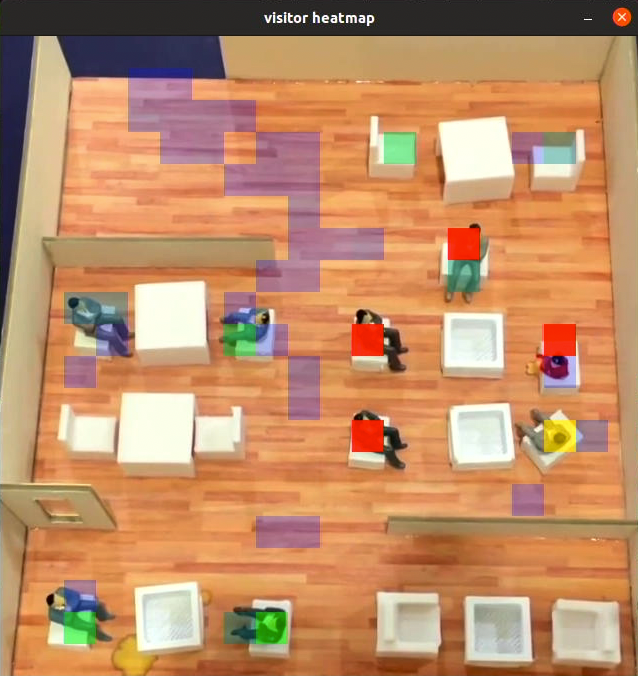

### Hardware Components:

- Miniature figures and interior set (cardboard)
- NVIDIA Jetson Orin Nano Developer Kit (8GB)
- USB Camera/webcam (eg. Logitech C270/ C920)
- DisplayPort to HDMI cable
- Display/monitor
- Standee/Tripod
- Keyboard, mouse or PC/Laptop via ssh
- Orin Nano case (3D print file [https://thingiverse.com/thing:6068997](https://thingiverse.com/thing:6068997) or available for purchase from a variety of sources)

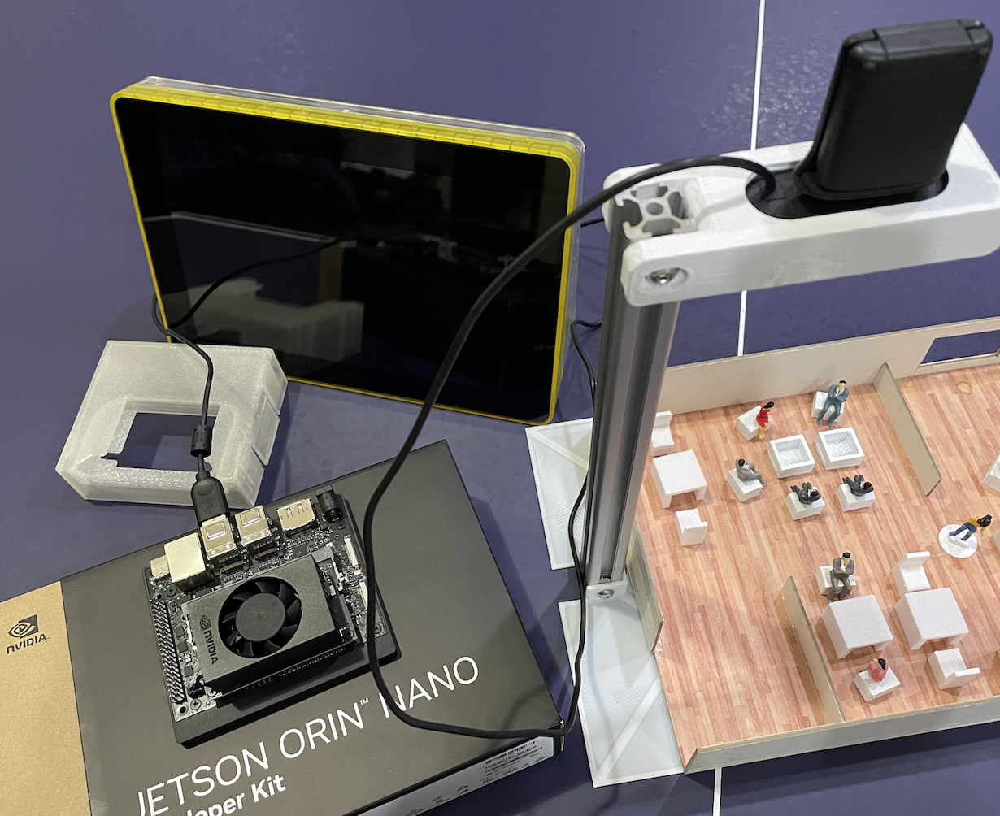

### Software & Online Services:

- NVIDIA Jetpack (5.1.2)
- Edge Impulse Studio
- Edge Impulse's Linux & Python SDK
- Terminal

## Steps

### 1. Collecting Data

In the initial stage of building a model in Edge Impulse Studio, we need to prepare the data. In this project we use a USB camera connected to a pc/laptop, or smartphone camera to capture the images for data collection for ease of use. Take pictures from above, in slightly different angles and lighting conditions to ensure that the model can work under different conditions (to prevent model overfitting). Object size is a crucial aspect (in FOMO) to ensure the performance of this model. You must keep the camera distance from objects consistent, because significant difference in object size will confuse the algorithm.

For those who are not familiar with Edge Impulse Studio, please follow these steps. Navigate to [https://studio.edgeimpulse.com](https://studio.edgeimpulse.com), login or create an account, then create a new project. Choose the **Images** project option, then **Object detection**. In Dashboard > Project Info, choose "Bounding Boxes" for labeling method, and "NVIDIA Jetson Orin Nano" for the target device. Then in **Data acquisition**, click on Upload Data tab, choose your photo files, auto split, then click **Begin upload**.

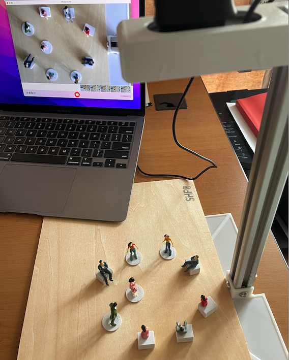

### 2. Labeling

The next step is labeling. Click on **Data Acquisition**, click on "Labelling queue" tab then labeling your "people" by dragging a box around an object and label it, then repeat the steps until all images are labelled. 

> Update: Alternatively you can try Edge Impulse's new feature, [AI labeling](https://docs.edgeimpulse.com/docs/edge-impulse-studio/data-acquisition/ai-labeling).

After labeling, it's recommended to split the data into training and testing sets, around an 80/20 ratio. If you haven't done this yet, click on Train / Test Split and proceed.

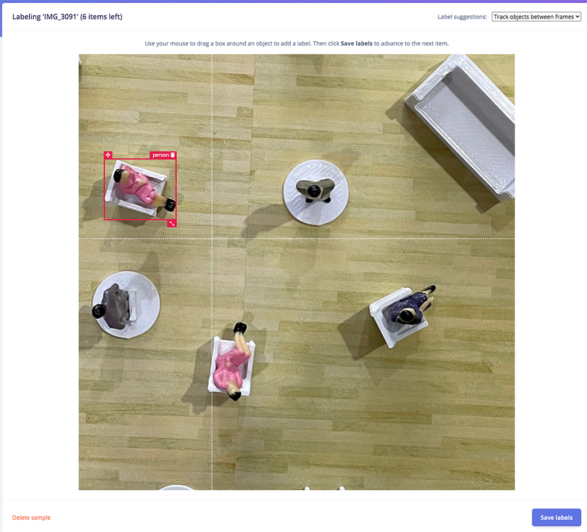

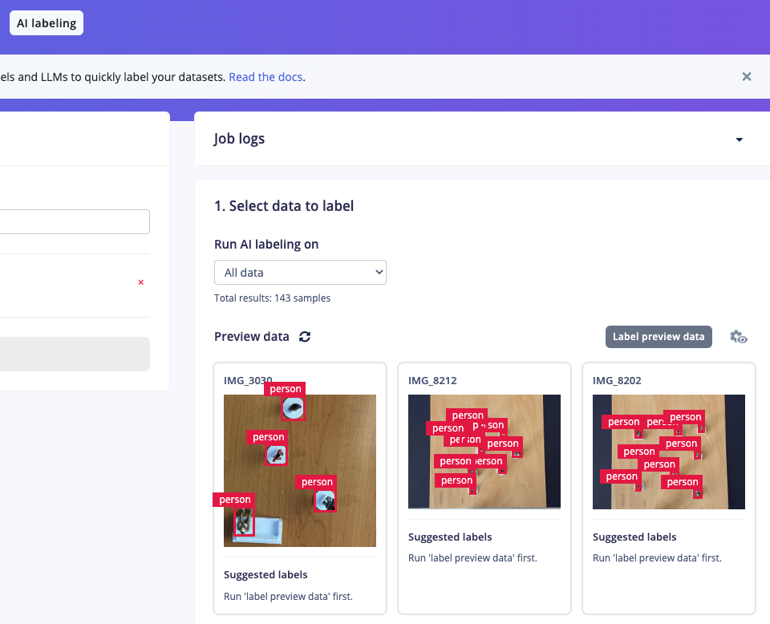

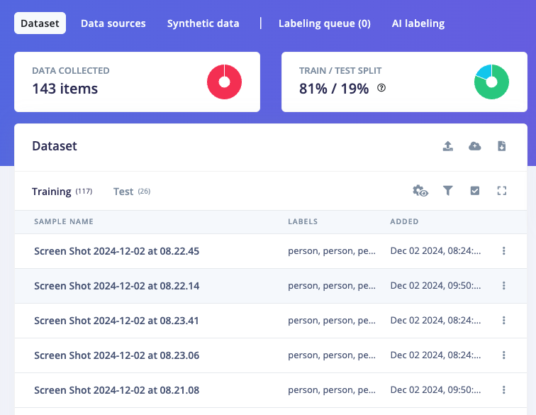

### 3. Train and Build Model

Once your labelled dataset is ready, go to Impulse Design > Create Impulse, and set the image width and height to 640x640. Choose Fit shortest axis, then select Image and Object Detection as the learning and processing blocks, and click **Save Impulse**. Next, navigate to the Image Parameters section, select _Grayscale_ as the color depth, and press Save parameters. Then click on **Generate** and navigate to Object Detection section, and leave training setting for Neural Network at their default settings (100 cycles and learning rate 0.001), then we choose FOMO MobileNet V2 0.35. You can then begin the training, and see the progress and result on the right side of the screen.

If everything is OK (we get F1 score > 90%), then we can test the model, go to Model Testing section and click Classify all. Our result is above 90%, so we can move on to the next step — Deployment.

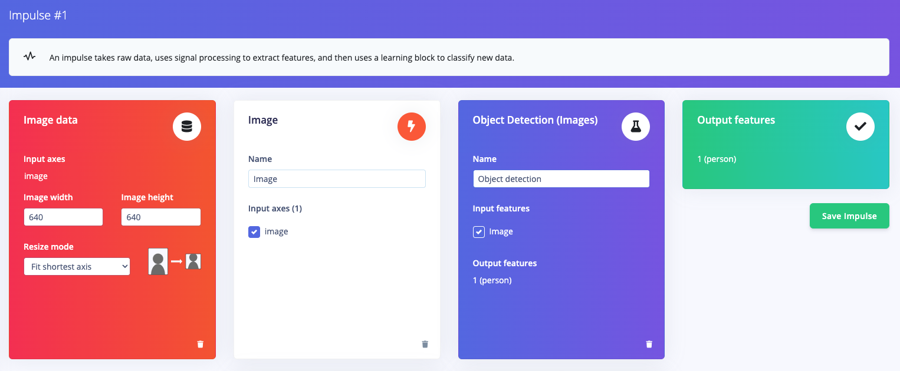

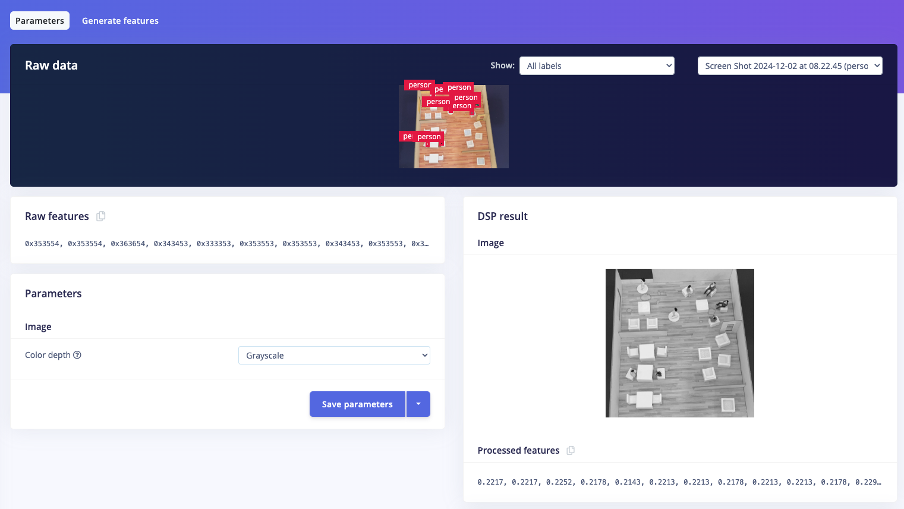

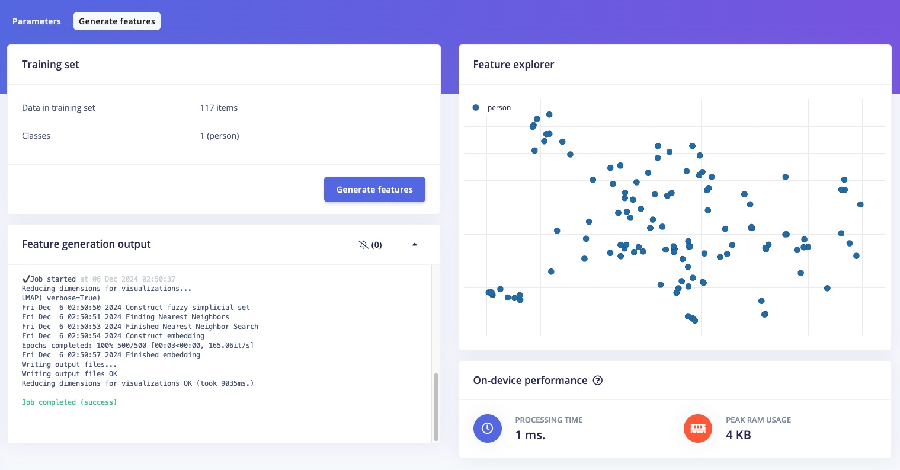

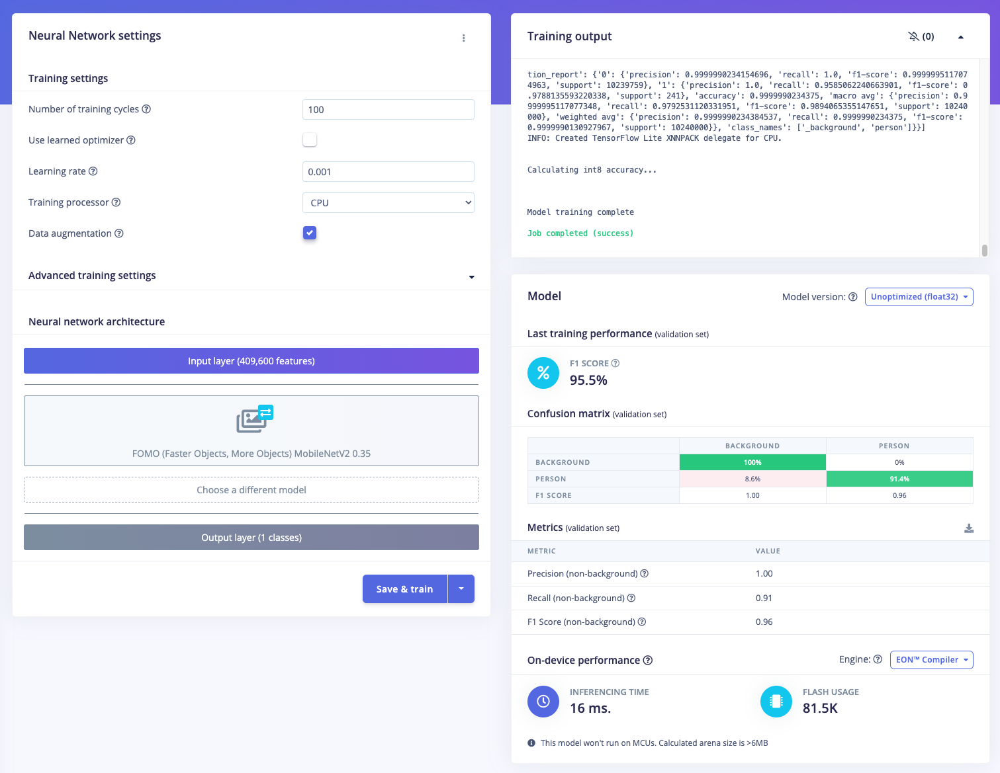

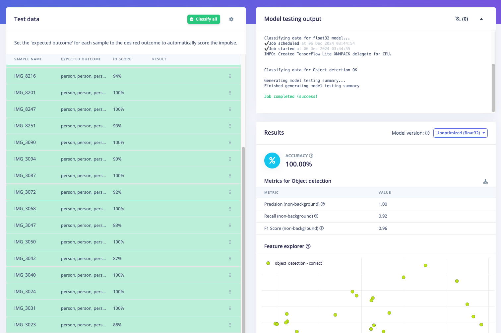

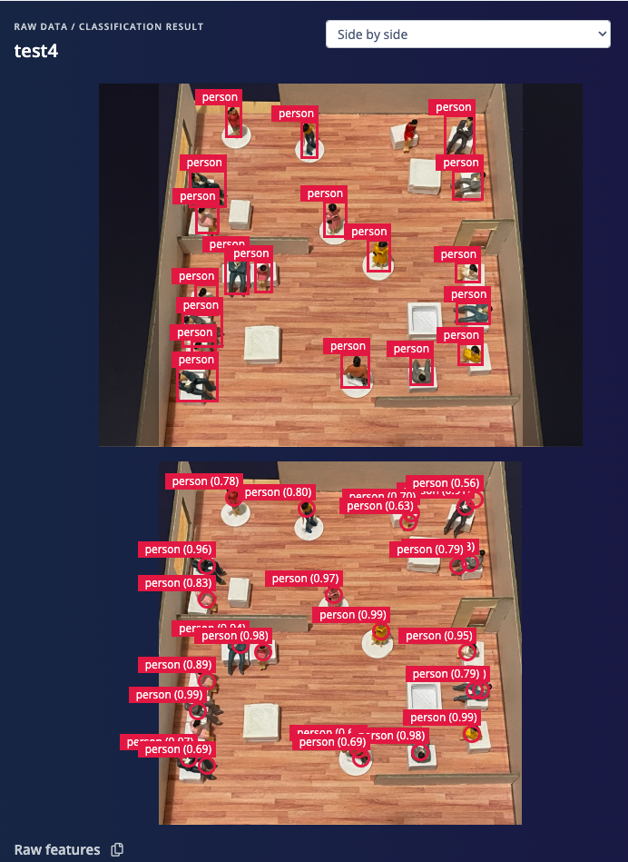

### 4. Deploy Model Targeting NVIDIA Orin Nano GPU

Click on the Deployment tab, then search for TensorRT, select (Unoptimized) Float32, and click Build. This will generate the NVIDIA TensorRT library for running inference on the Orin Nano's GPU. Once downloaded, unzip the file, and you'll be ready to deploy the model using the Edge Impulse SDK on the NVIDIA Jetson Orin Nano. You can follow the steps to get this TensorRT model in this link, [https://docs.edgeimpulse.com/docs/tools/edge-impulse-for-linux/linux-cpp-sdk](https://docs.edgeimpulse.com/docs/tools/edge-impulse-for-linux/linux-cpp-sdk)

Alternatively you can skip those steps, there's an easier way: simply ensure that the model has been built in Edge Impulse Studio. From there, you can test, download the model, and run everything directly from the Orin Nano. 

On the Orin Nano side, there are several things that need to be done. Make sure the unit uses JetPack: we use Jetpack v 5.1.2, which is usually pre-installed on the SD card. Then, open a Terminal on Orin Nano or ssh via your PC/laptop and setup Edge Impulse firmware in the terminal.

`wget -q -O - https://cdn.edgeimpulse.com/firmware/linux/orin.sh | bash`

You also need to install Linux Python SDK library (you need Python >=3.7 included in JetPack), and it is possible you need to install Cython for building the `numpy` package: `pip3 install Cython` 

Then install Linux Python SDK: `sudo apt-get install libatlas-base-dev libportaudio2 libportaudiocpp0 portaudio19-dev python3-pip` , then: `pip3 install pyaudio edge_impulse_linux` then clone the examples: `git clone https://github.com/edgeimpulse/linux-sdk-python`

Next, download the model. Open terminal on the Orin Nano or ssh from your PC/laptop and simply type `edge-impulse-linux-runner` (add `--clean` to allow you to select your project if needed). Log in to your account then choose your project. This process will download the `model.eim` which is specifically built with the TensorRT library targeting the Orin Nano GPU and run EI runner with a camera setup on Orin Nano. You can see a live stream via your browser at http://your-orin-ip-address:4912.

During the process, the console will display the path where the `model.eim` has been downloaded. For example, in the image below, it shows the file located at `/home/orin/.ei-linux-runner/models/240606/v17`.

For convenience, you can copy this file to the same directory as the Python program you'll be creating in the next steps. For instance, you can use the following command to copy it to the home directory: `cp -v model.eim /home/orin`

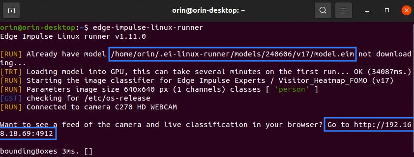

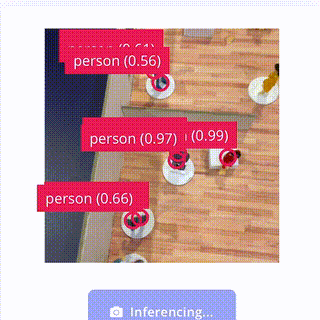

The inferencing time is around 3-5ms, which is an incredibly fast for object detection speed.

Now the model is ready to run in a high-level language such as the Python program in the next step.

### 5. Build a Visitor Heatmap Program (Python)

With our FOMO model ready, we can now create a Visitor Heatmap program using Python. This program will utilize the bounding box locations of objects and their duration of presence. The heatmap will consist of semi-transparent color blocks overlaying the camera/video display, implemented using the OpenCV library.

The color transitions will range from blue → green → yellow → orange → red, representing durations from 1 second to over 20 seconds. While real-world video input typically spans hours, for this simulation we will use accelerated stop-motion video. The video/camera resolution for this simulation will be set to 640x640, divided into 20x20 grids as the color blocks for the heatmap.

If we run the program using a video file as input (e.g., video.mp4), we use the path to the video file when executing the program:

`python3 heatmap.py <path to modelfile>/model.eim <path to videofile>/video.mp4`

> Note: For video/camera capture display, you cannot use the headless method from a PC/laptop. Instead, connect a display/monitor directly to the Jetson Orin Nano to view the heatmap visualization.

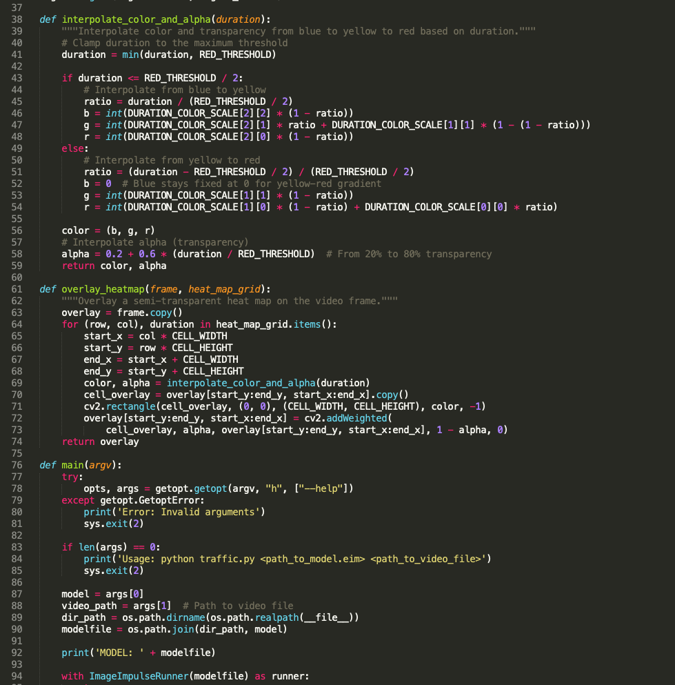

All codes, images and videos can be accessed at: https://github.com/Jallson/VisitorHeatmap

Check our demo test video: 



## Conclusion

After testing FOMO for visitor object detection and implementing the heatmap program, we have successfully identified visitor flow patterns, how long they stay, and which areas are their favorites. Although this project input used miniature figures and created with stop-motion video, it effectively simulates typical conditions in a café or restaurant.

The color patterns from the heatmap results can be used to adjust furniture layouts, redesign interiors, or quickly understand visitor behavior. In conclusion, this project was successfully executed with minimal setup, a straightforward training process, and implementation on low-energy devices without requiring an internet connection. This ensures better privacy and makes it easy to apply in public setups such as café, restaurant, library, lobby, and store.
