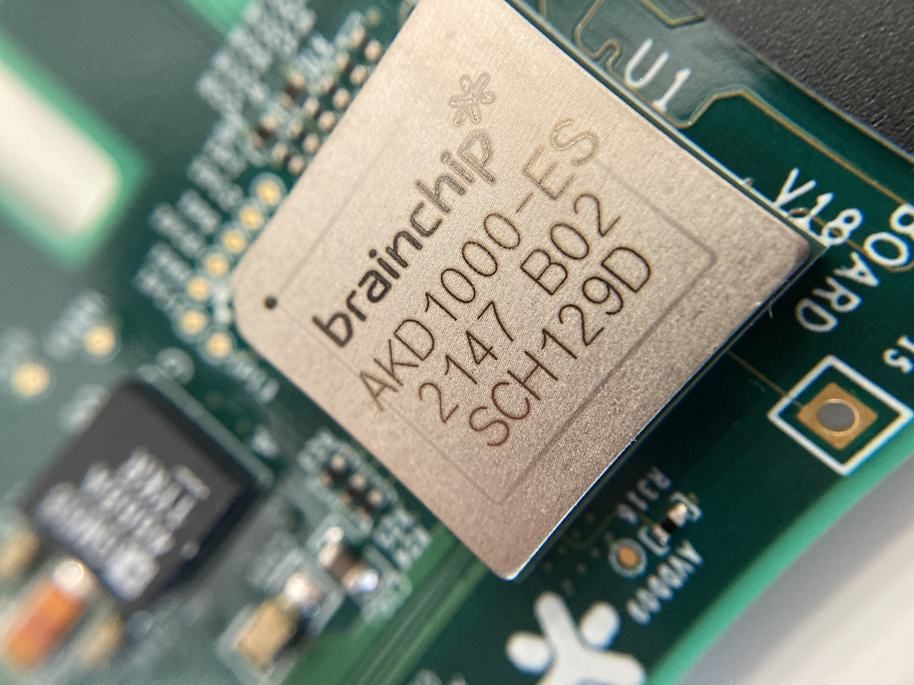
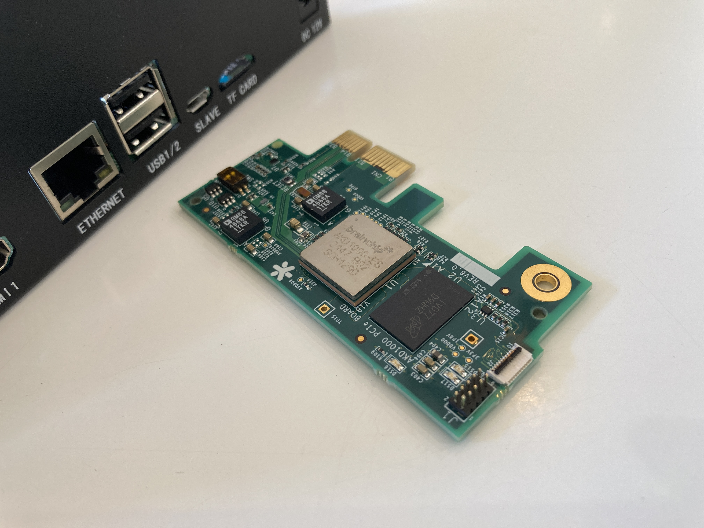
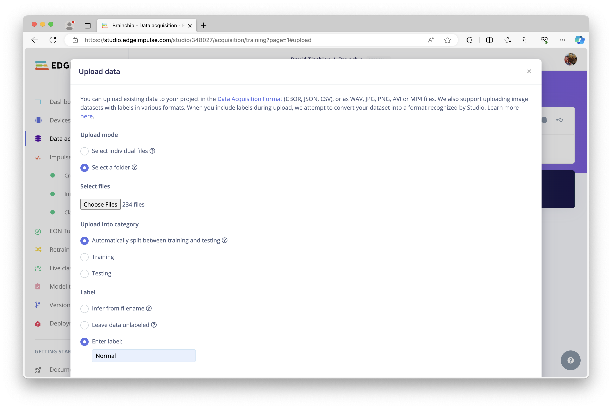
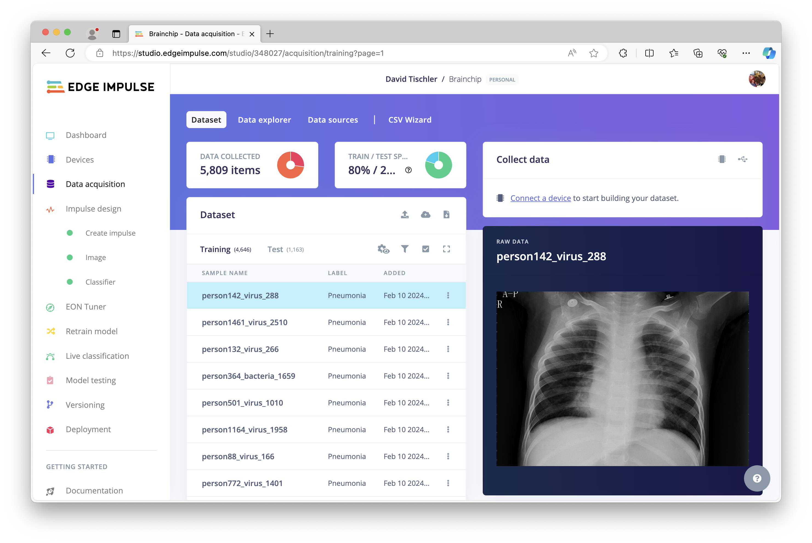
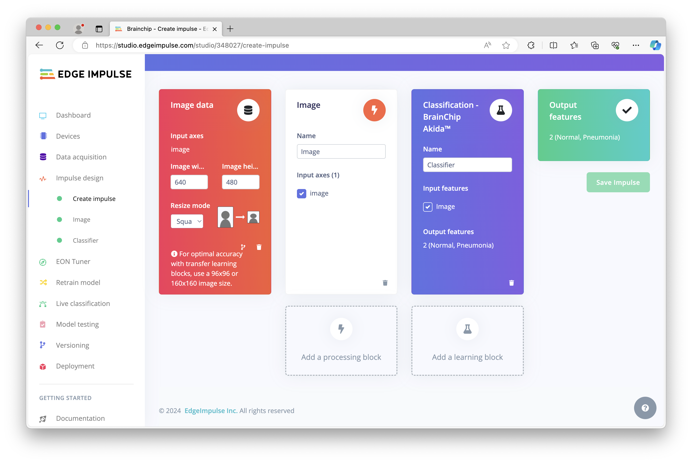
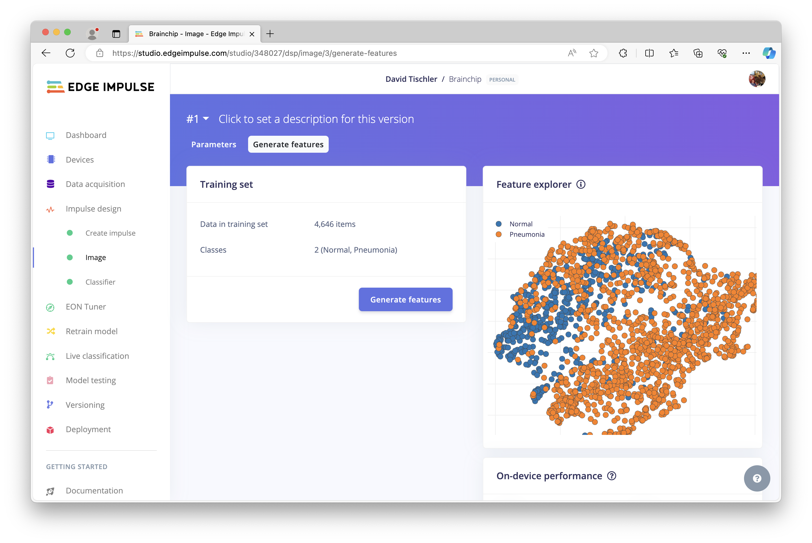
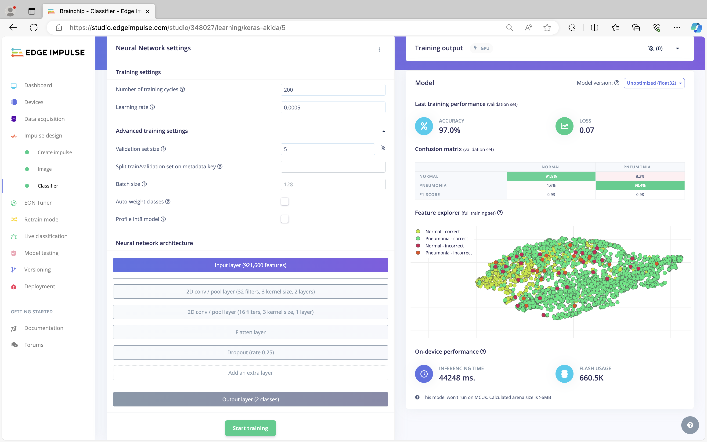
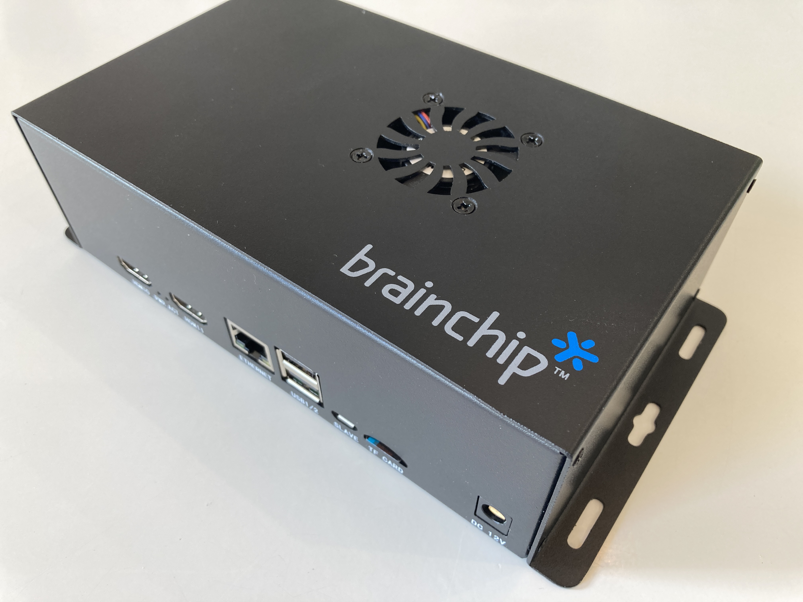
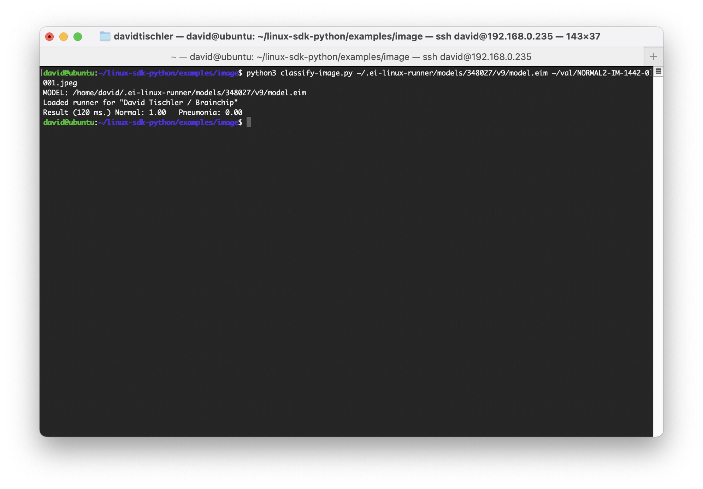

# X-Ray Classification and Analysis - Brainchip Akida Neuromorphic Processor

Created By: David Tischler

Public Project Link: [https://studio.edgeimpulse.com/public/348027/latest](https://studio.edgeimpulse.com/public/348027/latest)



## Introduction

Over the past several years, as hardware has improved and machine learning models have gotten more efficient, many AI workloads have been transitioned from the cloud to the edge of the network, running locally on devices that were previously not able to perform inferencing tasks.  Fast CPU's and GPU's, more memory, and better connectivity have helped, but a very large impact has come from dedicated AI Accelerators that offer high performance inference, in small, low-power form-factors.

The [Brainchip Akida AKD1000](https://brainchip.com/akida-neural-processor-soc/) is one such example, with the ability to speed up sensor, audio, or vision tasks such as image classification or object detection significantly over standard CPU-based inferencing, while using only a few milliwatts of power.  In this project we'll use the [Brainchip Akida Developer Kit](https://brainchip.com/akida-enablement-platforms/), which comes in a ready-to-use system consisting of an x86 or Arm-based platform, plus an Akida AKD1000 NPU on a small PCIe add-on card.



However, even this low-power system is more powerful than truly necessary, as the Akida NPU could be simply integrated directly into a single PCB containing a processor, memory, storage, and any necessary interfaces, eliminating the need for the PCIe add-on card.  Even more integrated, the Akida IP can be licensed and embedded directly within an SoC, creating a single-chip solution capable of compute and AI acceleration, combined.  But for ease of getting started, the Brainchip Akida Raspberry Pi Developer Kit is used here.

## Improving Medical Processes

Artificial Intelligence may never be able to fully replace a doctor, but it can certainly help supplement their work, speed up diagnostic processes, or offer data-driven analyses to assist with decision making.  This project will explore the capability of the Akida processor to identify pneumonia in an x-ray image, along with some potential next steps and description of how that can be leveraged in the real-world.

We'll use the Akida Developer Kit, Edge Impulse, a curated dataset from Kaggle, and some basic utilities to evaluate performance.  The standard Edge Impulse workflow will be used, [which is well-documented here](https://docs.edgeimpulse.com/docs/).

## Dataset Collection

The first step to consider for a machine learning project is the dataset.  This could be collected yourself, such as most sensor projects, or you can use an existing dataset if there is one that meets your particular needs.  In this case, as we are interested in evaluating the Akida for x-ray classification, we can use the [Chest X-Ray Images (Pneumonia) dataset provided by Paul Mooney on Kaggle](https://www.kaggle.com/datasets/paultimothymooney/chest-xray-pneumonia).  This dataset consists of 5,863 images (x-rays) of patients who were diagnosed with pneumonia, as well as those who did not have pneumonia (i.e., "normal").  You can download the dataset, then unzip it, to find Test, Train, and Validation folders, subdivided into "pneumonia" and "normal" folders for each.

Make a new project in Edge Impulse, click on Data Acquisition, and then upload the Test and Train folders for each Class, making sure you select "Automatically split between training and testing" and also provide the correct Label for each folder condition.



Once each folder is appropriately uploaded, your dataset should look something like this:



I've ended up with 4,646 images in my Training set, and a total of 1,163 images in my Test set, which will be held back and can be used later to test the model on unseen data.

## Building a Model

To begin the process of building a classification model, click on Impulse Design on the left, and set the image dimensions in the Image data block.  I have chosen 640x480 as a starting point, though we could possible go a bit higher depending on if the model accuracy is too low once we begin testing.  Next, add an Image Processing block, then a Classification - BrainChip Akida Learning block.  Then click Save Impulse.



In the Impulse block detail page, you can likely change to Grayscale as x-rays are black and white, so we can save a bit of processing speed / memory by eliminating RGB color.  Choose "Grayscale" from the Color depth drop-down menu, and then click Save Parameters.  On the next page, click on Generate Features, and you will see a visual representation of your dataset features after the process completes.



On the Classifier settings page, I've made a few changes to increase accuracy of the model, bumping up the number of epochs run to 200, reducing the learning rate to 0.0005, and reduced my validation set size down to 5%.  To speed up the training process, I've used GPU training, which is available for Enterprise users.  You can request a [free 14-day trial here](https://studio.edgeimpulse.com/trial-signup) if you'd like to increase your model sizes and reduce your build times.

Once the build is complete, you'll be presented with Validation accuracy and inference time information.



During the data upload step earlier, recall that we set aside 1,163 images that were not used for training the machine learning algorithm (this occurred automatically as a result of the "Automatically split between training and testing" checkbox).  Now we can have our newly created model try to evaluate those 1,163 images, but using the Model Testing feature.  Click on Model Testing on the left navigation, and then click the "Classify all"  button.  A job will be started, with logs available on the right side of the screen, and once complete the model will iterate through the unseen Test images and perform an inference on each, then render the results against the known value.  This will give you a good indication of how well your model is working on new x-ray images.  Here I received a Test classification accuracy of about 94.06%, so I will move forward with deploying the model to the board.

## Deploying to the Developer Kit

Now it's time to setup the Akida Developer Kit.  There is an included SD Card, ready to use out-of-the-box with Brainchip's model zoo and sample applications.  This makes it quick and easy to evaluate the Akida, and begin using the device.  But as we're going to be using Edge Impulse in this tutorial, I've instead flashed a new SD Card with Ubuntu 20.04.5 LTS 64-bit by using the Raspberry Pi Imager application.  I also used the "Customize" feature of the application to add a username and password, as well as local WiFi credentials, though you could just as easily plug in an ethernet cable for connectivity.  Once booted up and on the network, the Akida Developer Kit is similar to any other Raspberry Pi in how you can interact with it.  You can attach a keyboard, mouse, and HDMI monitor, or in my case I simply accessed the device over SSH.



As this was a fresh installation of Ubuntu, we'll need to install both the Akida tooling and drivers, as well as the Edge Impulse tooling and examples.  Those require some prerequisites, so the process actually begins by updating the system and then installing necessary packages.  After that, the Edge Impulse CLI, Akida CLI, Edge Impulse Linux SDK, and Akida PCIe driver can be installed.

Here is the complete series of commands I used, in order:

```
1. sudo apt-get update && sudo apt-get upgrade
2. sudo reboot
3. sudo su
4. curl -sL https://deb.nodesource.com/setup_12.x | sudo bash -
5. apt-get install build-essential linux-headers-$(uname -r) git gcc g++ make nodejs sox gstreamer1.0-tools gstreamer1.0-plugins-good gstreamer1.0-plugins-base gstreamer1.0-plugins-base-apps libatlas-base-dev libportaudio2 libportaudiocpp0 portaudio19-dev python3-opencv python3-pip
6. npm config set user root && sudo npm install edge-impulse-linux -g --unsafe-perm
7. reboot 
8. export PATH=/home/<your-username-here>/.local/bin:$PATH  # (or add to `.profile` file to make permanent)
9. pip install --upgrade pip
10. pip install --upgrade akida
11. pip install edge_impulse_linux -i https://pypi.python.org/simple
12. pip install pyaudio
13. git clone https://github.com/edgeimpulse/linux-sdk-python
14. git clone https://github.com/Brainchip-Inc/akida_dw_edma
15. cd akida_dw_edma/
16. ./install.sh 
17. akida devices
```

> Note:  Be sure to replace the username in Step 8, with your own username. 

If successful, the `akida devices` command should return:

```
Available devices
PCIe/NSoC_v2
```

## Inference Evaluation

Now that the Akida Developer Kit is setup, we can run our model and evaluate the results.  We'll use two distinct methods to test out the Akida performance in this tutorial, though other methods or scenarios could also exist.  The first method we will use is the Edge Impulse Linux SDK, which includes a sample python script that takes a model file and an image as inputs, run inferences on the given image, and then displays the output results on the command line.

The second method is to use a USB Webcam attached to the Akida Developer Kit, capture the live video feed, and inference what is seen through the camera.  If the images are displayed on a monitor, the brightness of the screen, resolution, or light in the room could impact the overall accuracy or ability of the model to make predictions.  Thus is likely a less ideal method for this use-case, but we'll document it as it could serve useful in other scenarios beyond x-ray classification.

### Method 1 - Linux SDK Python Inferencing

Earlier, when we unzipped the downloaded dataset from Kaggle, there were three folders inside it:  Train, Test, and Val.  We uploaded the Test and Train folders to Edge Impulse, but the Val folder was not uploaded.  Instead, we can now place those Validation images on a USB drive and copy them over to the Akida Developer Box (or use the `scp` command, FTP, etc.) in order to evaluate how our model performs on the hardware.

In a terminal, we'll continue where we left off above.  With the images copied over to a USB stick and then inserted into the Akida Developer Kit, the following series of commands will copy the images to the device, and use the example python from the Linux SDK to run inference:

```
1. sudo mount /dev/sda1 /tmp
2. mkdir /home/<your-username-here>/validation
3. cp /tmp/NORMAL/*.jpeg /home/<your-username-here>/validation && cp /tmp/PNEUMONIA/*.jpeg /home/<your-username-here>/validation
4. edge-impulse-linux-runner  # login to Edge Impulse, select project, build, then exit running process with Control+C
5. cd linux-sdk-python/examples/image/
6. python3 classify-image.py ~/.ei-linux-runner/models/<your-project-number-here>/<your-version-number-here>/model.eim ~/validation/NORMAL2-IM-1427-0001.jpeg  
```

> Note:  Once again, the username needs to be substituted with your own.  The project number and version number can be obtained by simply `ls`'ing the `models` directory.

The `edge-impulse-linux-runner` command in Step 4 above is used to connect the Akida Developer Kit to Edge Impulse, login with your credentials, select a project, and then download your model to the device.  Once that is complete, inference will attempt to begin, but you can cancel the running process with `Control+C` to exit the process.  The model is downloaded, which is what we are interested in.  Continuing on with Step 5 and Step 6 will run the inference and display the results, time it took to process, and power consumption.  You can iterate through all of the images in the `validation` folder you created (which should contain some Normal and some Pneumonia images.)



### Method 2 - USB Webcam Inferencing

As mentioned above, the second methodology we'll explore is live inference from an attached USB Webcam, though this does introduce a set of variables that may impact accuracy for our selected use-case of x-ray classification.  Other use-cases may not have these variables, so we'll document the method as it could be helpful for other projects.  In this situation, we'll open up those same Validation images on a separate laptop or PC, then point the webcam that is hooked up to the Akida Developer Kit at the monitor showing he x-ray image.

On the Akida Developer Kit, launch the application by entering `edge-impulse-linux-runner` on the command line.

Inference will start running continuously, printing out results to the console.  An extra feature of the Linux Runner is that it also starts an HTTP service, which can be accessed at `http://<IP-address-of-the-device>:4912` (the IP will be displayed in the text that is printed out as the application begins, or just run `ip a` to find it). 

Then in a browser on the PC or laptop, open up that URL and you will see a view from the camera, and its inference results.  You might need to arrange your windows or move the camera so that it is only seeing the x-ray, otherwise classification will not work.

However, as identified earlier, this method may not be as reliable for the x-ray classification use-case, due to lighting conditions of the room, brightness and contrast of the monitor, quality of the USB Webcam, resolution and size of the monitor, etc.  It is worth exploring though, as many vision projects are excellent candidates for live inferencing with a camera and the Akida NPU.


## Going Further

At this point, we have demonstrated how to build a machine learning model and deploy it to the Brainchip Akida Developer Kit, and proven that inference is working successfully.  But let's look a bit closer at the results we achieved and analyze our current situation.

Inference times were only 100 to 150 milliseconds.  For a doctor evaluating a single patient x-ray, this is near instantly, and anything within a minute or two would be acceptable on-site at a healthcare facility while diagnosing a patient.  The Akida is orders of magnitude fast enough for that situation.  Alternatively, if attempting to classify a large dataset of tens-of-thousands or hundreds-of-thousands of images, such as a researcher or government entity may need to do, again the Akida can dramatically speed up the process.

Second, power consumption is measured in the _**milliwatts**_ of energy consumed.   Although the Akida Developer Kit is plugged in to a steady power supply and a Raspberry Pi is measured in watts, keep in mind as mentioned above that the Akida processor could rather easily be integrated in to a more compact, lower power, single PCB alongside an application processor, lowering power consumption significantly.  Even further, the Akida IP could be directly embedded into a processor, eliminating the need for the stand-alone co-processor completely, adding just that small uptick of those few milliwatts to a device's power consumption, while adding NPU acceleration for machine learning tasks. 

With these factors in mind, it is entirely feasible to build x-ray classification capabilities directly into new generations of smart medical devices that can do real-time inference, to aid doctors in their decision making.  It may even be possible to create small handheld, battery-powered classifiers, that simply accept a USB drive containing the images, which could be useful for remote clinics.

If you have ideas for other use-cases or product designs using the Brainchip Akida neuromorphic processor, [be sure to reach out to us](https://edgeimpulse.com/contact)!
