---
description: >-
  Use computer vision and a Texas Instruments TDA4VM to perform anomaly detection for quality assurance of parts.
---

# Visual Anomaly Detection with FOMO-AD - Texas Instruments TDA4VM

Created By: Roni Bandini

Public Project Link: [https://studio.edgeimpulse.com/public/374008/latest](https://studio.edgeimpulse.com/public/374008/latest)

GitHub Repo: [https://github.com/ronibandini/visualAnomaly/](https://github.com/ronibandini/visualAnomaly/)


## Introduction

Quality control is a critical aspect of any production line or manufacturing process. Many times quality control is performed by an trained or senior employee meticulously spotting faulty items as they roll off the assembly line. But what if that employee becomes distracted or tired? The consequences could be significant: increased shipping and handling costs via product returns, administrative expenses, and the need for refunds to customers due to missing or defective items.

Artificial intelligence and specifically a Machine Learning algorithm named FOMO-AD (Faster Objects, More Objects - Anomaly Detection) by Edge Impulse could be instrumental in addressing this challenge.

## How Does Visual Anomaly Detection Work? 

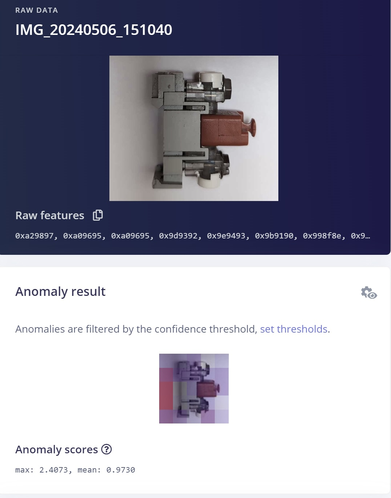

Detecting anomalies visually can be a challenging task. While we understand what a standard item should look like, identifying faulty items that exhibit previously unseen anomalies poses a unique set of difficulties. 

Imagine having to collect samples for every conceivable anomaly that might occur. This is called dataset asymmetry: you end up with a huge dataset of valid items and a tiny dataset of faulty items. 

The solution are unsupervised learning techniques. These methods allow us to build models without relying on labeled data, specifically marked as faulty. Instead, they learn from the overall distribution of data points, identifying patterns and deviations.

Once we've trained our anomaly detection model, we can deploy it to small devices with limited hardware resources. These lightweight models consume minimal power, and can even operate without an internet connection.

Under the hood, a clustering technique named Gaussian Mixture Models is used. Data points with low probabilities are identified and if a data point has a significantly lower probability of being generated by the mixture model compared to most other data points, it is considered an anomaly and it will output a high anomaly score. 

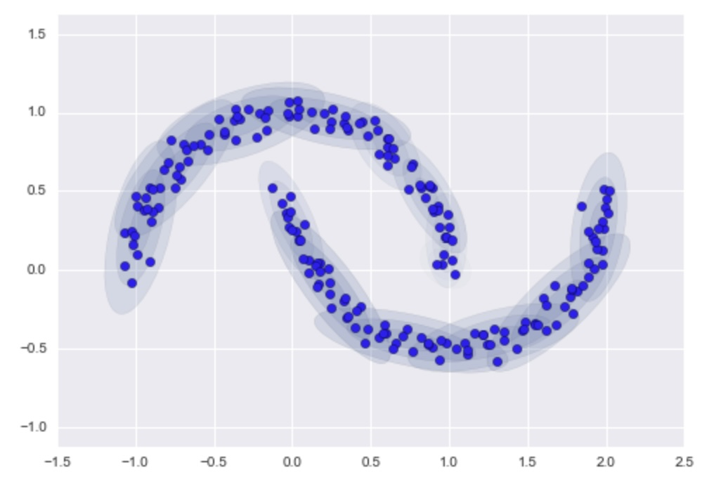

Though Gaussian Mixture Model (GMM) is often categorized as a clustering algorithm, fundamentally it is an algorithm for density estimation. That is to say, the result of a GMM fit to some data is a generative probabilistic model describing the distribution of the data.

FOMO-AD uses GMM per cell, so each cell has an anomaly score.

One interesting thing about FOMO-AD is that it detects not only the presence of an anomaly, but also its specific location within the image, which can be very useful for diagnostics and feedback, and fast visual interpretation.

## Hardware and Software Setup

FOMO-AD requires an Enterprise version of Edge Impulse.  To explore the capability, you can sign up for a free Enterprise Trial at [https://studio.edgeimpulse.com/trial-signup](https://studio.edgeimpulse.com/trial-signup), then create a new project named _Visual Anomaly_.

Download the Python parser script at [https://github.com/ronibandini/visualAnomaly](https://github.com/ronibandini/visualAnomaly), or git clone the full repo. 

I am using the Texas Instruments TDA4VM development board in this project, so I will download the OS image from [https://www.ti.com/tool/download/PROCESSOR-SDK-LINUX-SK-TDA4VM/08.06.00.11](https://www.ti.com/tool/download/PROCESSOR-SDK-LINUX-SK-TDA4VM/08.06.00.11). The TI AM62A and AM68A could also be used in a similar fashion as described in this project. 

> Note: Download version 8 (08.06.00.11 as indicated by the URL), as the latest version of the image doesn't seem to detect the USB camera while executing the Edge Impulse Linux Runner later.
 
Extract and flash the image with Etcher or any other similar application.

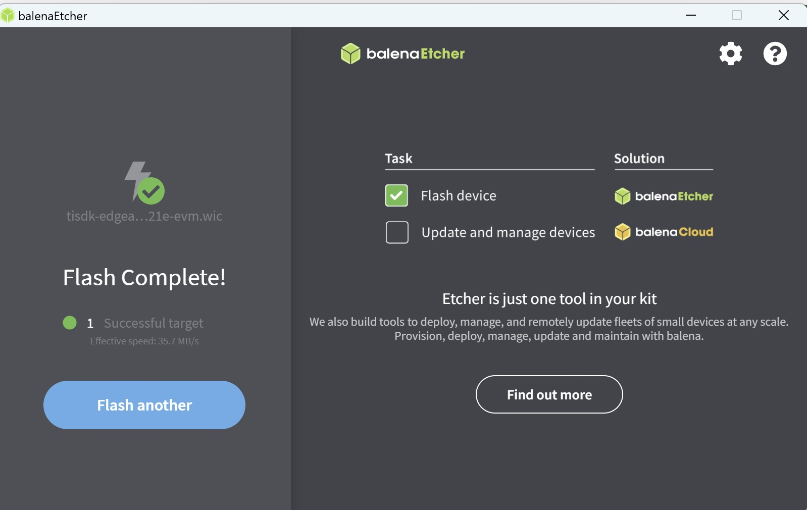

Place the microSD into the TDA4VM. Connect a USB-C power supply with at least 3A, and an Ethernet Cable to the router. Connect a Logitech C270, C920 or C922 compatible webcam, as well.


Determine the IP address that your router assigned to the board, and then connect to the TDA4VM using SSH with the following credentials:

User: root 
Password: (empty)

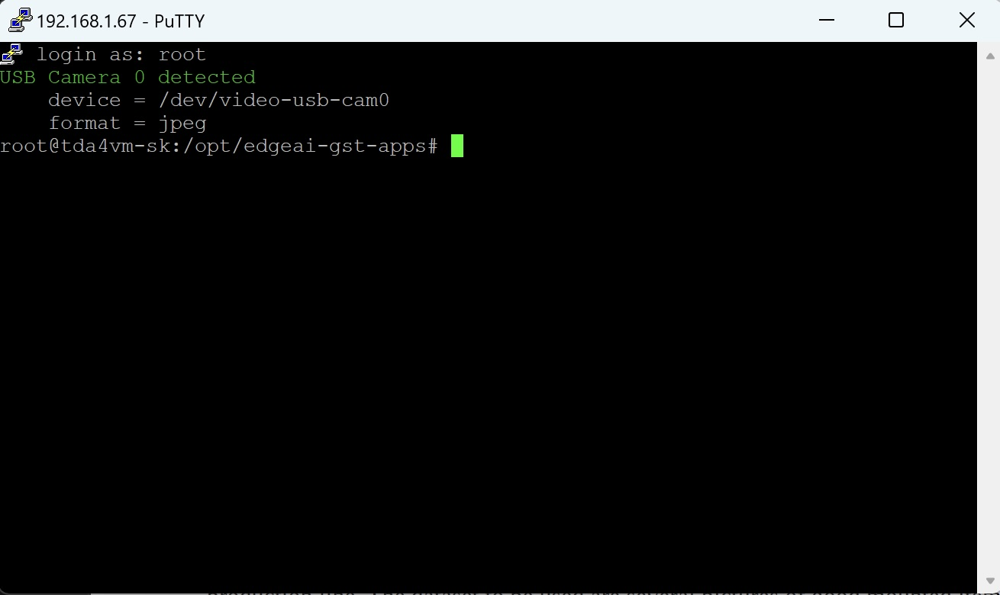

You should see the USB camera detected after the login.

The first thing to do on the board is to update `npm`:

```
npm install -g n
n lts
n latest
n prune
```

Then install Edge Impulse:

```
npm install -g --unsafe-perm edge-impulse-linux
```

Now you can check your camera focus by opening the stream at http://your-ip-address:4912.  For example, mine was http://192.168.1.67:4912.

## Data Collection


For this sample project the idea is to spot and alert about faulty electricity components in a production line. The dataset to be used is composed of hundreds of pictures of properly assembled, high quality items. 

- Upload around 100 pictures of correct, quality products to Edge Impulse using **No Anomaly** as the label
- In Impusle Design, Select Image Data, 96x96 pixels, and **Squash** as the resize mode.
- Select an Image processing block, and choose **FOMO-AD**.

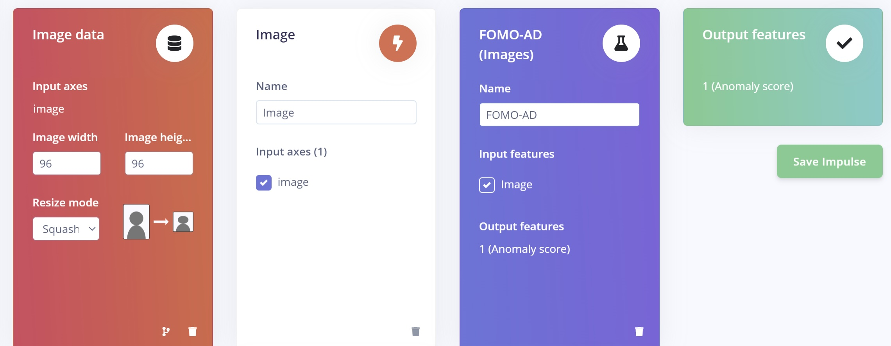

Proceed to **Generate features** and then configure the training settings.

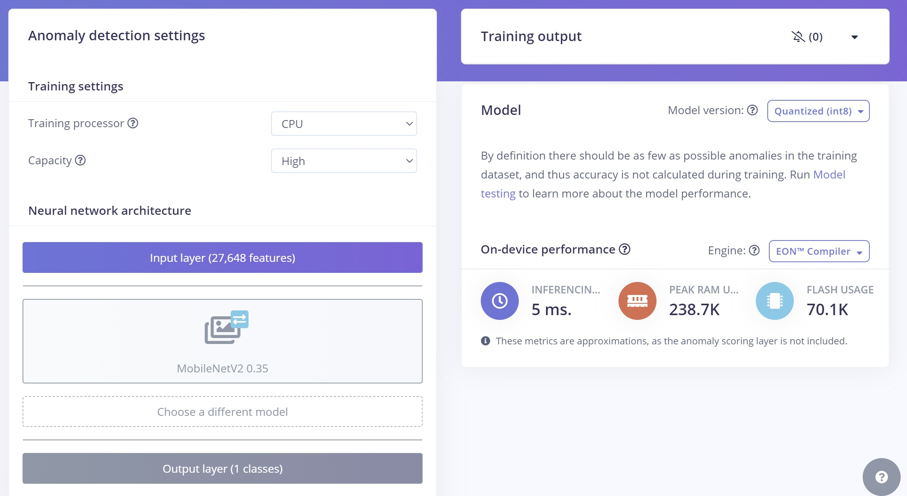

**Capacity setting**: the higher the capacity, the higher the number of Gaussian components, and the more adapted the model becomes to the original distribution.

For obvious reasons there should not be any anomalies in the training dataset and accuracy is not calculated here. 

To calculate F1 score if necessary, you could later upload a set of anomaly pictures and label them as **Anomaly**.

## Testing The Model

Every learning block has a threshold. This can be the minimum confidence that a neural network needs to have, or the maximum anomaly score before a sample is tagged as an anomaly. You can configure these thresholds to tweak the sensitivity of these learning blocks. This affects both live classification as well as model testing.

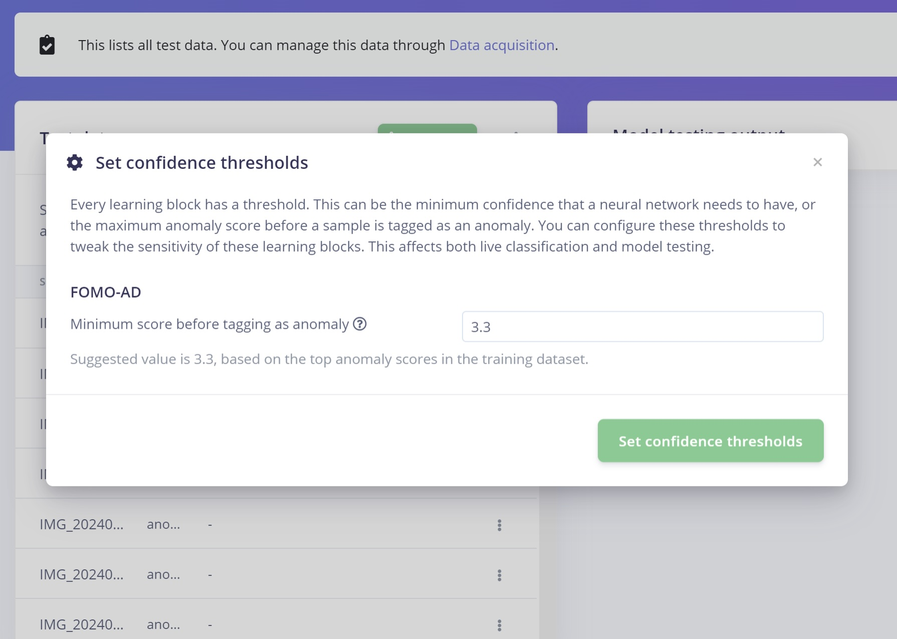

Choose **Model Testing** from the navigation, and you can click **Classify All** to analyze both global results and specific individual classifications.

## Understanding the Anomaly Matrix


All cells are assigned a cell background color based on the anomaly score, going from blue to red, with an increasing opaqueness. The cells with white borders are the ones that exceed the defined confidence threshold, signifiying an anomoly.

If you hover over a cell, you will see the specific score.

## Deployment

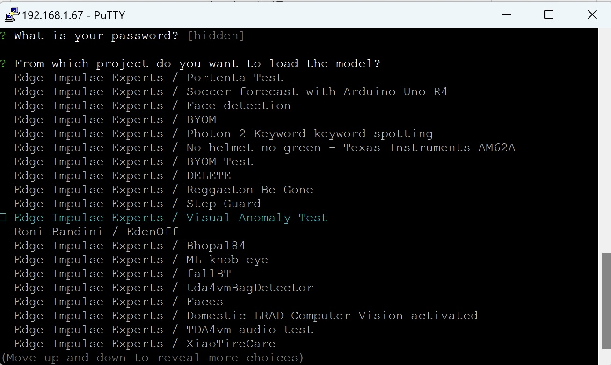

Now that the model is trained and tested, it is time to deploy it to the TDA4VM board.

Go back to SSH and execute:

```
edge-impulse-linux-runner 
```

> Note: the SoC's built-in AI accelerator (edge-impulse-linux-runner --force-engine tidl --force-target runner-linux-aarch64-tda4vm) does not work yet with Visual Anomaly for this board, but should soon.

Log in with your Edge Impulse credentials and select your Edge Impulse project.

> Note: If you need to change the threshold or make other changes to the model, you can re-download the model with `edge-impulse-linux-runner –reset`.

## Parsing the Runner Response

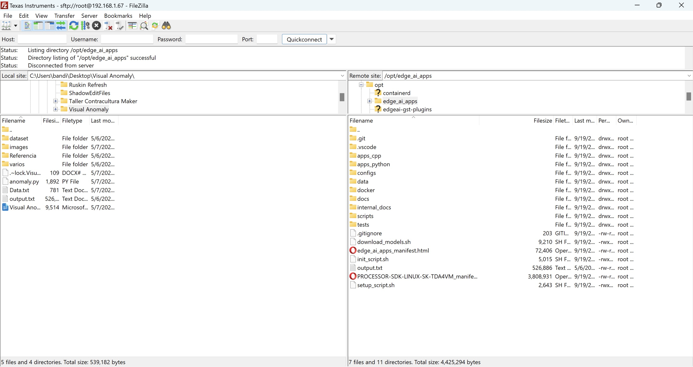

Connect with SFTP using the same SSH credentials, and upload the `anomaly.py` parsing script to the `/opt/edge_ai_apps` folder.

Now execute:

```
python3 anomaly.py
```

For each inference, the runner will return all the anomaly points with their coordinates using JSON such as:

```
{"height":19,"label":"anomaly","value":3.5148870944976807,"width":19,"x":38,"y":0}
```

The JSON will be parsed and a text matrix will be displayed showing the anomaly location: `X` for anomaly and `.` for no anomaly.

## Limitations

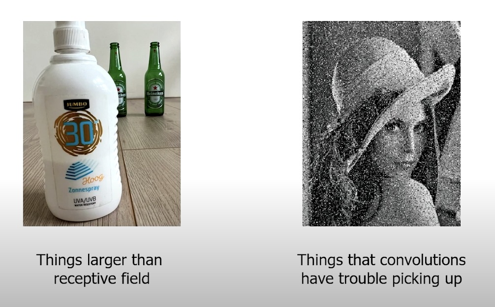

One limitation for Visual Anomaly Detection is having a dataset of noisy images. Convolutions can have trouble with these kinds of images and predictions may not be reliable. 

Another limitation is trying to spot things that are larger than receptive fields. In this case 2 models should be deployed, with the second model backing up the first the model, to add trust to the first model. 

## Final Notes

In conclusion, embracing FOMO-AD can revolutionize quality control, making it more efficient, accurate, and less burdensome for human workers.  

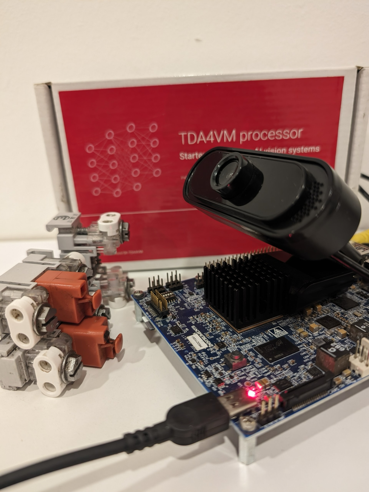

## Demo Video



## References

- [https://jakevdp.github.io/PythonDataScienceHandbook/05.12-gaussian-mixtures.html](https://jakevdp.github.io/PythonDataScienceHandbook/05.12-gaussian-mixtures.html)
- [https://www.youtube.com/watch?v=se9ZDBVKN1M](https://www.youtube.com/watch?v=se9ZDBVKN1M)
- [https://www.edge-ai-vision.com/2023/06/visual-anomaly-detection-with-fomo-ad-a-presentation-from-edge-impulse](https://www.edge-ai-vision.com/2023/06/visual-anomaly-detection-with-fomo-ad-a-presentation-from-edge-impulse) 
- [https://cumulusds.com/unveiling-the-hidden-cost-of-poor-quality-copq-on-construction-and-maintenance-projects](https://cumulusds.com/unveiling-the-hidden-cost-of-poor-quality-copq-on-construction-and-maintenance-projects)
