# Visual Anomaly Detection in Fabric using FOMO-AD

Created By: Naveen Kumar

Public Project Link: [https://studio.edgeimpulse.com/studio/384963](https://studio.edgeimpulse.com/studio/384963)

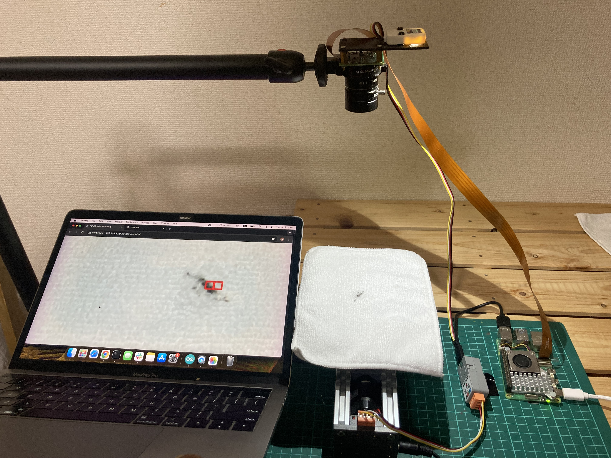

## Introduction

The current practice of anomaly detection in the textile industry predominantly relies on visual inspection by skilled workers, which, while effective, is subject to human error due to the vision fatigue and inattention. The industry has been exploring alternative methods such as spectrum-based, statistics-based, and combined approaches to enhance efficiency and accuracy. However, these methods often come with stringent sample requirements and may not be suitable for all types of textiles. Despite the progress, the industry continues to face challenges in generalizing these systems across the vast range of fabric types and colors, and in integrating them seamlessly into the existing production lines without disrupting the workflow.

In the pursuit of excellence in textile manufacturing, the detection of visual anomalies is crucial. This project is dedicated to developing a machine learning-based visual anomaly detection system to identify defects in fabrics, which can range from subtle pattern inconsistencies to noticeable flaws. The system is trained to learn from **good** samples to detect **anomalies**, offering a promising solution to the challenges of manual inspection and the limitations of other automated methods.

## Hardware Setup

For this project, we will use the latest **Raspberry Pi 5** and the **Raspberry High-Quality Camera** with a **6mm 3MP Wide Angle Lens**. Fabrics can have a wide range of anomalies, from tiny pinholes to subtle variations in texture or color. High-resolution cameras provide detailed images that can improve the accuracy of defect detection algorithms, reducing false positives and negatives. 

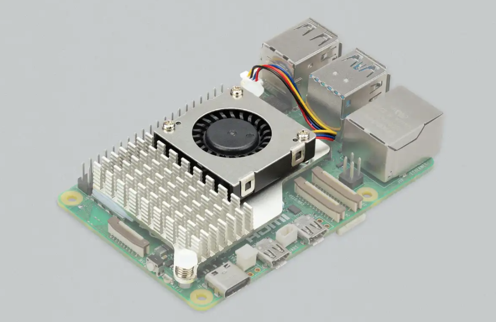


Although this system will be a proof of concept, we will use an **M5Stack 6060-PUSH Linear Motion Control** to keep it close to an industrial setup. Linear motion platforms provide precise control over the movement of the inspection system, allowing for accurate positioning. The stable movement of a linear motion platform is ideal for use with high-resolution cameras, ensuring that the images captured are clear and free of motion blur, which is crucial for detecting anomalies.

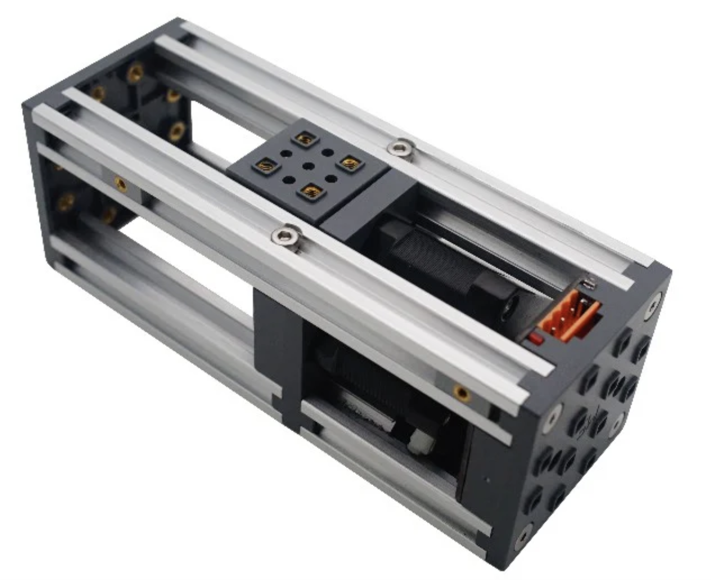

The 6060-PUSH Linear Motion Control is based on a stepper motion controlled over RS485 communication protocol. We will use an **M5Stack Atom Lite** (ESP32) with an **ATOMIC RS485 Base** to control its movement. Also, we will use the **M5Stack Flashlight Unit** as an overhead lighting system to ensure the fabric is evenly lit, providing consistent lighting conditions. It prevents shadows or highlights that could be mistaken for defects.  The flashlight is connected to the Atom Lite using a Grove connector. 

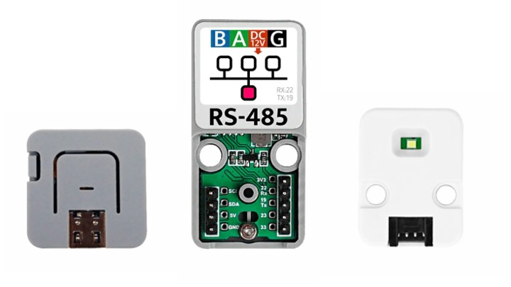

We have designed and 3D-printed a base plate with a Lego connector for the Flashlight Unit to mount on the top of the Raspberry PI High-Quality Camera. The overhead lighting positioned correctly can reduce glare, which might otherwise interfere with the camera's ability to detect anomalies.

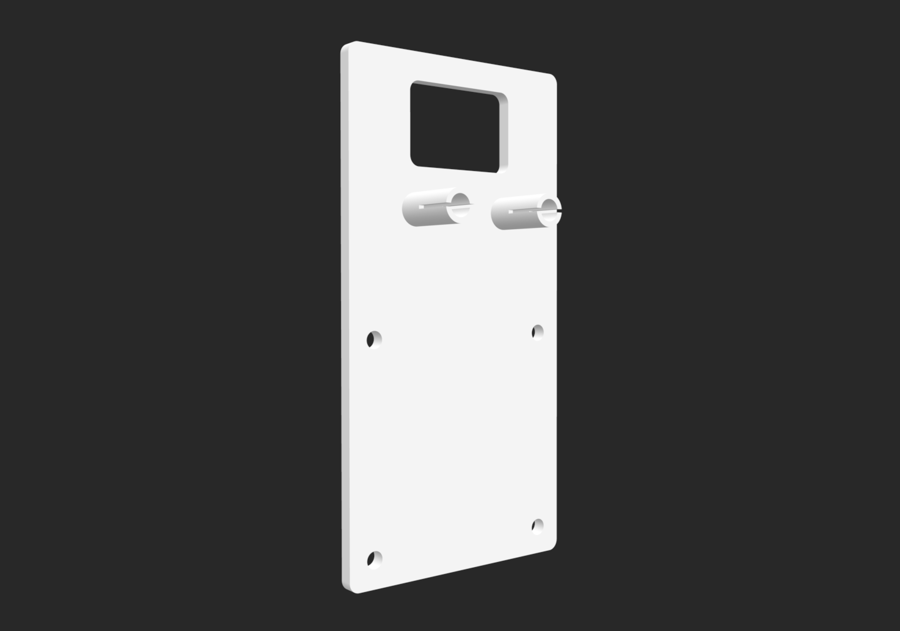

The flashlight unit with the camera looks as it is shown below.

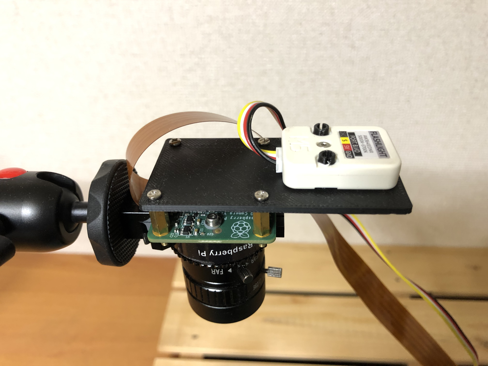

We have used a metal prototyping plate as a platform for the fabrics.

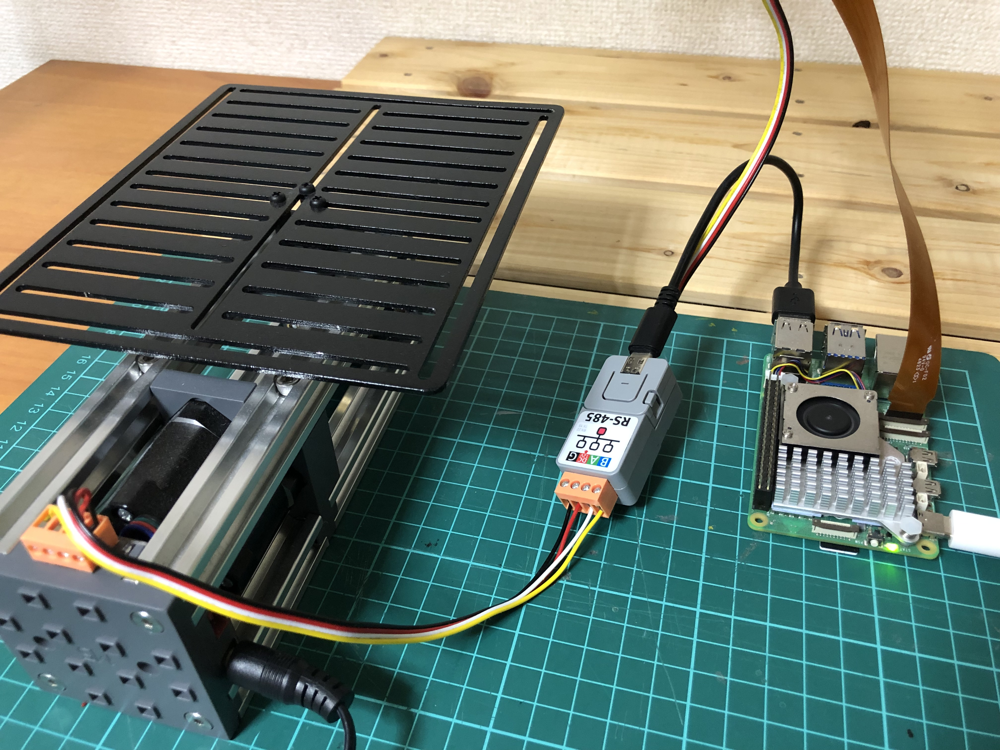

We have used a desk camera stand to mount the overhead camera and lighting assembly. The M5 Atom Lite is connected to the Raspberry Pi 5 over the USB connection. The final hardware setup looks as follows. 

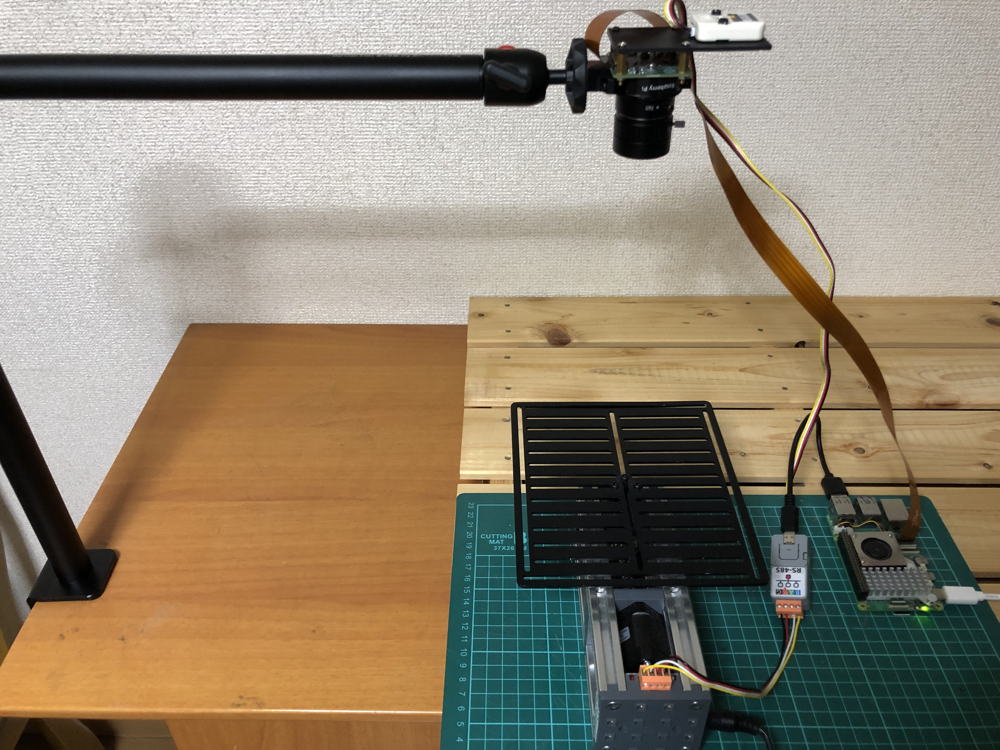

## Data Collection

We are using a set of dust cloths as the fabric.

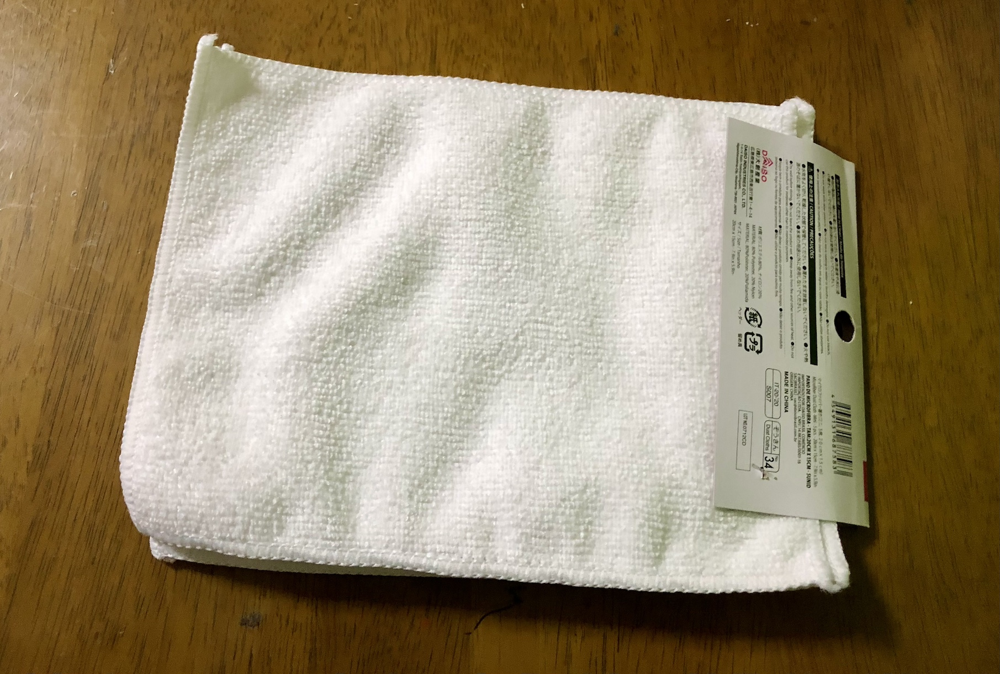

We will be using a Python script for the data collection. The code below is used for streaming the images over the network and can be displayed on a web page. It will be imported by the data collection and inferencing scripts. 

File: *Stream.py*

```
import io
import logging
import socketserver
from http import server
from threading import Thread, Condition

class StreamingOutput(io.BufferedIOBase):
    def __init__(self):
        self.frame = None
        self.condition = Condition()

    def write(self, buf):
        with self.condition:
            self.frame = buf
            self.condition.notify_all()

class StreamingHandler(server.BaseHTTPRequestHandler):
    @classmethod
    def set_stream_output(self, output):
        self.output = output

    @classmethod
    def set_page(self, title, width, height):
        self.PAGE= f"""\
        <html>
          <head><title>{title}</title></head>
          <body>
            <h1>{title}</h1>
            
         </body>
        </html>
        """

def do_GET(self):
    if self.path == '/':
        self.send_response(301)
        self.send_header('Location', '/index.html')
        self.end_headers()
    elif self.path == '/index.html':
        content = self.PAGE.encode('utf-8')
        self.send_response(200)
        self.send_header('Content-Type', 'text/html')
        self.send_header('Content-Length', len(content))
        self.end_headers()
        self.wfile.write(content)
    elif self.path == '/stream.mjpg':
        self.send_response(200)
        self.send_header('Age', 0)
        self.send_header('Cache-Control', 'no-cache, private')
        self.send_header('Pragma', 'no-cache')
        self.send_header('Content-Type', 'multipart/x-mixed-replace; boundary=FRAME')
        self.end_headers()
        try:
            while True:
                with self.output.condition:
                    self.output.condition.wait()
                    frame = self.output.frame
                self.wfile.write(b'--FRAME\r\n')
                self.send_header('Content-Type', 'image/jpeg')
                self.send_header('Content-Length', len(frame))
                self.end_headers()
                self.wfile.write(frame)
                self.wfile.write(b'\r\n')
        except Exception as e:
            logging.warning(
              'Removed streaming client %s: %s',
              self.client_address, str(e))
    else:
        self.send_error(404)
        self.end_headers()

class StreamingServer(socketserver.ThreadingMixIn, server.HTTPServer):
    allow_reuse_address = True
    daemon_threads = True
```

The script below is used to capture the image from the camera and save it to the Raspberry Pi 5 storage.

File: *capture_image.py*

```
import cv2
import logging
import serial
import numpy as np
from picamera2 import Picamera2
from threading import Thread
from Stream import StreamingOutput, StreamingHandler, StreamingServer

def capture_thread(output):
    try:
        picam2 = Picamera2()
        crop_w, crop_h = 1920, 1920
        full_res = 4056, 3040
        roi = (int((full_res[0]-crop_w)/2), int((full_res[1]-crop_h)/2), crop_w, crop_h)
        picam2.preview_configuration.main.size = (640, 640)
        picam2.preview_configuration.main.format = "RGB888"
        picam2.preview_configuration.controls.ScalerCrop = roi
        picam2.preview_configuration.align()
        picam2.configure("preview")
        picam2.start()
        ser = serial.Serial('/dev/ttyUSB0', 115200)
 
        count = 0
        while True:
            img = picam2.capture_array()
            _, buf = cv2.imencode('.jpg', img)
            output.write(buf)
            if ser.in_waiting > 0:
                if ser.read(1) == b'1':
                    filename = f'data/no_anomaly.{count:03}.jpg'
                    cv2.imwrite(filename, img)
                    count += 1
                    logging.info(filename)
                ser.reset_input_buffer()
    except Exception as ex:
        logging.info(ex)
    finally:
        if picam2:
            picam2.stop()
        if ser:
            ser.close()

if __name__ == "__main__":
    logging.basicConfig(format='%(asctime)s: %(message)s', level=logging.INFO, datefmt='%H:%M:%S')

    output = StreamingOutput()
    StreamingHandler.set_stream_output(output)
    StreamingHandler.set_page('FOMO-AD Data collection', 640, 640)
    server = StreamingServer(('', 8000), StreamingHandler)
    ser = serial.Serial('/dev/ttyUSB0', 115200)
    th = Thread(target=capture_thread, args=(output,))
    th.start()

    logging.info("Server started at 0.0.0.0:8000")

    try:
        server.serve_forever()
    except KeyboardInterrupt:
        logging.info("Capture stopped")
```

The Arduino sketch below should be uploaded to the M5 Atom Lite (ESP32) to control the flashlight and send a message to Raspberry Pi 5 to trigger the camera.

File: *data_collection.ino*

```
#include "M5Atom.h"

#define FLASH_EN_PIN 26

bool longPressed = false;
bool flash_enabled = false;
unsigned long lastLongPressed = 0;
int brightness = 0;

void setup() {
  Serial.begin(115200);
  pinMode(FLASH_EN_PIN, OUTPUT);
  digitalWrite(FLASH_EN_PIN, LOW);
}

void loop() {
  if (M5.Btn.pressedFor(1000)) {
    if (M5.Btn.lastChange() - lastLongPressed > 0) {
      longPressed = true;
      flash_enabled = !flash_enabled;
      brightness += 1;
      
      if (brightness > 3) {
        brightness = 0;
      }
      
      unit_flash_set_brightness(brightness);
      lastLongPressed = M5.Btn.lastChange();
    }
  }

  if (M5.Btn.wasReleased()) {
    if (longPressed) {
      longPressed = false;
    } else {
      Serial.print(0x01);
    }
  }

  M5.update();
}

void unit_flash_set_brightness(uint8_t brightness) {
  if ((brightness >= 1) && (brightness <= 16)) {
    for (int i = 0; i < brightness; i++) {
      digitalWrite(FLASH_EN_PIN, LOW);
      delayMicroseconds(4);
      digitalWrite(FLASH_EN_PIN, HIGH);
      delayMicroseconds(4);
    }
  } else {
    digitalWrite(FLASH_EN_PIN, LOW);
  }
}
```

Now execute the command below to start the data collection process.

```
$ python3 capture_image.py
```

We have collected a total of 93 images of the fabric mostly with the label **No Anomaly**. The images without any anomalies are required by the **FOMO-AD** learning block that we will be using for the training.  A few images with fabricated anomalies are taken for testing the model.  A few example images are shown below.

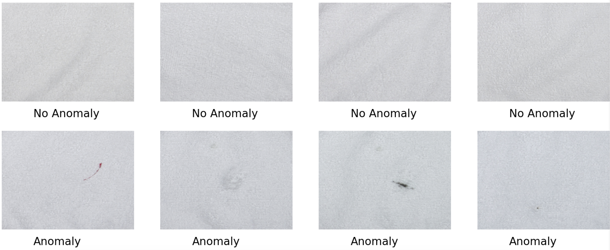

## Data Collection Demo



## Uploading Data to Edge Impulse Studio

We need to create a new project to upload data to Edge Impulse Studio.

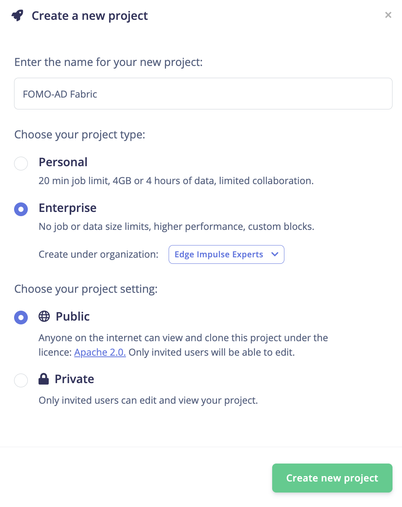

The data is uploaded using the Edge Impulse CLI. Please follow the instructions to install the CLI here: https://docs.edgeimpulse.com/docs/cli-installation. Please remember to execute the following command to upload the **No Anomaly** images only for the training. 

```
$ edge-impulse-uploader --category training  --label "No Anomaly" no_anomaly.*.jpg
```

We can add a few Anomaly/No Anomaly images to the testing set using the following commands.

```
$ edge-impulse-uploader --category testing  --label "No Anomaly" no_anomaly.*.jpg
$ edge-impulse-uploader --category testing  --label "No Anomaly" anomaly.*.jpg
```

We can see the uploaded datasets on the Edge Impulse Studio's **Data Acquisition** page.

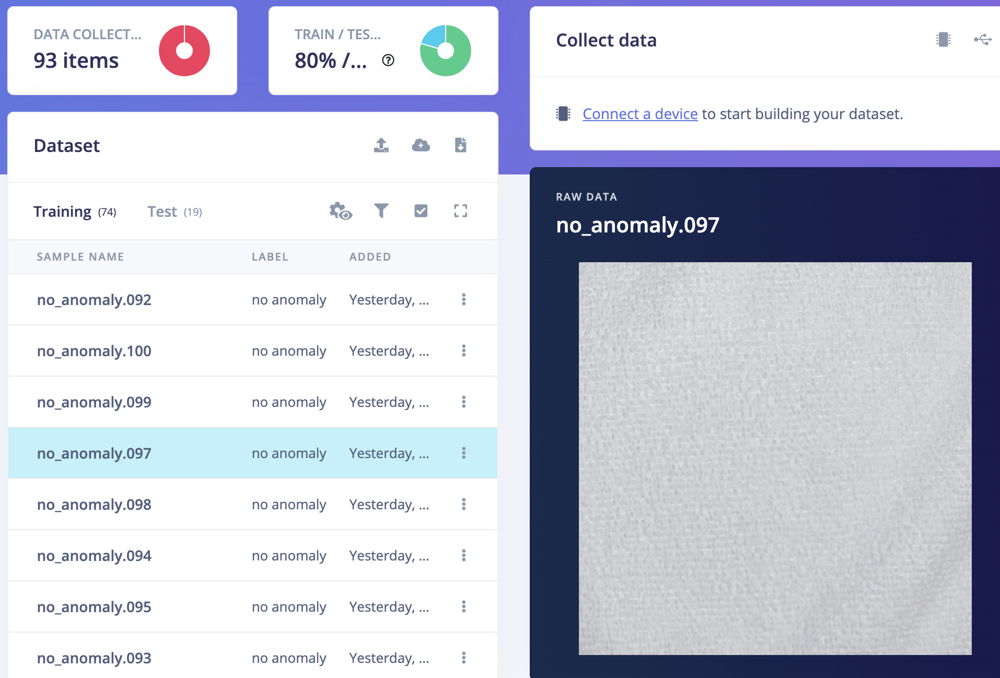

## Training

Go to the **Impulse Design** > **Create Impulse** page, click **Add a processing block**, and then choose **Image**, which preprocesses and normalizes image data, and optionally reduces the color depth. Also, on the same page, click **Add a learning block**, and choose **FOMO-AD (Images**), which finds outliers in new data, extracts visual features using a pre-trained model on the data, and a Gaussian mixture model (GMM). 

A Gaussian Mixture Model represents a probability distribution as a mixture of multiple Gaussian (normal) distributions. Each Gaussian component in the mixture represents a cluster of data points with similar characteristics. Thus, GMMs work using the assumption that the samples within a dataset can be modeled using different Gaussian distributions. Anomaly detection using GMM involves identifying data points with low probabilities. If a data point has a significantly lower probability of being generated by the mixture model compared to most other data points, it is considered an anomaly; this will output a high anomaly score.

We are using an image size of **640x640**, which is required for better model accuracy. Now click on the **Save Impulse** button.

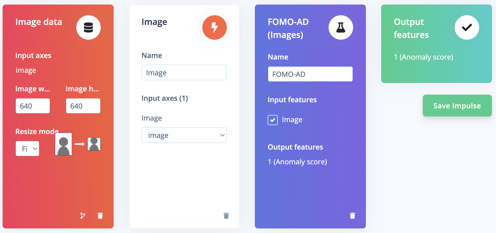

Next, go to the **Impulse Design** > **Image** page set the **Color depth** parameter as RGB, and click the **Save parameters** button which redirects to another page where we should click on the **Generate Feature** button. It usually takes a couple of minutes to complete feature generation.

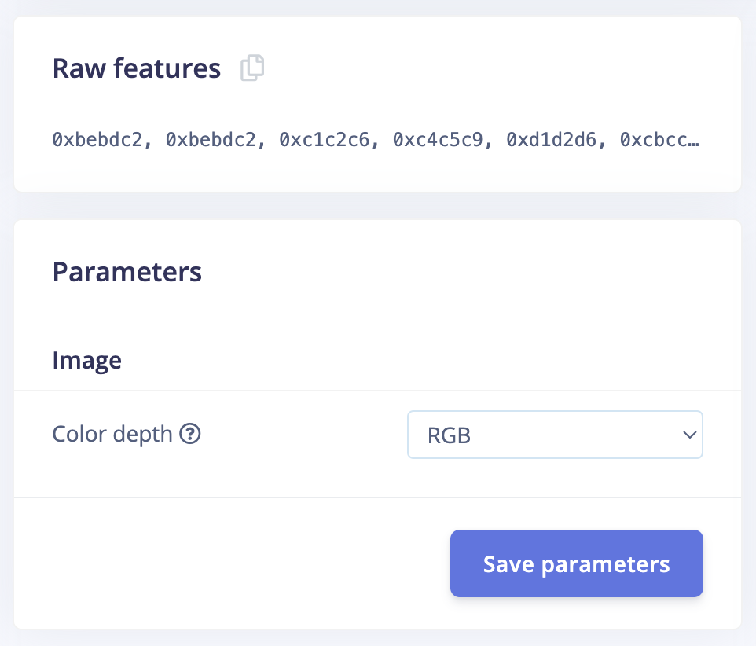


We can see the 2D visualization of the generated features in the **Feature Explorer**.

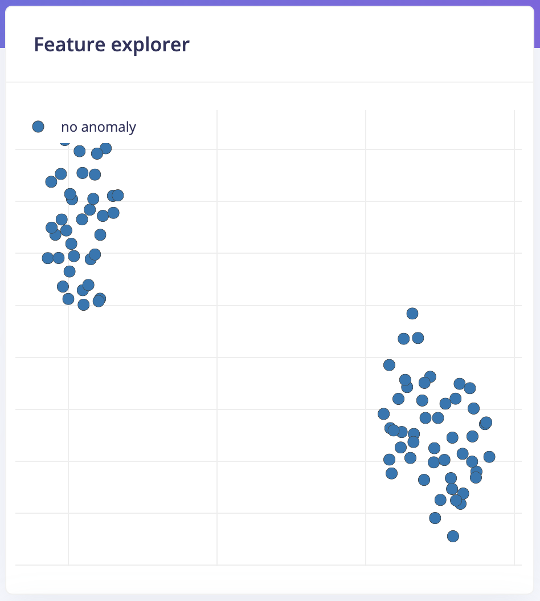

Now go to the **Impulse Design** > **FOMO-AD** page and choose the Neural Network architecture. We are using the **MobileNetV2** **0.35** transfer learning model with the pre-trained weight provided by the Edge Impulse Studio. Also, we have chosen the **Capacity** parameter as medium. The higher the capacity, the higher the number of (Gaussian) components, and the more adapted the model becomes to the original distribution.

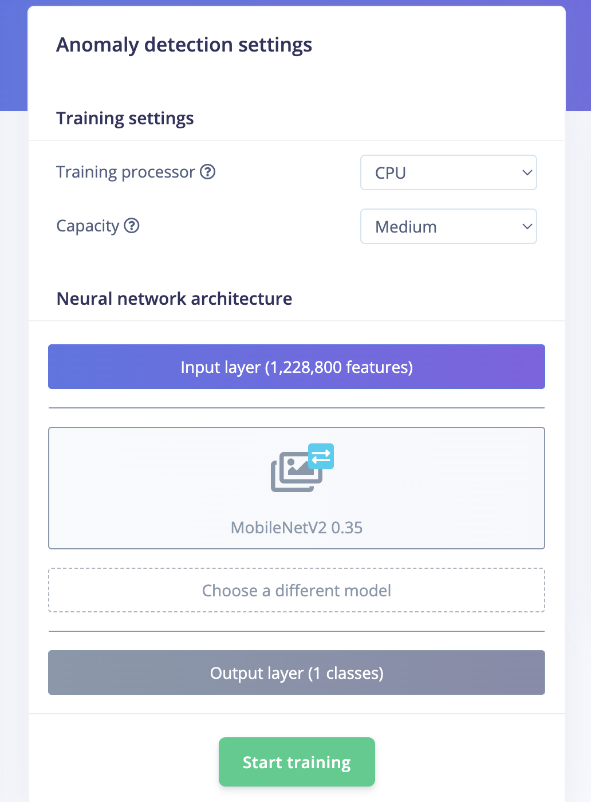

Now click the **Start Training** button and wait until the training is completed. By definition, there should be as few as possible anomalies in the training dataset, and thus accuracy is not calculated during training. Later we will run the Model testing to learn more about the model performance. On completion, It displays the estimated On-device performance of the Raspberry Pi for the EON Compiler engine.

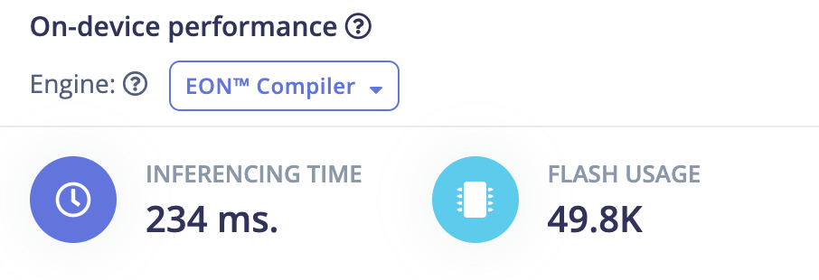

## Testing

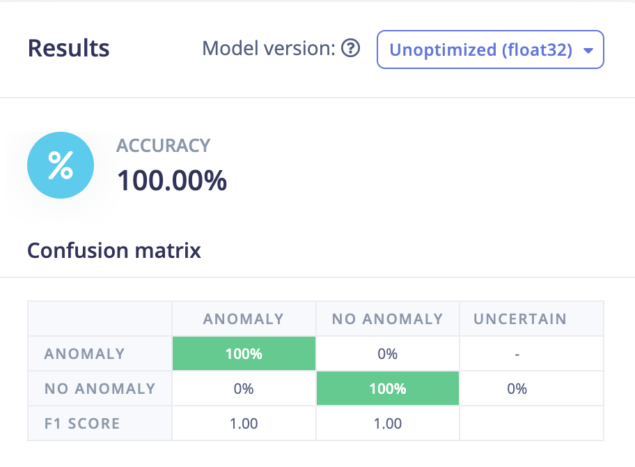

## Model Deployment

Please ensure to visit the **Deployment** page, select **Linux (AARCH64)** as the deployment target, and click on **Build** at the bottom of the page. An **eim** model (an Edge Impulse packaged model) will be downloaded to the computer.

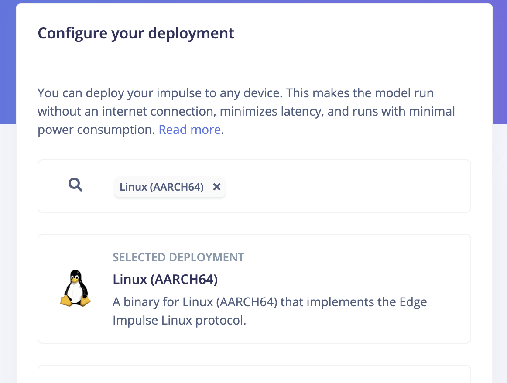

We should copy the model file to the Raspberry Pi 5 and make it an executable. 

```
$ chmod +x ad-c-linux-aarch64-v8.eim
```

The Python script (below) is responsible for loading the model, capturing the image, performing inferencing, and displaying the results on the web page. 

File: *classify-camera.py*

```
import cv2
import os
import logging
import serial
import numpy as np
from edge_impulse_linux.image import ImageImpulseRunner
from picamera2 import Picamera2
from threading import Thread
from Stream import StreamingOutput, StreamingHandler, StreamingServer

def ei_runner_thread(modelfile, output, picam2, ser):
    with ImageImpulseRunner(modelfile) as runner:
        model_info = runner.init()
        show_anomaly = False
        try:
            while True:
                if ser.in_waiting > 0:
                    byte = ser.read(1)
                    if byte == b'0':
                        show_anomaly = False
                        logging.info("Display anomaly disabled")
                    if byte == b'1':
                        show_anomaly = True
                        logging.info("Display anomaly enabled")

                img = picam2.capture_array()
                pixels = img.flatten().tolist()
                features = []
                for ix in range(0, len(pixels), 3):
                    r = pixels[ix + 0]
                    g = pixels[ix + 1]
                    b = pixels[ix + 2]
                    features.append((r << 16) + (g << 8) + b)
                try:
                    res = runner.classify(features)
                except Exception as e:
                    print("Unhandled exception: restarting the runner")
                    runner.stop()
                    model_info = runner.init()
                    continue

                if "visual_anomaly_grid" in res["result"].keys():
                    if show_anomaly:
                        for grid_cell in res["result"]["visual_anomaly_grid"]:
                            start_point = (int(grid_cell['x']), int(grid_cell['y']))
                            end_point  = (int(grid_cell['x'] + grid_cell['width']), int(grid_cell['y'] + grid_cell['height']))
                            img = cv2.rectangle(img, start_point, end_point, (0, 0, 255), 2)
                 _, buf = cv2.imencode('.jpg', img)
                 output.write(buf)
        finally:
            if runner:
                runner.stop()

if __name__ == "__main__":
logging.basicConfig(format='%(asctime)s: %(message)s', level=logging.INFO, datefmt='%H:%M:%S')
model = "ad-c-linux-aarch64-v8.eim"
dir_path = os.path.dirname(os.path.realpath(__file__))
modelfile = os.path.join(dir_path, model)

picam2 = Picamera2()
crop_w, crop_h = 1920, 1920
full_res = 4056, 3040
picam2.preview_configuration.main.size = (640, 640)
picam2.preview_configuration.main.format = "RGB888"
picam2.preview_configuration.controls.ScalerCrop = (int((full_res[0]-crop_w)/2), int((full_res[1]-crop_h)/2), crop_w, crop_h)
picam2.preview_configuration.align()
picam2.configure("preview")
picam2.start()

output = StreamingOutput()
StreamingHandler.set_stream_output(output)
StreamingHandler.set_page('FOMO-AD Inferencing', 640, 640)
server = StreamingServer(('', 8000), StreamingHandler)
ser = serial.Serial('/dev/ttyUSB0', 115200)
th = Thread(target=ei_runner_thread, args=(modelfile, output, picam2, ser))
th.start()

logging.info("Server started at 0.0.0.0:8000")
try:
    server.serve_forever()
except KeyboardInterrupt:
    logging.info("Capture stopped")
finally:
    if picam2:
        picam2.stop()
    if ser:
        ser.close()
```


Please execute the script as follows.

```
$ python3 classify-camera.py

01:30:50: Configuration successful!
01:30:50: Camera started
01:30:50: Server started at 0.0.0.0:8000
```

Also, we need to upload the following  Arduino Sketch to M5 Atom which controls the Linear Motion Control and the flashlight automatically on button press.

```
#include "M5Atom.h"
#define RX_PIN      22
#define TX_PIN      19
#define FLASH_EN_PIN 26

enum P_State {
  P_START,
  P_END
};

P_State state = P_START;

void unit_flash_set_brightness(uint8_t brightness) {
  if ((brightness >= 1) && (brightness <= 16)) {
    for (int i = 0; i < brightness; i++) {
      digitalWrite(FLASH_EN_PIN, LOW);
      delayMicroseconds(4);
      digitalWrite(FLASH_EN_PIN, HIGH);
      delayMicroseconds(4);
    }
  } else {
    digitalWrite(FLASH_EN_PIN, LOW);
  }
}


void setup() {
  Serial.begin(115200);
  Serial2.begin(9600, SERIAL_8N1, RX_PIN, TX_PIN);
  delay(50);
  Serial2.print("ID=123\r\n");
  delay(50);
  Serial2.print("ID123Z\r\n");
  delay(50);
  pinMode(FLASH_EN_PIN, OUTPUT);
  digitalWrite(FLASH_EN_PIN, LOW);
}

bool flash = false;

void loop() {
  if (M5.Btn.wasPressed()) {
    state = (state == P_START) ? P_END : P_START;

    if (state == P_START) {
      Serial2.printf("ID123:X%d\r\n", 1);
    }

    if (state == P_END) {
      Serial2.printf("ID123:X%d\r\n", 42);
    }

    delay(10);

    while (true) {
      Serial2.print("ID123P\r\n");
      delay(50);

      if (Serial2.available()) {
        float pos = Serial2.parseFloat();
        if (pos == 0) {
          continue;
        }
        if ( state == P_START) {
          if (pos <= 30) {
            if (flash == true) {
              unit_flash_set_brightness(0);
              Serial.println(0x00);
              flash = false;
            }
          }

          if (pos < 2) {
            break;
          }
        }

        if ( state == P_END) {
          if (pos >= 30) {
            if (flash == false) {
              unit_flash_set_brightness(5);
              flash = true;
            }
          }

          if (pos >= 41) {
            delay(100);
            Serial.println(0x01);
            break;
          }
        }
      }
    }
  }
  M5.update();
}
```

## Inferencing Demo

The following video demonstrates the operation of the systems. Any anomalies found are displayed using square bounding boxes. The inference bounding boxes are shown only when the Linear Motion Control stops moving, to ensure that the entire fabric is within the camera's region of interest (ROI). 



## Conclusion

This project aims to revolutionize the field of textile quality control through the application of machine learning for visual anomaly detection. By utilizing cutting-edge technology, such as the Edge Impulse **FOMO-AD,** we can significantly elevate the standards of fabric inspection and maintain the integrity of the textile industry.

