# Predictive Maintenance - Commercial Printer - Sony Spresense + CommonSense

Created By: [Zalmotek](https://zalmotek.com)

Public Project Link: 
 - [https://studio.edgeimpulse.com/studio/139770](https://studio.edgeimpulse.com/studio/139770) - VoC
 - [https://studio.edgeimpulse.com/studio/140871](https://studio.edgeimpulse.com/studio/140871) - Vibration
 
GitHub Repo:

[https://github.com/Zalmotek/edge-impulse-predictive-maintenance-vibration-commonsense-sony-spresense](https://github.com/Zalmotek/edge-impulse-predictive-maintenance-vibration-commonsense-sony-spresense) 

## Introduction

Predictive maintenance can help you avoid costly downtime and repairs, by predicting when equipment is going to fail. This allows you to schedule maintenance before the problem occurs. Additionally, predictive maintenance can improve safety by identifying potential hazards before they cause an accident. This allows companies to take steps to prevent accidents from occurring. And last but not least, predictive maintenance can help avoid costly downtime and repairs by predicting when equipment is going to fail. This allows you to schedule maintenance before the problem occurs, instead of waiting for something to break.

## The Challenge

The machineries present in a print shop include printers, copiers, and scanners. These machines are used to print, copy, and scan documents. Additionally, there are often other machines present in a print shop such as shredders and laminators.

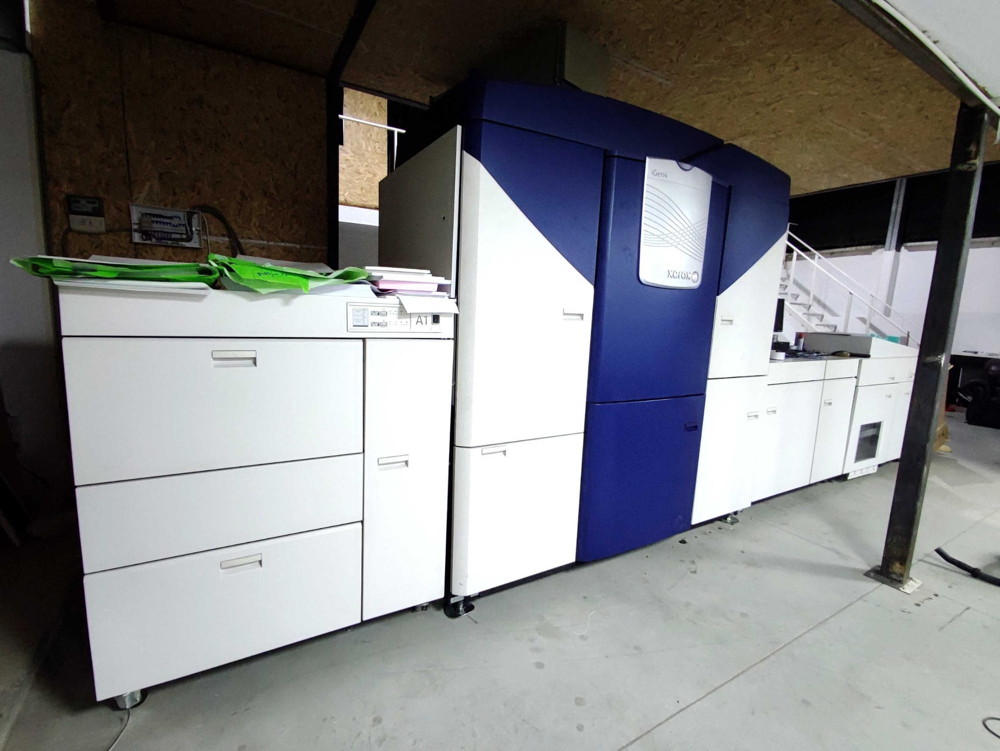

One of our clients has a Xerox iGen4 machine in its print shop, and while the machine has been launched a few years ago when it's properly maintained and cared for it can still be used to print materials. Some common problems with Xerox iGen4 print machines include paper jams, toner issues, and printer errors. These problems can cause the machine to fail and result in lost production. Additionally, these problems can also be safety hazards if they are not fixed. While the unit has basic features to identify the above problems in their interface once you start using the machine there are some blind spots that you cannot safely detect.

The air quality in a print shop can be dangerous because of the chemicals used in the printing process. These chemicals can be harmful to your health if you are exposed to them for too long. 

## Our Solution

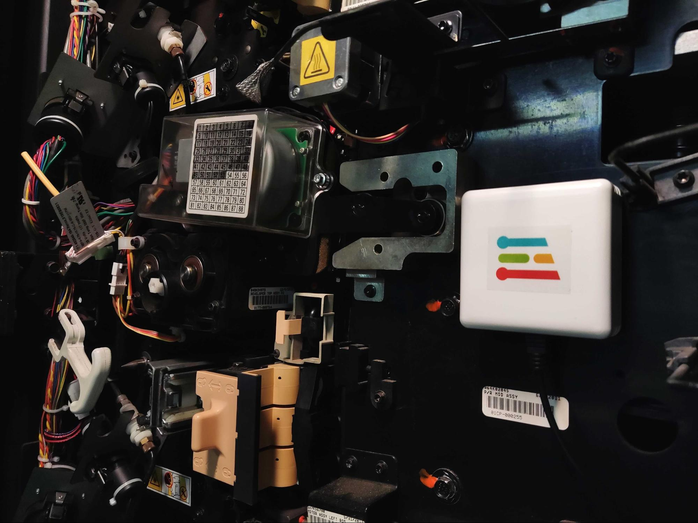

If a print shop has equipment that is predicted to fail, they can schedule maintenance and repairs before the equipment actually fails. This can help avoid costly downtime and lost production. Additionally, if predictive maintenance can identify potential hazards, the print shop can take steps to prevent accidents from occurring.

Our client needed some extra peace of mind and informed us where issues usually arise. We have chosen the Sony Spresense development board paired with the CommonSense expansion board to monitor vibrations and air quality by being placed directly inside the print unit in key points where they could detect issues and report them in real time.

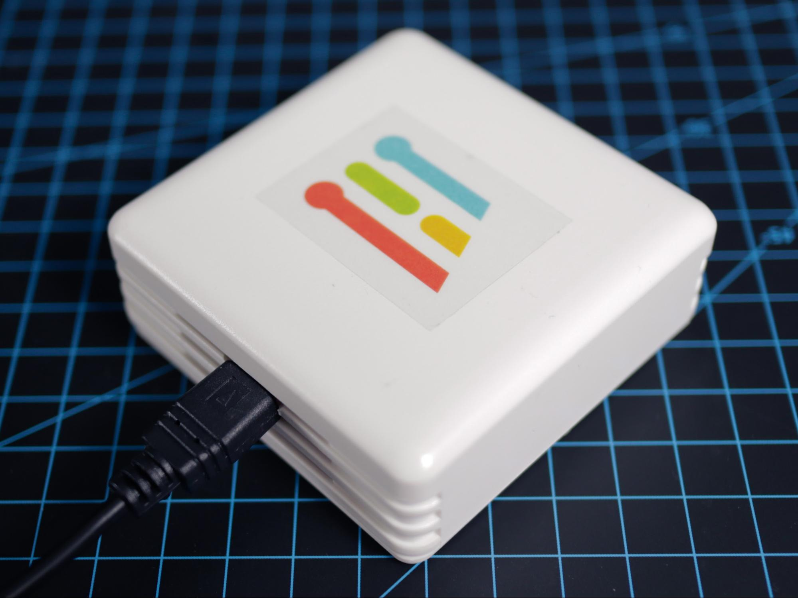

The Sony Spresense development board is a processor developed by Sony for IoT and sensing applications. The main board can be operated alone or with the extension board. The Spresense uses Sony’s new chipset on the main board: the CXD5602 System on Chip (SoC) multi core processor with GNSS and the the CXD5247 power management and audio analog interface chip.

The CommonSense expansion board created by SensiEdge provides an array of very useful sensors that can be used with the Sony Spresense board to capture the data we are interested in, especially the vibration sensor and the air quality one.

### Hardware Requirements
- [Sony Spresense](https://developer.sony.com/develop/spresense/)
- [CommonSense expansion board developed by SensiEdge](https://www.sensiedge.com/commonsense)
- Enclosure with wall mount options

### Software Requirements
- Edge Impulse account
- Arduino CLI
- Edge Impulse CLI
- Git

## Hardware Setup

The Spresense main board has the following features: Sony’s CXD5602 Processor, 8 MB Flash memory, PCB with small footprint, Dedicated camera connector, GNSS (GPS) antenna, Pins and LEDs, Multiple GPIO (UART, SPI, I2C, I2S), 2 ADC channels, Application LED x 4 (Green), Power LED (Blue), USB serial port.

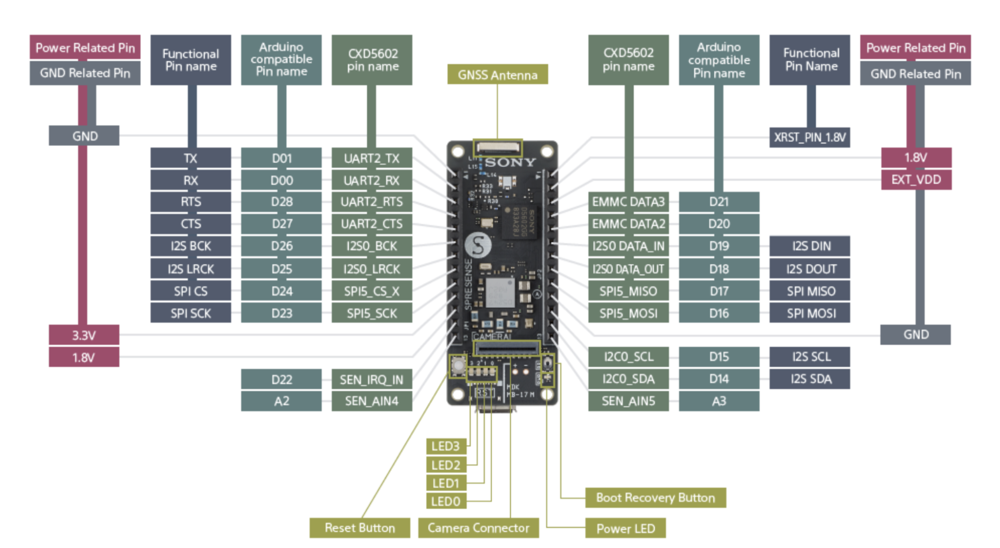

From the CommonSense expansion board we are interested in LSM6DS3: inertial module: 3D accelerometer and 3D gyroscope and the SGP-40: Air quality sensor:

The LSM6DS3 is a system-in-package featuring a 3D digital accelerometer and a 3D digital gyroscope. Enabling always-on low-power features for an optimal motion experience.

The SGP40 is a digital gas sensor designed for easy integration into air purifiers or demand controlled ventilation systems. Sensirion’s CMOSens ® technology offers a complete , easy to use sensor system on a single chip featuring a digital I2C interface and a temperature controlled micro hotplate, providing a humidity compensated VOC based indoor air quality signal . The output signal can be directly processed by Sensirion’s powerful VOC Algorithm to translate the raw signal into a VOC Index as a robust measure for indoor air quality. The VOC Algorithm automatically adapts to the environment the sensor is exposed to.


The CommonSense can be plugged directly in the Sony Spresense since its pins are matching perfectly.

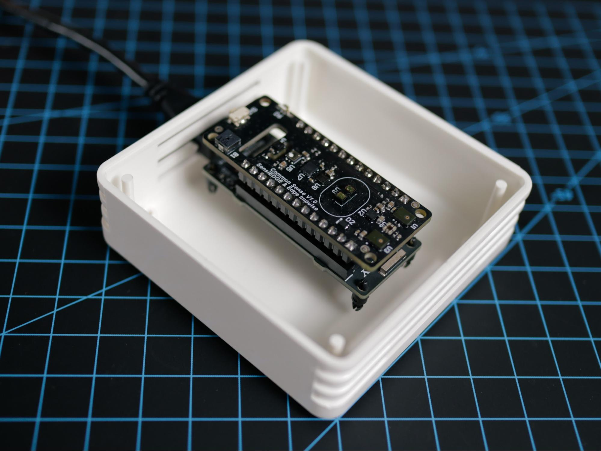

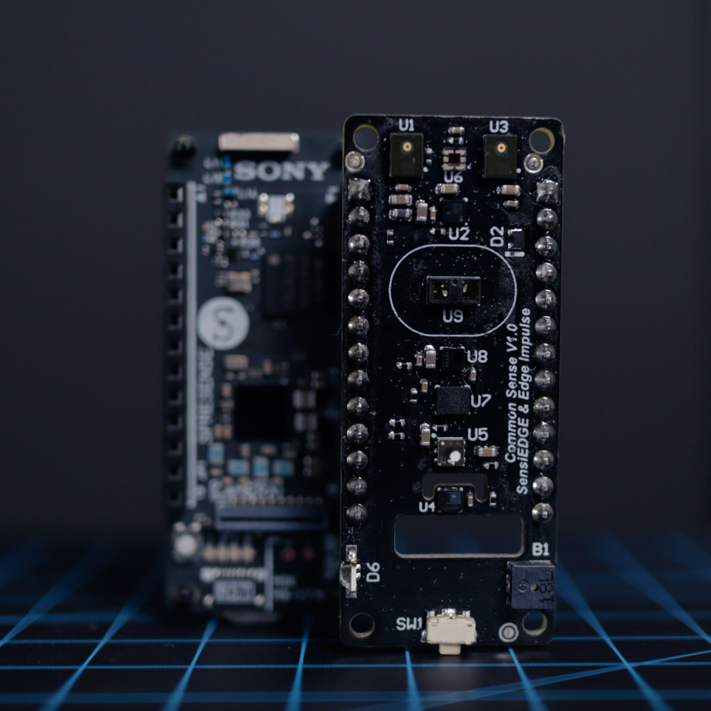


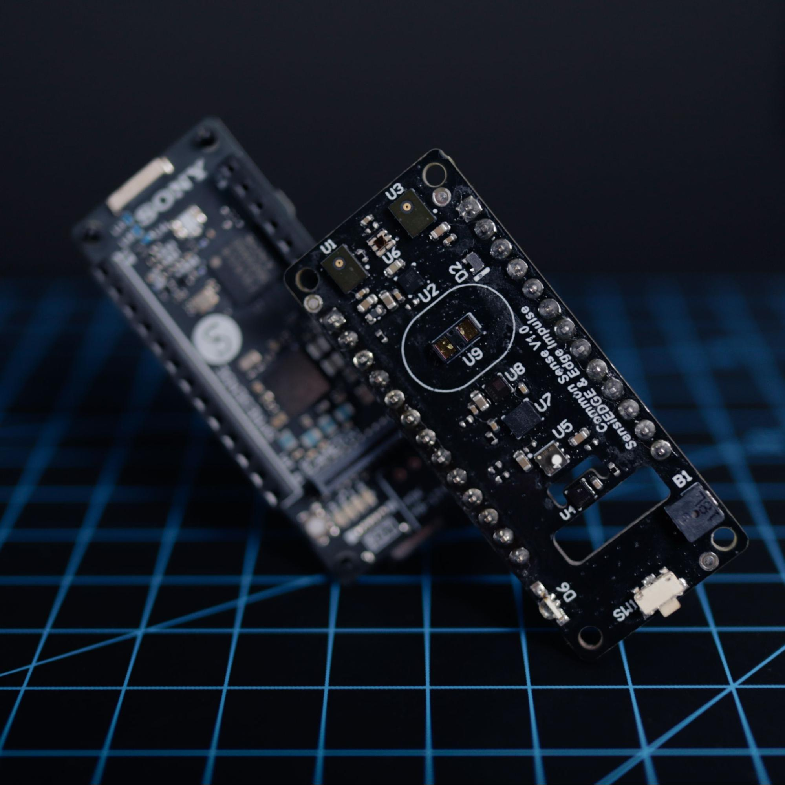

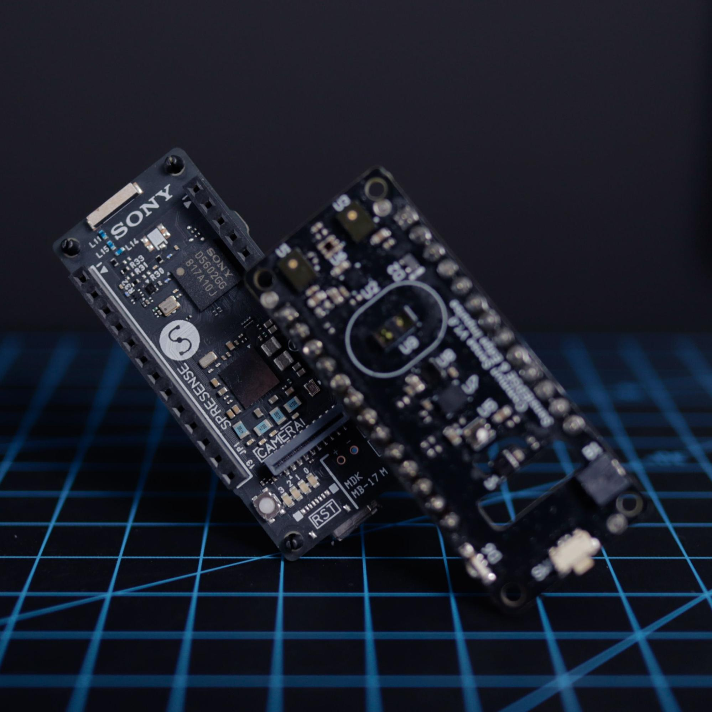

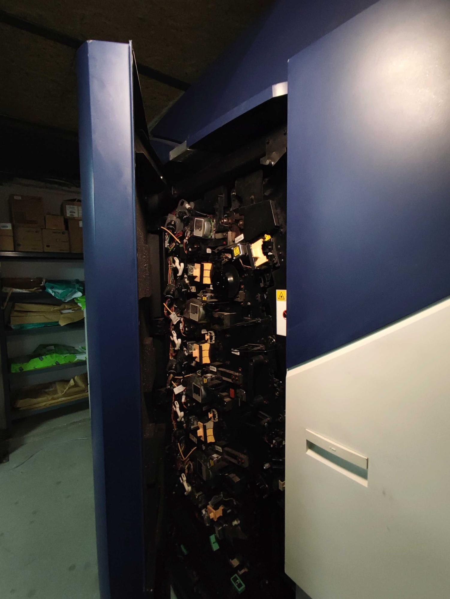

## Software Setup

### Setting up the Build Environment

#### Gnu Arm Embedded Toolchain

The first step in setting up the build environment for the Sony Spresense board equipped with the Common Sense expansion board is installing the GNU Arm Embedded Toolchain.

Determine the latest version of the toolchain:

```
$ARM_TOOLCHAIN_VERSION=$(curl -s https://developer.arm.com/downloads/-/gnu-rm | grep -Po '<h3>Version \K.+(?= <span)')

```

Download the archive from the official website:

```
$curl -Lo gcc-arm-none-eabi.tar.bz2 "https://developer.arm.com/-/media/Files/downloads/gnu-rm/${ARM_TOOLCHAIN_VERSION}/gcc-arm-none-eabi-${ARM_TOOLCHAIN_VERSION}-x86_64-linux.tar.bz2"
```

Create a new directory to store the downloaded files:

```
$sudo mkdir /opt/gcc-arm-none-eabi
```

And finally, extract the toolchain files to the newly created directory:

```
$sudo tar xf gcc-arm-none-eabi.tar.bz2 --strip-components=1 -C /opt/gcc-arm-none-eabi
```

Add this directory to the Path environment variable:

```
$echo 'export PATH=$PATH:/opt/gcc-arm-none-eabi/bin' | sudo tee -a /etc/profile.d/gcc-arm-none-eabi.sh
```

And finally , run the following command to apply the changes:

```
$source /etc/profile
```

#### Python 3.7

Next up in setting up the build environment is installing Python 3.7:

Install the prerequisites for adding custom PPAs:

```
sudo apt install software-properties-common -y
```

And then, add `deadsnakes/ppa` to the local APT package source list:

```
$sudo add-apt-repository ppa:deadsnakes/ppa -y
```

Run:

```
$sudo apt update
```

And then:

```
$sudo apt install python3.7 -y
```

Now that we have python 3.7 installed on our machine, it’s time to create a virtual environment.
To do so, make sure you have pip installed:

```
$sudo apt-get install python3-pip
```

And then issue the following command to install virtualenv:

```
$sudo pip3 install virtualenv.
```

With virtual env installed, run the following command to create an environment that runs Python 3.7:

```
$virtualenv -p /usr/bin/python3.7 SonySpresense
```

There are a few modules that must be installed before moving on to building the firmware and flashing the board with it:

```
$pip3 install inquirer 
$pip3 install pyserial
```

Everything is now in place to build and flash firmware on the Sony Spresense board.

## Creating an Edge Impulse Project

To build a machine learning model that is able to detect trends in Volatile Organic Compounds levels in the air, characteristic to ink or solvent spillage in the printing industry, we will be using the Edge Impulse platform. Register a free account and then create a new project, give it a fitting name and press **Create new project**.

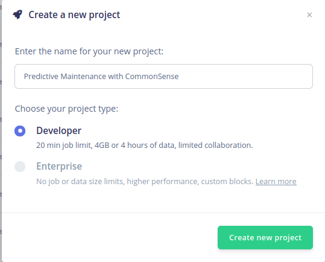

## Connecting the Device

To connect the device to the edge impulse platform, you must first download the data forwarder firmware from here. Pick whatever firmware you wish, either the firmware used for measuring Volatile Organic Compounds level, or the one used to measure the vibration of the printer.

Launch a terminal, navigate to the software folder and activate the build environment:

```
$source /etc/profile
$source SonySpresense/bin/activate
```

Afterwards, build the firmware using `make`:

```
$make -j
```

After the build is successful, it’s time to flash the board by running:

```
$python tools/flash_writer.py -s -d -b 921600 -n build/firmware.spk
```

Now, connect the board to the platform by using the Data Forwarder tool provided in the Edge Impulse CLI suite:

```
$edge-impuse-data-forwarder --clean
```

You will be prompted to fill in the username and password used to log in on the Edge Impulse platform, and then assign the board to one of the existing projects. After doing so, you will see the development board appear under the Devices tab with a green dot next to it, signifying the fact that it is online and ready for data acquisition.


## Building the Dataset

### VoC
 
In printing industries, there are numerous volatile organic compounds that can be found in the air inside and in the near vicinity of printing presses, like Isopropanol, Benzene,  Ethyl-Toluene isomers and styrene.  To emulate an ink and solvent spillage, we have exposed the Common sense board to varying concentrations of Isopropanol which, being a very volatile compound, easily vaporizes and is picked up by the sensor.

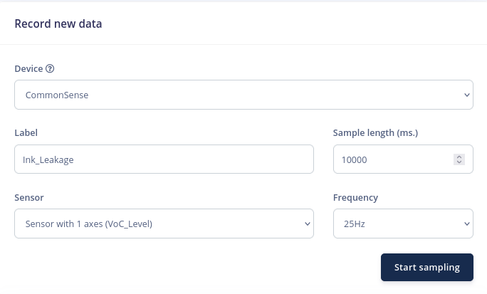

Once the device is connected, go to the Data acquisition page, choose the one axis sensor defined when starting the edge-impulse-data-forwarder tool, set the data acquisition frequency to 25Hz, and begin data recording.

We will define two classes for this application, "Ink_Leakage" and "Normal". 

To prevent the detection algorithm from producing a false positive result, it is crucial to add the "Normal" class, which contains readings specific to the normal conditions of the environment in which the system would be implemented. When gathering data it is recommended to have at least 2.5 minutes worth of data for each defined class.

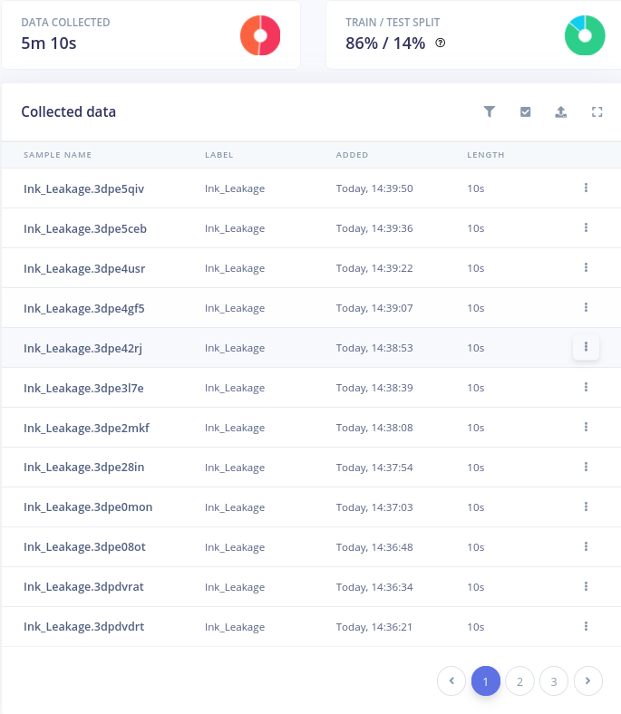

When recording data, you will notice that the board records the sensor readings in a buffer that is ultimately uploaded in the Edge Impulse platform and afterwards, you are presented in the Raw Data tab with the time-domain representation of the newly acquired signal.

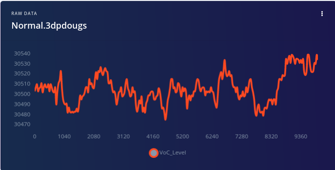

It is noticeable that in normal working conditions, the sensor oscillates in a narrow channel, between 30000 and 31000. When an ink or solvent leakage takes place, the value abruptly drops to around 23000.

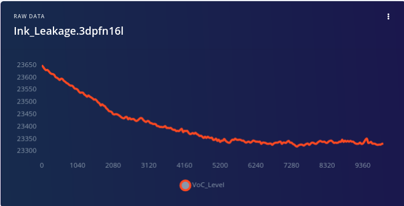

After you have gathered enough data for both classes, remember to click on the red triangle to rebalance the dataset. An optimal ratio would be 80% Training data to 20% Testing Data.

The testing data pool will be used at the end of the process to see how the machine learning model fares on unseen data, before deploying it on the edge, saving a great deal of time and resources.

### Vibration 

For vibration data, we must name the 3 axes exposed by the board as X, Y and Z. Then ,when recording data, make sure the 3-axes sensor is selected. Use a Sample length of 10 seconds and leave the frequency on the default value.

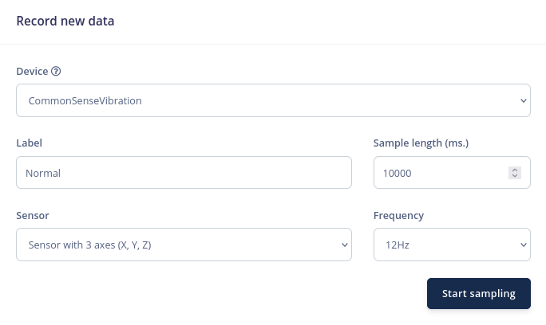

When dealing with industrial machinery, running it in a faulty manner to acquire data specific to various malfunctions is out of the question. Instead, our approach is to collect plentiful data when the machine operates nominally, is idle or is powered off and creates an anomaly detection algorithm that will detect if something is out of order.
 
Just like when gathering VoC data, make sure you have at latest 2.5 minutes of data and perform an 80-20 split. 

## Designing the Impulse

### VoC
 
After populating the dataset it’s time to design the Impulse. The impulse allows the user to control the defining parameters parameters of the whole process of taking raw data from the dataset, pre-processing it into manageable chunks called "windows," extracting the relevant features from them using digital signal processing algorithms, and then feeding them into a classification neural network that puts them in one of the defined classes.

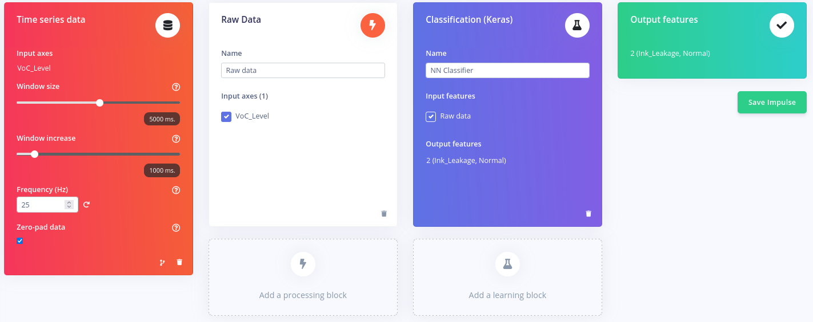

For the input block, we will be using time series data split into 5000ms Windows, with a Window increase of 1000ms and a frequency of 25Hz.

As a signal processing block we will be using a Raw data block and for the learning block, we will be using a **Classification(Keras)** block.

### Vibration

The Impulse for the anomaly detection algorithm is rather different from the one used in the VoC case.


For the input block we have decided to go with a 1s window and a 1s window increase. For the processing block we have used a **Spectral Analysis** block and as a learning block, we have picked an **Anomaly Detection NN**.

## Configuring the Raw Data Block (VoC)

After clicking on **Save Impulse**, each block can be selected from the Impulse Design submenu and configured.

The Raw data block could be the most straightforward of the processing blocks because it has just one adjustable option, the "Scale axis," which we'll set to 15. The time-domain representation of the chosen sample may be seen on the upper side of the screen.

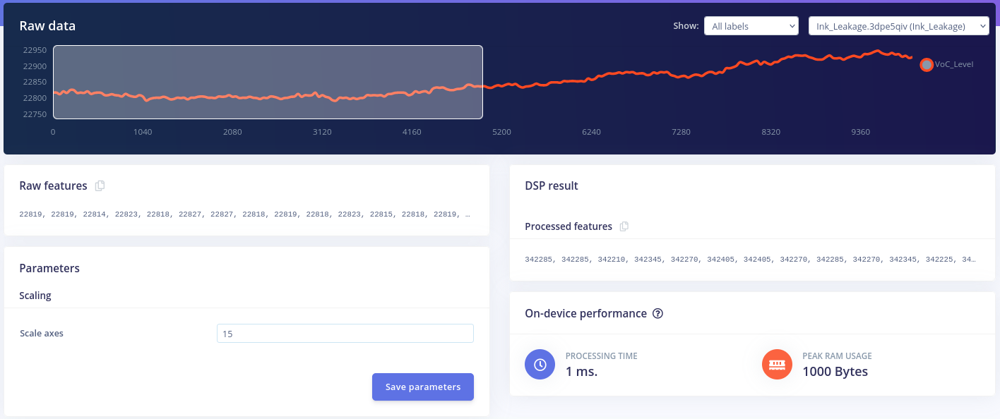

Afterwards, click on **Save parameter** and navigate to the feature generation tab. Nothing can be modified here so click on **Generate features** and wait for the job to end.

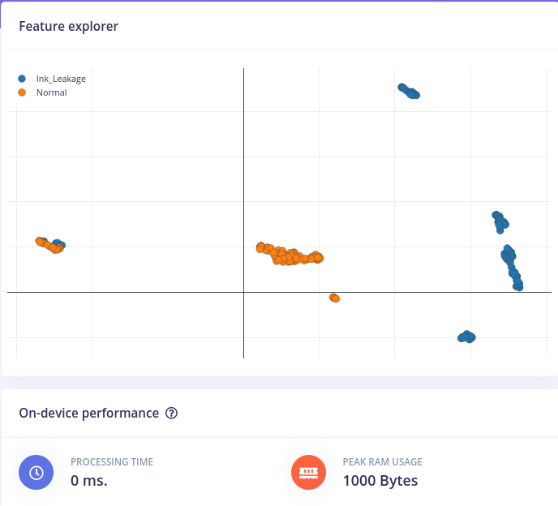

The Feature explorer lets you quickly assess if the data neatly separates because it provides a visual representation of all the data from the Training dataset. When you click on a data item, the raw waveform, the signal window that was utilized, and a direct link to the signal processing page are all presented. This makes it possible for you to locate the dataset's outlier data points quickly and determine what went wrong with them.

## Configure the NN Classifier (VoC)

The next block in line is the NN Classifier block. Here you can control the number of training epochs, the rate at which the weights of the linkages between neurons are changed, and the percentage of training dataset samples that are used for validation. Additionally, if needed you can even change the structure of the neural network.

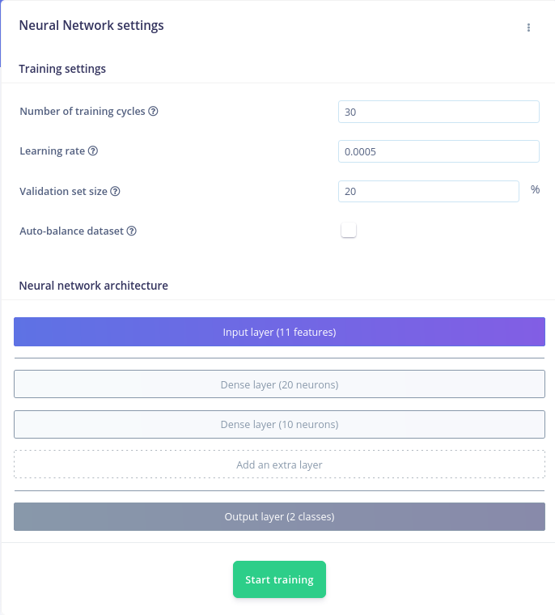

After clicking on **Start Training** a random value between 0 and 1 is assigned to the weight of each link between the neurons that make up the neural network. Then, the NN is fed the Training data set gathered during the data acquisition phase and the classification output is compared to the correct results. The algorithm then adjusts the weights assigned to the links at a rate defined in the **Learning rate** field and then compares the results once more. This process is repeated for a number of epochs, defined by the **Number of training cycles** parameter.

At the end of this process, the Classification Neural Network will be tested on a percent of the samples from the Training dataset held on the side for validation purposes.

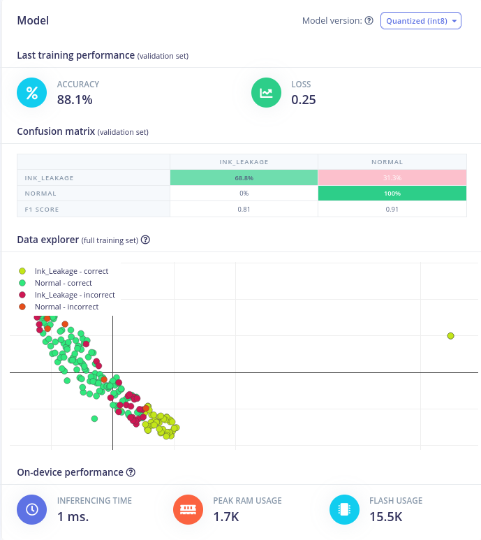

**Accuracy** represents the percentage of predictions in which the result coincides with the correct value and **Loss** represents the sum of all errors made for all the samples in the validation set.

Underneath those performance indexes, the Confusion matrix presents in a tabulated form the percent of samples that were miscategorised. In our case, 31.3% of Ink_Leakage data points were mislabeled as Normal. This comes with a low rate of false positives as an advantage, but also with a low sensitivity to the phenomena it’s trying to detect. 

Finally, the Feature explorer displays all the data from the Training dataset on a 2-axis graph and allows users to quickly determine what data points are outliers and trace back to their source by clicking on them and finding out why a misclassification might occur.

 

## Configure the Spectral Analysis Block (Vibration)

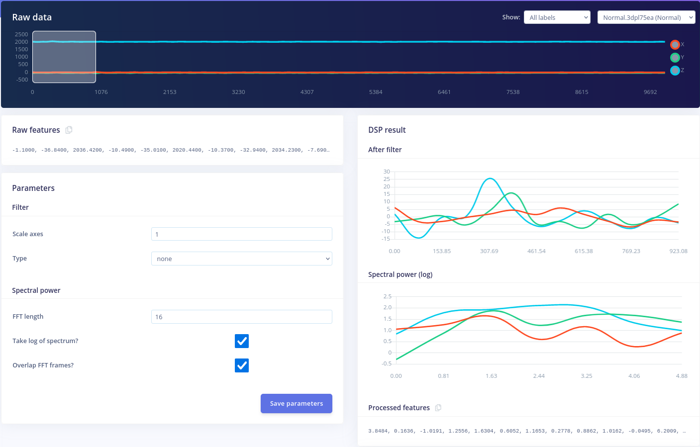

To extract relevant power and frequency characteristics of the accelerometer signal we will be using a Spectral Analysis block. Here you have the option to add low-pass or high-pass filters to remove unwanted frequency from the signal, to scale the axes and to modify the FFT length. It is worth spending some time on this signal processing block until the results are acceptable. A good rule of thumb here is that for similar input signals you must obtain similar processing results. 

After clicking Save parameters, you will be redirected to the Generate features tab where you must make sure to check the Calculate feature importance option before clicking on **Generate features**.

## Configure the Anomaly Detector

The Anomaly Detector block is a great way of detecting any anomalous behavior of the machinery during it’s runtime. Click on **Select suggested axes** to greatly increase the performance of this NN and to reduce its resource usage, as it will only take into account the features identified in the previous step.

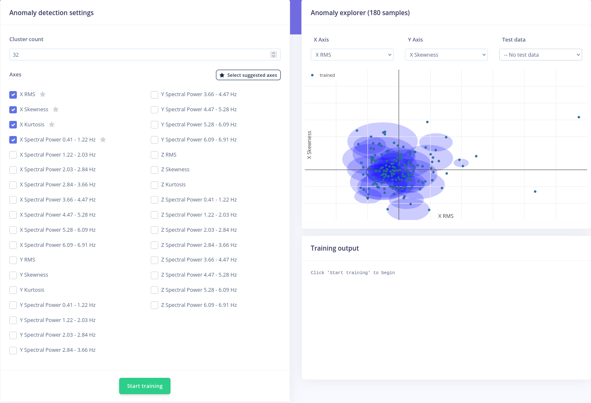

For our application, the algorithm identified the X RMS, X Skewness, X Kurtosis and X Spectral Power 0.41 - 1.22 Hz as the most important features.  This algorithm groups similar data points in a predefined number of clusters. Then, a threshold value is detected based on which an area is defined around each of those clusters. When doing an inference, the NN computes the distance from the center of a cluster to the new datapoint and if it falls outside a cluster, aka the distance between the nearest centroid and the datapoint is greater than the threshold value, that that datapoint is registered as an anomaly.

## Model Testing 

The user can see how the neural network performs when presented with  data that it has never seen before using the **Model Testing** page. After clicking **Classify all**, Edge Impulse will then feed the neural network with all the data in the Testing data pool and display, just like during training the training process of the NN, the classification results and model performance.

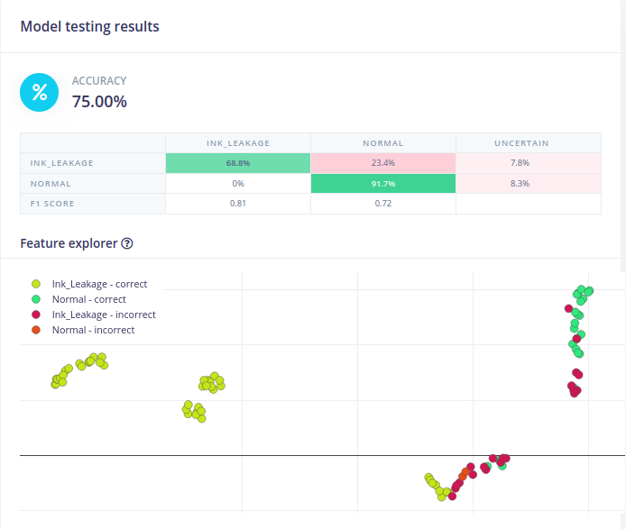

Another way of testing out your model is to use the Live Classification function of the Edge Impulse Platform. This tab enables the users to validate the machine learning model using data captured directly from any connected device, giving them a great overview on how it will perform when deployed on the edge. This is great to check if the device is mounted accordingly on the machine it monitors or if it has all the conditions it needs to run optimally.

## Conclusion

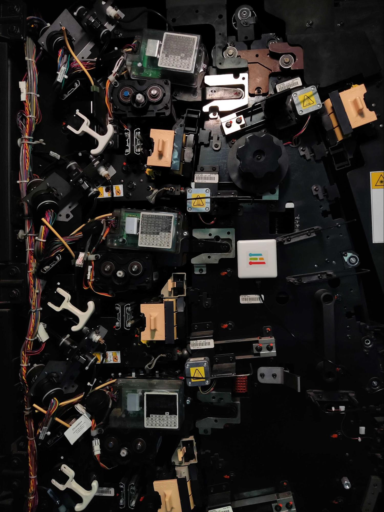

The solution presented above allows you to schedule maintenance before the problem occurs, instead of waiting for something to break. Additionally, predictive maintenance can improve safety by identifying potential hazards before they cause an accident. In our case detecting unusual vibration in the printer and solvents or ink leaks can keep the workers safe and the workflow uninterrupted. The combination of the Sony Spresense and the CommonSense board can cover a wide array of use cases, we have only scratched the surface with the accelerometer and the gas sensor.

If you need assistance in deploying your solutions or more information about the tutorial above please [reach out to us](https://edgeimpulse.com/contact)!

