# Vibration Classification and Anomaly Detection with BrainChip’s Akida


With predictive maintenance, you can monitor your equipment while it’s running: This means that there is less downtime for inspections and repair jobs because the monitoring process takes place during operation instead of waiting until something breaks or wears out.

The Edge Impulse platform and solutions engineering team enables companies to make more accurate predictions about when devices might fail, which lets them optimize their fleet maintenance and use service crews most effectively. This saves the companies money by letting them lower overall asset downtime and allows customers to be more satisfied with their product and services.

In this article, we will explain some of the beneficial applications of predictive maintenance, and then show how to build a predictive maintenance solution that will detect abnormal vibrations using Edge Impulse’s platform, the BrainChip Akida hardware, and a computer cooling fan.

**Business Case Examples for Edge Predictive Maintenance**

Predictive maintenance provides a wide variety of business benefits, such as:

**Predicting asset depreciation and maintenance timelines**
The security and building-access industry have been experiencing increasing pressure due to the global pandemic, and it’s imperative for customers to understand when a security door or component might fail. By anticipating maintenance, companies can reduce unplanned out-of-service intervals, allowing for minimal disruption in office buildings where there is huge traffic of people.

**Lowering cost and gaining more ROI**
Global shipping companies are looking for ways to lower their costs and increase efficiency. Focusing on predictive maintenance can allow them to proactively address any issues before they become costly or cause unsafe conditions in order to avoid downtime on ships.

### **Advantages of Processing with Edge Devices**

**Data complexity**: If you’ve got a factory or manufacturing floor with hundreds of cameras and sensors in it then there’s just no way to send that information across the Internet to the cloud for processing — it’s going to overwhelm whatever kind of connection you have.

**Latency**: This is the time it takes for something to happen after a key event happened. It’s important in industrial and manufacturing because if there are sudden changes, such as a potential machine malfunction — then those cloud-based compute devices won’t be able to make decisions or predictions quick enough. Cloud processing is simply too slow. Predictive models running on the edge is the way to go.

**Cost**: The economics of cloud computing are getting better and cheaper all the time, but it still costs money. Edge Computing can reduce data consumption by sending less information to a server in a remote location, which saves energy as well as provides faster network speeds for users on competitive websites who do not have this advantage over them yet.

**Reliability**: The local processing of an asset-monitoring system means that it will be able to work even when connectivity goes down. Edge machine learning is great for both on- and off-grid industrial assets.

**Privacy**: With edge compute, sensitive live operational sensor data does not need to leave the facility or be shared with third parties.

## **Building a Predictive Maintenance Demonstration**

Let’s look at how to assemble a solution that detects anomalous hardware vibrations.

## Hardware Requirements

*   [Akida Development Kit Raspberry Pi](https://brainchip.com/akida-enablement-platforms/), keyboard, mouse, monitor
*   [ADXL345](https://pimylifeup.com/raspberry-pi-accelerometer-adxl345/)
*   [120mm case fan](https://www.google.com/search?q=120mm+case+fan)
*   Standoffs and screws — used are a #2-52 screw/nut to secure to fan

## Hardware Setup

First, connect the accelerometer to the Raspberry Pi header like so:

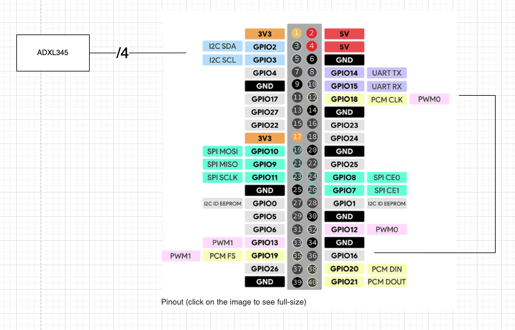


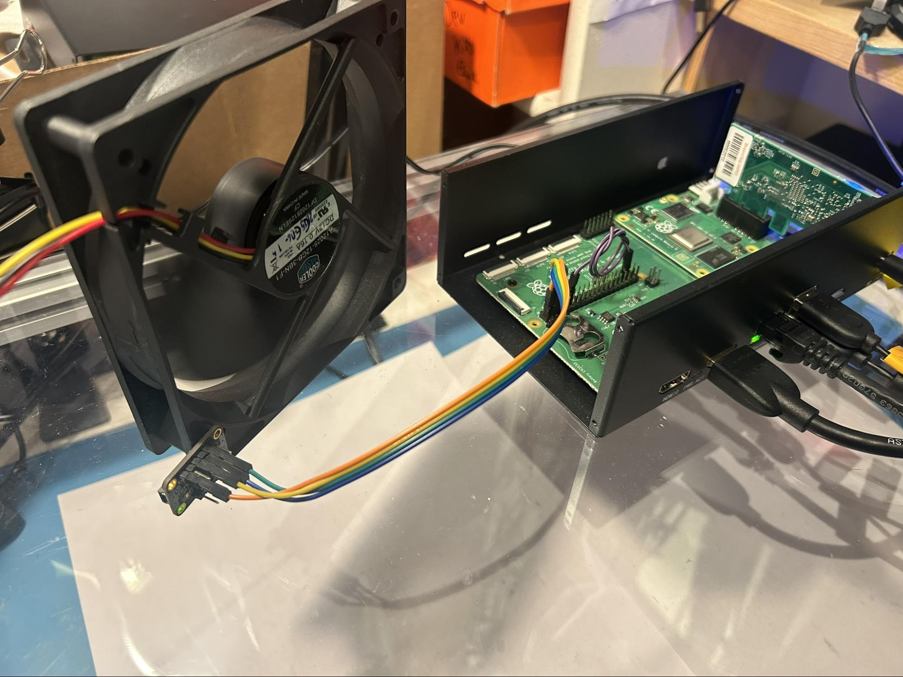

## Software Setup

## Create an Edge Impulse project

Please follow these [instructions](https://docs.edgeimpulse.com/docs/) for setup and creation of your Edge Impulse account. Once you have an empty project created you can set up your AkidaTM Development Kit and collect your accelerometer data. We will design the Impulse later in this guide.

## Set Up the Akida Development Kit

To start setting up the device for a custom model deployment, let&#039;s verify we have installed all the packages we need. Ensure the development kit is powered on and connected to the network. Setup [Visual Studio Code for remote debugging](https://code.visualstudio.com/docs/remote/ssh) and open a terminal in VSCode once connected. Run these commands to install the needed components.

```
pip show akida # will show the installed version.
lspci | grep Co-processor # will check if the PCIe card is plugged in correctly.
python3 --version # will check the installed Python version (3.8 is required).
```

You will also need Node Js v14.x to be able to use the[Edge Impulse CLI](https://docs.edgeimpulse.com/docs/edge-impulse-cli/cli-installation). Install it by running these commands:

```
curl -sL https://deb.nodesource.com/setup_14.x | sudo -E bash -
sudo apt-get install -y nodejs
node -v
```

The last command should return the node version, v14 or above.

Finally, let&#039;s install the[Linux Python SDK](https://docs.edgeimpulse.com/docs/edge-impulse-for-linux/linux-python-sdk), you just need to run these commands:

```
sudo apt-get install libatlas-base-dev libportaudio0 libportaudio2 libportaudiocpp0 portaudio19-dev
pip3 install edge_impulse_linux -i https://pypi.python.org/simple
```

## Data Acquisition to create ML Dataset

After getting the Akida Development Kit configured and having the accelerometer connected you will need to collect data from the accelerometer/fan setup. Since we are using custom devices we have developed code that you can use immediately.

You can download with git using:

```
git clone https://github.com/edgeimpulse/brainchip-accelerometer.git
```

Inside the directory you will find **accel-hw-timed-fixed-dt.py**. This file has the needed components to collect accelerometer data. Here is a flow chart of how it runs:

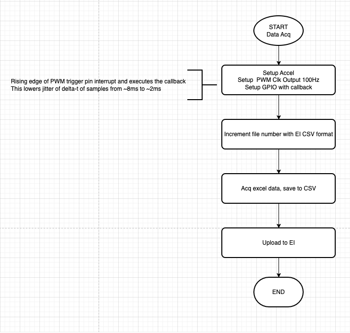

To run use this command

python3 accel-hw-timed-fixed-dt.py --output_dir &lt;name of folder&gt; —number_of_files &lt;number of files&gt;

This will start collecting data in the folder specified. For the project to have a good data we recommend taking at least 300 samples for each of the following conditions:

*   Fan off — label as “off”
*   Fan on — label as “on”
*   Fan on with finger lightly rubbing the spinning center hub of the motor — label this as “center”. This is to simulate one possible fault condition.
*   Fan on with finger light touching the spinning blade at the outermost edge — label this as “edge”. This simulates another possible fault condition.

To upload the data to Edge Impulse use the [uploader](https://docs.edgeimpulse.com/docs/tools/edge-impulse-cli/cli-uploader) tool installed with the Edge Impulse CLI.

```
cd &lt;samples directory&gt;

edge-impulse-uploader --category split --label off *.csv
```

You may be prompted for username and password for Edge Impulse. After successful connection you should select the empty project you had created earlier.

## Acquiring Accelerometer Data

The Ubuntu operating system running on Raspberry Pi is not an RTOS and so it is impossible to get consistently spaced accelerometer samples. That is, the data acquisition is not hardware timed as the OS has to be interrupted to service the sampling and it can be delayed by other tasks. Therefore there is no guarantee that samples are acquired at a fixed delta-t.

In order to get good performance we implement a hardware interrupt with the PWM and GPIO pins. Our testing showed that the maximum delay in servicing the interrupt went from approximately 8ms to 2ms. In the code we make an assumption that the delta-t is fixed at the sample frequency and no variance is recorded.

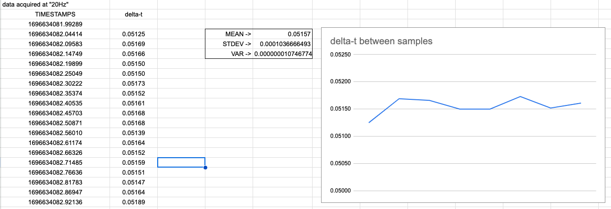

Lastly, it is important to get the data out of the accelerometer as fast as possible so that it is ready for the next sample. In the code we ensure that the fastest speed is enabled. The code is set up to take 100 samples of data for 1 second and transfer off the device as quickly as possible.

## Less Code with Two Edge Impulse Projects

Since we have not implemented custom C++ processing code for this custom processing block, we are not able to deploy an EIM compiled model from Edge Impulse Studio. That is, if we tried to build an EIM for “Linux (AARCH64 with AKD1000 MINI PCIe)” there would be a build error because of the lack of C++ code to run the DSP on the CPU.

We can work around this issue by creating two projects: One that does the custom feature generation (the customer DSP block) to which we select the FBZ file for Akida. Then, a second project that is used only for anomaly detection. This second project we will output the EIM for the anomaly detection to run on the CPU.

The Python code that runs on the Enablement device will tie all the pieces together.

## The First Project: Impulse Setup for Classification Project

Once you have collected the data it is time to design the rest of the Edge Impulse Studio project. This is what your Impulse design should eventually look like.

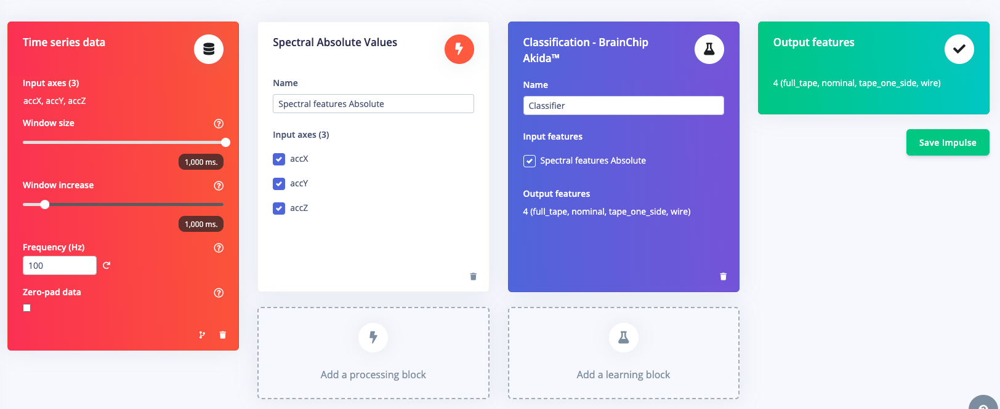

## Timing Series Block

Since we have taken accelerometer data at 100Hz for 1-second record lengths it is important to use those values in the Timing series data block.

## Processing Block: Custom Spectral Features

Akida dense network uses 4 bit uint8 inputs. This means that the range of input data allowed must be between 0 and 15\. The default classification blocks with Edge Impulse output signed float data. Therefore we must use custom spectral features code that makes the training and test dataset correct for the 4-bit, uint8 dense layer classifier. The code for the custom processing block is found [here](https://github.com/edgeimpulse/processing-blocks/tree/abs-spectral-features). You will need to follow the instructions of using [Custom Processing Blocks](https://docs.edgeimpulse.com/docs/edge-impulse-studio/processing-blocks/custom-blocks) to add to your Edge Impulse Studio project.

## Learn Block: Classification - BrainChip Akida™

Select the Classification - BrainChip Akida™ as the learn block and ensure that the Spectral Features input box is checked. Save the Impulse and proceed onto feature generation.

## Feature Generation

This process of generating features and determining the most important features of your data will further reduce the amount of signal analysis needed on the device with new and unseen data. An obstruction in the fan will create a much different waveform on all three accelerometer axes than a nominal sample; we can use the most important features to more quickly and accurately determine if a new incoming signal is an obstruction or a fan failure, etc.

## Training the Classifier

When using the Akida blocks it is important to review the accuracy of the model. Akida heavily quantizes the model and without proper training (especially quantization ware training). The Akida Learning Blocks have this training code implemented and the defaults can work really well with this type of data.

To view the model accuracy and Akida specific metrics be sure to select the “Quantized (akida)” as the model version.

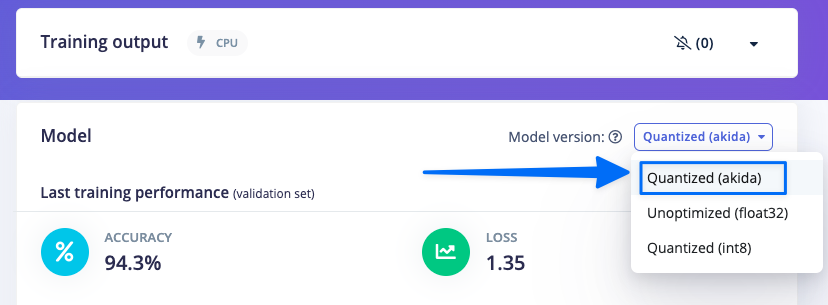

When this option is selected you will see the Confusion Matrix for the Validation Dataset and Akida Performance parameters.

## The Second Project: Impulse Setup for the Anomaly Project

## Download Data and Create Second Project

From the first project (the classifier project) go into the **Dashboard** and select **Export** and [follow the step to download the data](https://forum.edgeimpulse.com/t/export-your-datasets/104). Once downloaded go back to the second project (the anomaly project) and in the **Data Acquisition** tab to [upload](https://docs.edgeimpulse.com/docs/edge-impulse-studio/data-acquisition/uploader) the recently downloaded data.

With the data uploaded you will need to create a new Impulse as shown below.

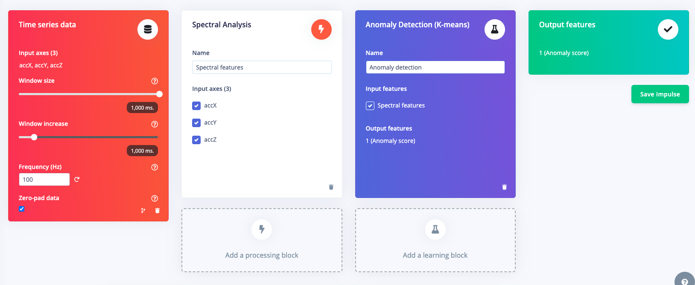

## Timing Series Block

Since we have taken accelerometer data at 100Hz for 1 second record lengths it is important to use those values in the Timing series data block.

## Processing Block: Spectral Analysis

The k-mean algorithm does not have the restriction of 4-bit, unsigned data and so does not require a custom block. Please select the default Spectral Analysis block.

## Learn Block: Anomaly Detection (K-means)

Anomaly detection can be used to detect irregular patterns in the collected sensor data. In Edge Impulse we can implement anomaly detection using one of the available [anomaly detection blocks](https://docs.edgeimpulse.com/docs/edge-impulse-studio/learning-blocks/anomaly-detection). For this setup we will be using k-means as it is freely available to all Edge Impulse developers.

In the anomaly detection block, make sure to click the “Select Suggested Axes” to highlight the features of importance . Without selecting this button, the anomaly detection settings will default to your data’s Root-Mean-Square value (or RMS) for each of the axes. Prior to the release of the feature importance view in the DSP block, the anomaly detection block would prioritize the RMS values, and you would then have to make a decision by yourself if the RMS values were most meaningful for your anomaly detection use case. With feature importance, we take the guesswork out of this and get your model to production even faster!

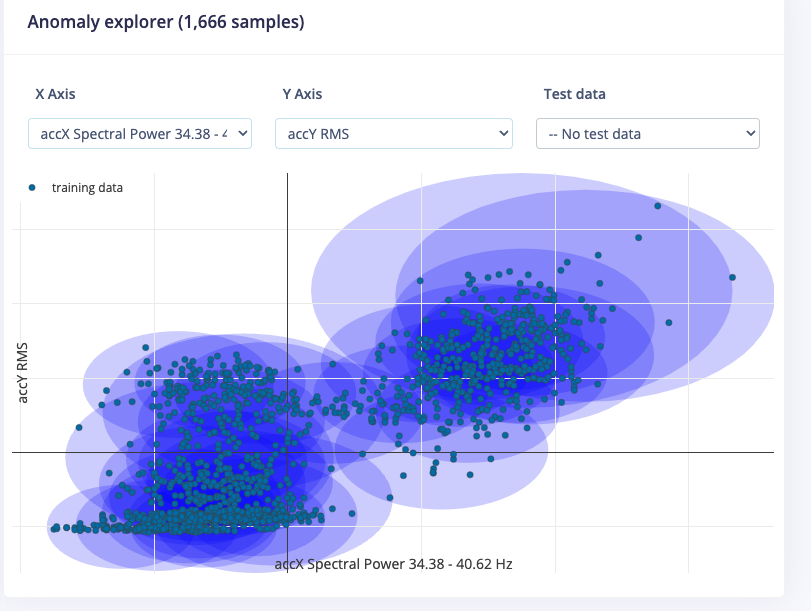

## Download of MetaTF FBZ File

We are using custom code for this project and we will need the Akida compatible model file stored in FBZ format. Proceed to the dashboard of the first project (the classifier project) and select the **Classifier model - MetaTF** file. Once the file is presented download to your machine and then drag and drop into the _brainchip_acceleromenter_ folder in the open Visual Studio Code file viewer.

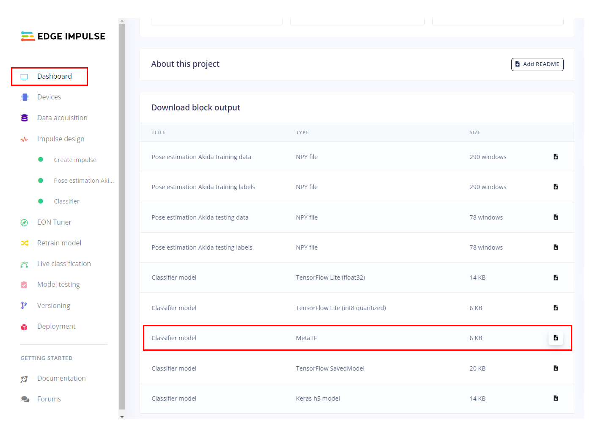

## Download of Edge Impulse Anomaly Scoring model .eim

The anomaly scoring algorithm can be neatly packaged into an Edge Impulse .eim file. To do so go to the Deployment tab of the second Edge Impulse project (the one with the k-mean anomaly scoring) and select **Linux (AARCH64)** from the drop down menu and click **Build**. Once the file is presented, download it to your machine and then drag and drop into the _brainchip_acceleromenter_ folder in the open Visual Studio Code file viewer.

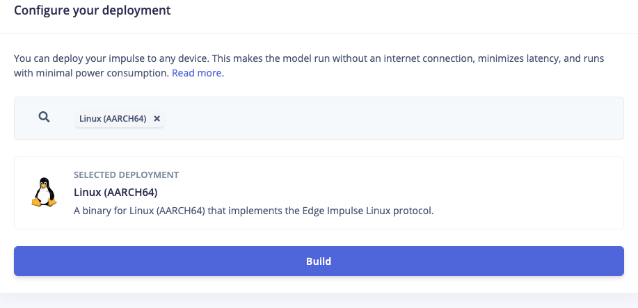

## On-Device Inferencing

Once all the files are in the correct directory you can run the inference demo with

```
python3 class-hw-timed-anom.py --fbz_file &lt;name-of-fbz-file&gt; --anomaly_eim &lt;name-of-anomaly-eim-file&gt;
```

Below is a flow chart of how the code works.

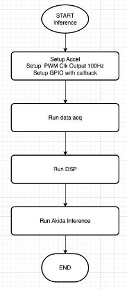

And the results of the inference will be displayed below. For example, here is where there the center hub is rubbing:

```
ubuntu@ubuntu:~/brainchip-accelerometer$ python3 class-hw-timed-anom.py --fbz_file accel.fbz --anomaly_eim anom.eim

[[[[ -2.256891 -24.837664 -0.38746595 -2.5941396 ]]]]

center: 0.121976525

edge: 1.9035794e-11

off: 0.790965

on: 0.08705848

/home/ubuntu/brainchip-accelerometer

Loaded runner for &quot;Brainchip / bc-pred-main-anom&quot;

classification:

{&#039;anomaly&#039;: -0.4078322649002075}

timing:

{&#039;anomaly&#039;: 0, &#039;classification&#039;: 0, &#039;dsp&#039;: 0, &#039;json&#039;: 0, &#039;stdin&#039;: 28}
```



## Conclusion

In this example we have shown how you can easily implement new solutions for BrainChip’s Akida enablement devices to test your predictive maintenance projects. Demonstrated are the abilities to use custom sensors with Akida and Edge Impulse, adjust Edge Impulse DSP blocks, train an Akida compatible model, and then download the trained model to run on your Akida device. The model is able to run fast, detect anomalies, and then be further customized with new data with easy upload back into Edge Impulse Studio for continuous improvement to the abilities of the model (new classes, higher accuracy etc).

To learn further about BrainChip devices please visit [brainchip.com](http://www.brainchip.com) or reach out to Edge Impulse at [edgeimpulse.com/contact](http://edgeimpulse.com/contact).

## Important links

[Custom Processing Code](https://github.com/edgeimpulse/processing-blocks/tree/abs-spectral-features)

[Custom On Device Code](https://github.com/edgeimpulse/brainchip-accelerometer)

[Classification Project](https://studio.edgeimpulse.com/public/370583/live)

[Anomaly Project](https://studio.edgeimpulse.com/public/370971/live)