# High-resolution, High-speed Object Counting - Nvidia Jetson Nano (TensorRT)

Created By: Jallson Suryo

Public Project Link: [https://studio.edgeimpulse.com/public/207728/live](https://studio.edgeimpulse.com/public/207728/live)

GitHub Repo: [https://github.com/Jallson/High\_res\_hi\_speed\_object\_counting\_FOMO\_720x720](https://github.com/Jallson/High_res_hi_speed_object_counting_FOMO_720x720)

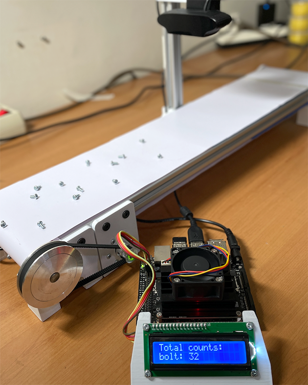

## Problem Statement

The object counting systems in the manufacturing industry are essential to inventory management and supply chains. They mostly use proximity sensors or color sensors to detect objects for counting. Proximity sensors detect the presence or absence of an object based on its proximity to the sensor, while color sensors can distinguish objects based on their color or other visual characteristics. There are some limitations of these systems though; they typically have difficulty detecting small objects in large quantities, especially when they are not in a row or orderly manner. This can be compounded by a relatively fast conveyor belt. These conditions make the object counting inaccurate.

## Our Solution

After experimenting with computer vision on the Jetson Nano [in a previous project](https://docs.edgeimpulse.com/experts/featured-machine-learning-projects/quality-control-jetson-nano), I believe that a computer vision system with its object detection capabilities can explore its potential to accurately count small objects in large quantities and on fast-moving conveyor belts. Basically, we'll explore the capability of [Edge Impulse's FOMO models](https://edge-impulse.gitbook.io/docs/edge-impulse-studio/learning-blocks/object-detection/fomo-object-detection-for-constrained-devices) that have been optimized for the GPU in the Jetson Nano. In this project, the production line / conveyor belt will run quite fast, with lots of small objects in random positions, and the number of objects will be counted live and displayed on a 16x2 LCD display. Speed and accuracy are the goals of the project.

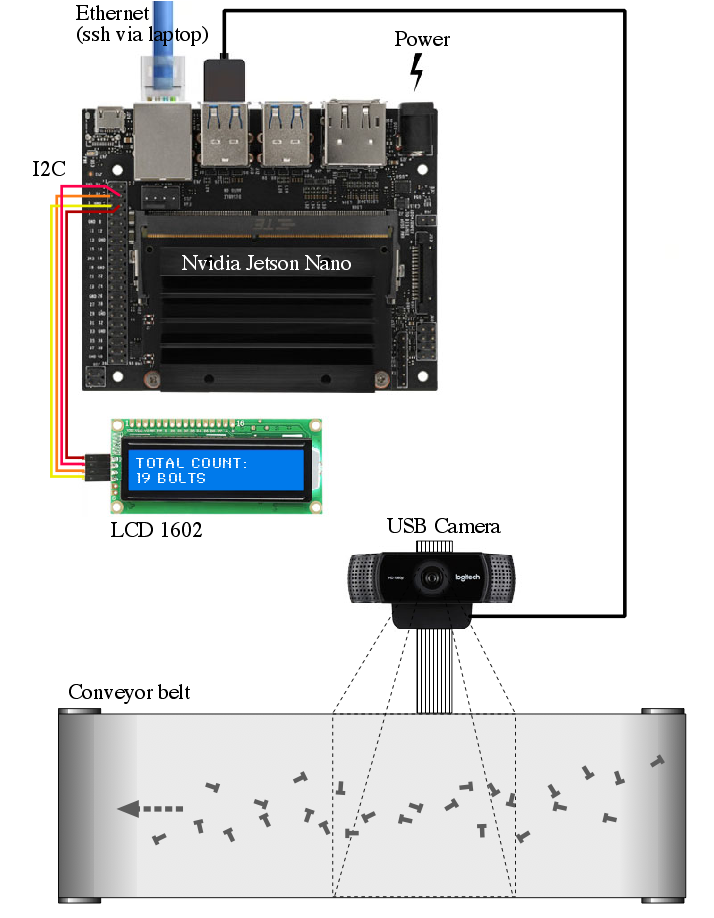

## How Does It Work?

This project utilizes Edge Impulse's FOMO algorithm, which can quickly detect objects in every frame that a camera captures on a running conveyor belt. FOMO's ability to know the number and position of coordinates of an object is the basis of this system. The project aims to assess the Nvidia Jetson Nano's GPU capabilities in processing higher-resolution imagery (720x720 pixels), compared to typical FOMO object detection projects (which often target lower resolutions such as 96x96 pixels), all while maintaining optimal inference speed.

The machine learning model (named `model.eim`) will be deployed using the TensorRT library, configured with GPU optimizations and integrated through the Linux C++ SDK. Additionally, the Edge Impulse model will be seamlessly integrated into our Python codebase to facilitate cumulative object counting. Our proprietary algorithm compares current frame coordinates with those of previous frames to identify new objects and avoid duplicate counting.

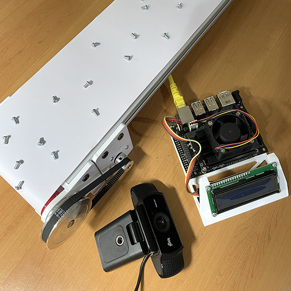

### Hardware Requirements:

* NVIDIA Jetson Nano Developer Kit
* USB Camera (eg. Logitech C922)
* Mini conveyor belt system with camera stand
* Objects: eg. bolt
* Ethernet cable
* PC/Laptop to access Jetson Nano via SSH

### Software & Online Services:

* Edge Impulse Studio
* Edge Impulse Linux, Python & C++ SDK
* NVIDIA Jetpack SDK
* Terminal

## Steps

### 1. Prepare Data / Images

In this project we use a Logitech C922 USB camera capable of 720p at 60 fps connected to a PC/laptop to capture the images for data collection, for ease of use. Take pictures from above the parts, at slightly different angles and lighting conditions to ensure that the model can work under different conditions (to prevent overfitting). Object size is a crucial aspect when using FOMO, to ensure the performance of this model. You must keep the camera distance from the objects consistent, because significant difference in object sizes will confuse the algorithm and cause difficulty in the auto-labelling process.

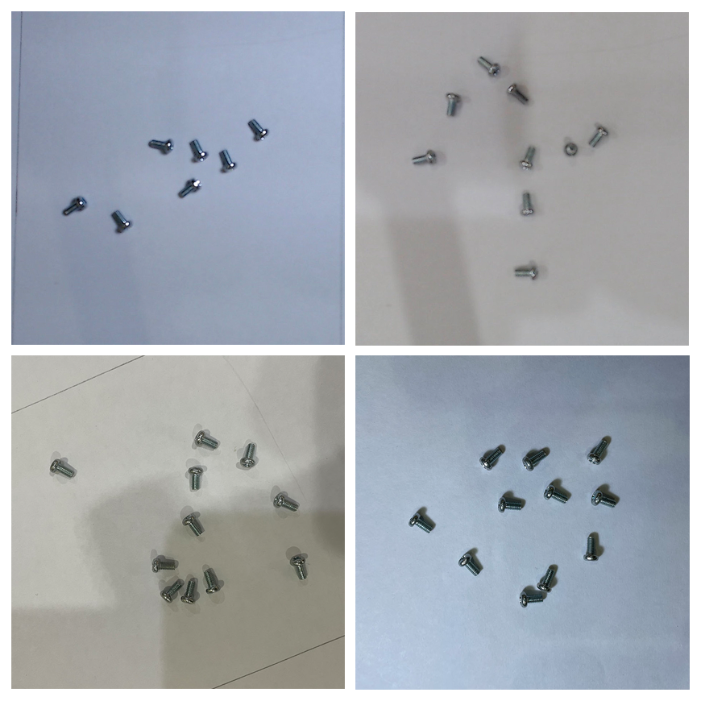

### 2. Data Acquisition and Labeling

Open studio.edgeimpulse.com, login or create an account then create a new project.

Choose the _Images_ project option, then _Object detection_. In _Dashboard > Project Info_, choose _Bounding Boxes_ for the labeling method and _NVIDIA Jetson Nano_ for the target device. Then in _Data acquisition_, click on _Upload Data_ tab, choose your photo files, automatically split them between Training and Testing, then click on _Begin upload_.

Next,

* For Developer accounts: click on the _Labeling queue_ tab then drag a bounding box around an object and label it, then click Save. Repeat this until all images labelled. It goes quickly though, as the bounding boxes will attempt to follow an object from image to image.
* For Enterprise accounts: click on _Auto-Labeler_ in _Data Acquisition_. This auto-labeling segmentation / cluster process will save a lot of time over the manual process above. Set min/max object pixels and sim threshold (0.9 - 0.999) to adjust the sensitivity of cluster detection, then click _Run_. If something doesn't match or if there is additional data, labeling can be done manually as well.

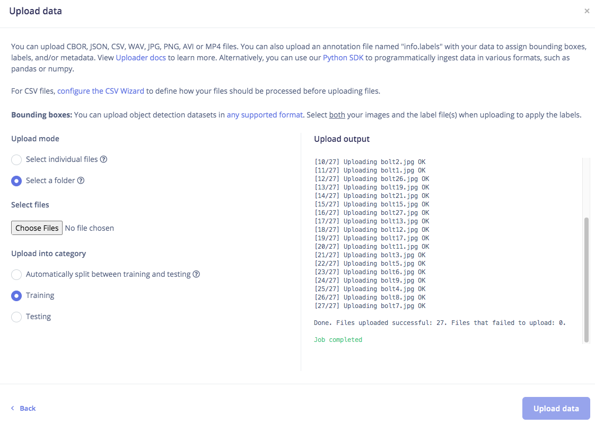

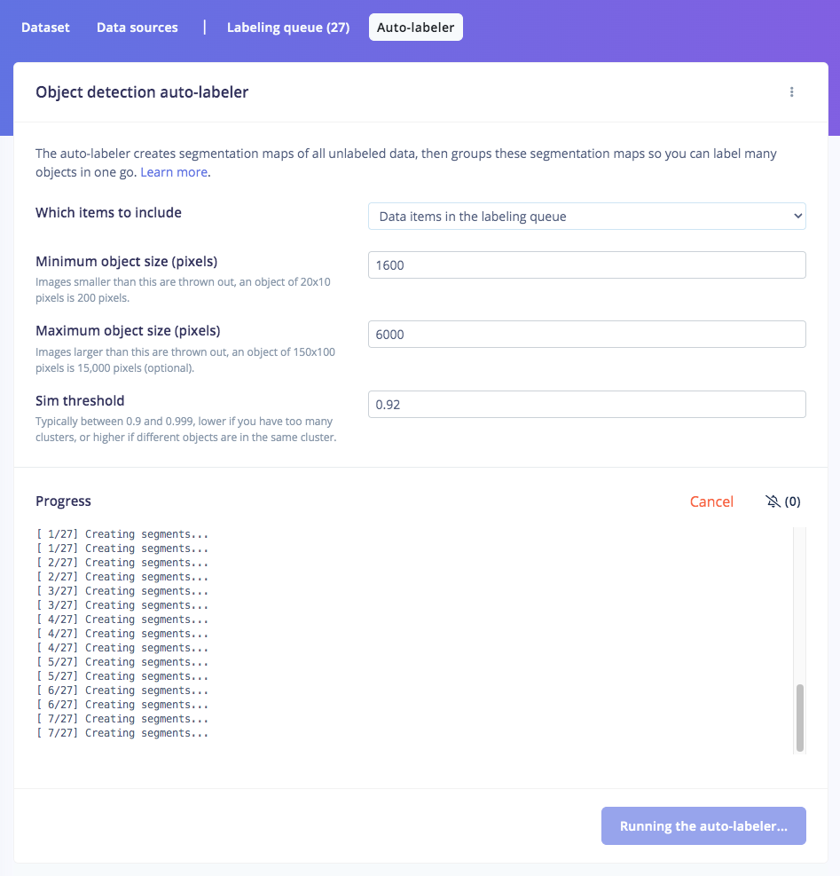

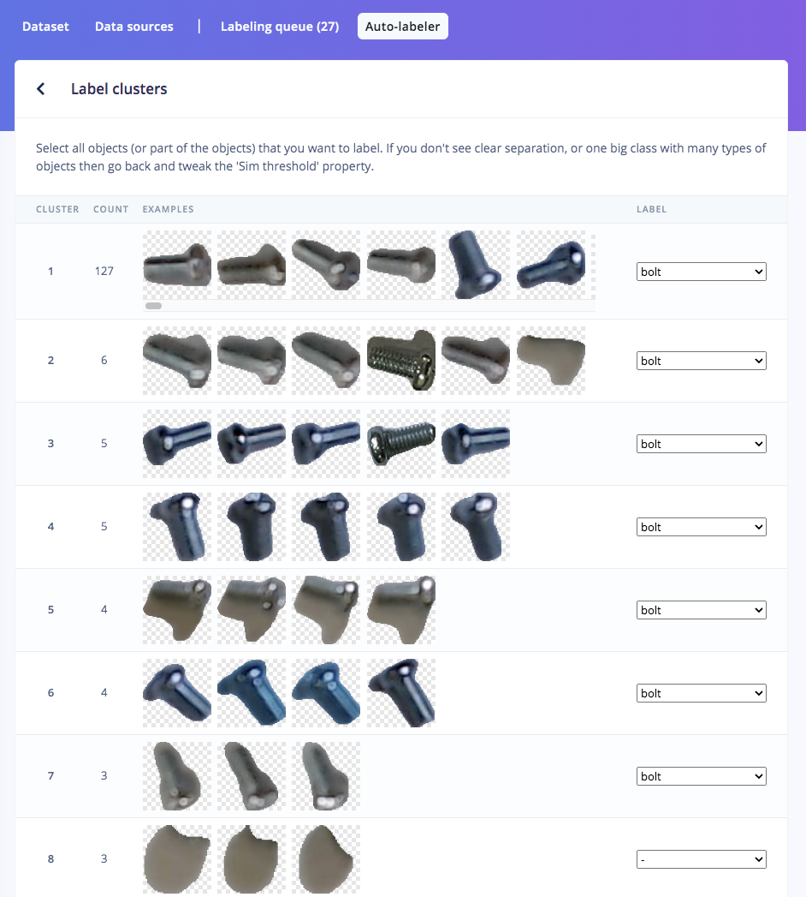

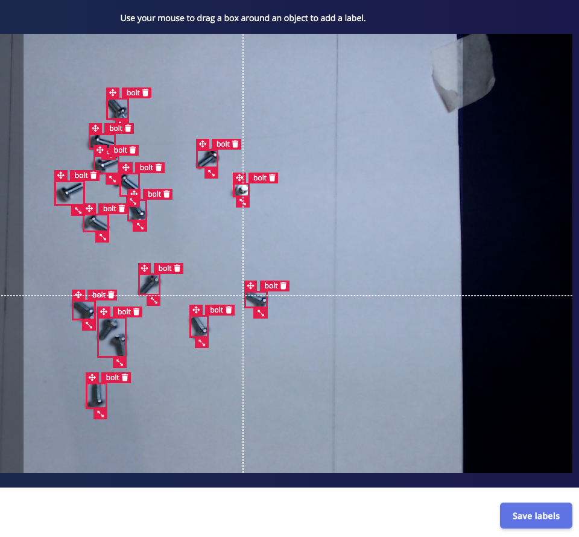

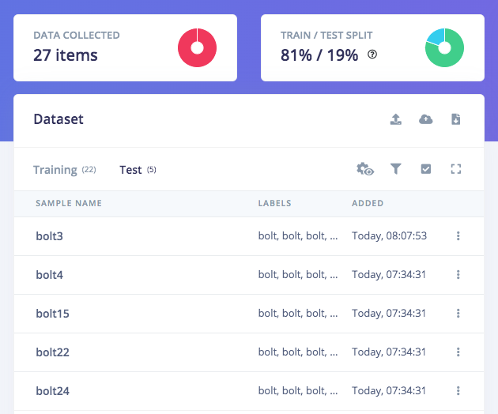

### 3. Train and Build Model Using FOMO Object Detection

Once you have the dataset ready, go to _Create Impulse_ and set 720 x 720 as the image width and height. Then choose _Fit shortest axis_, and choose _Image_ and _Object Detection_ as Learning and Processing blocks.

In the Image block configuration, select Grayscale as the color depth and click _Save parameters_. Then click on _Generate features_ to get a visual representation of the features extracted from each image in the dataset. Navigate to the Object Detection block setup, and leave the default selections as-is for the Neural Network, but perhaps bump up the number of training epochs to 120. Then we choose _FOMO (MobileNet V2 0.35)_, and train the model by clicking the _Start training_ button. You can see the progress on the right side of the page.

If everything is OK, then we can test the model, go to _Model Testing_ on the left navigation and click _Classify all_. Our result is above 90%, so we can move on to the next step — Deployment.

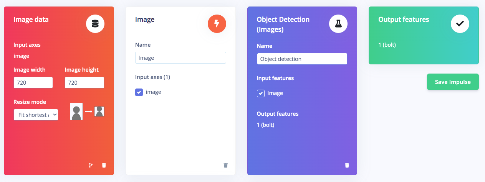

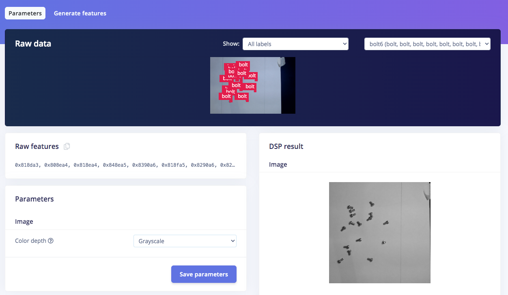

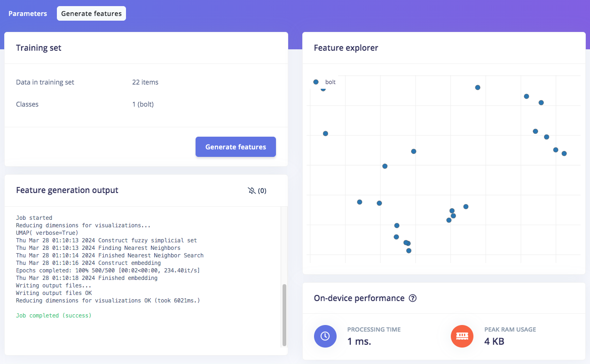

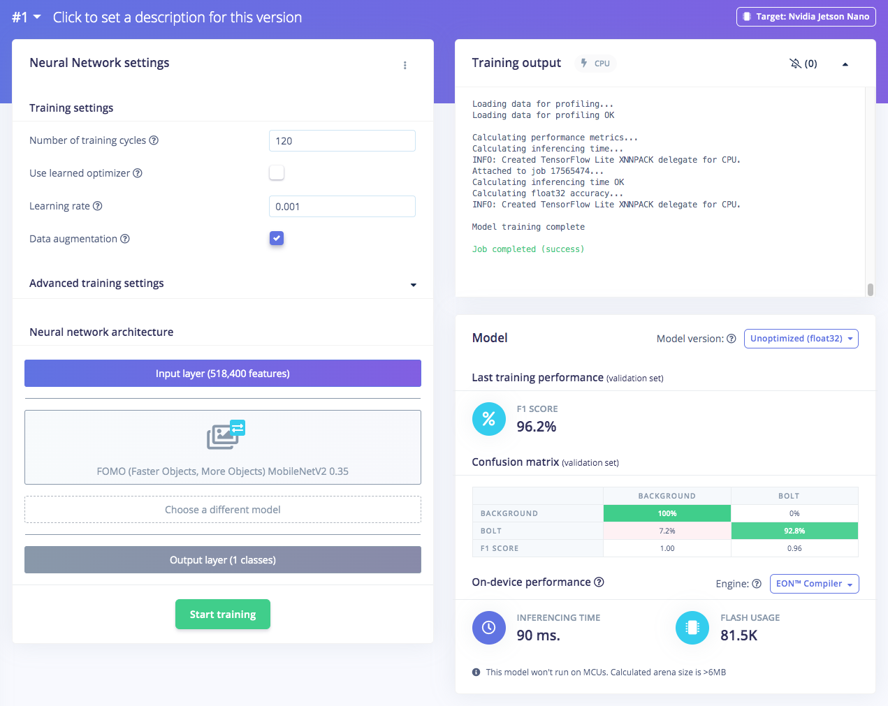


### 4. Deploy Model Targeting Jetson Nano's GPU

Click on the _Deployment_ navigation item, then search for _TensorRT_. Select _Float32_ and click _Build_. This will build an NVIDIA TensorRT library for running inferencing targeting the Jetson Nano's GPU. After it has downloaded, open the `.zip` file and then we're ready for model deployment with the Edge Impulse C++ SDK directly on the NVIDIA Jetson Nano.

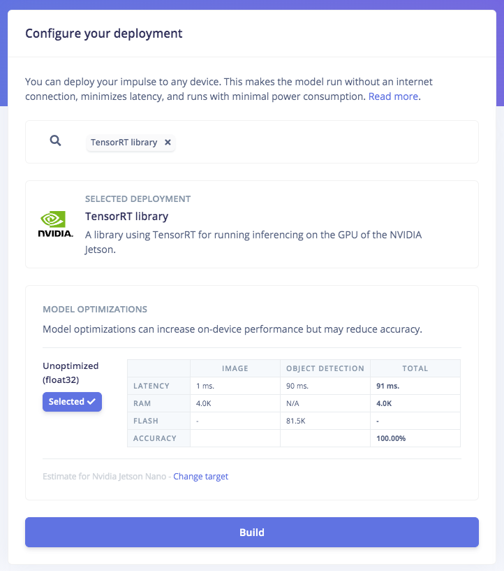

On the Jetson Nano, there are several things that need to be done to get ready for our project. Make sure the device is running it's native Ubuntu OS and JetPack which are usually pre-installed on the SD card. More information on [downloading and flashing the SD Card is available here](https://developer.nvidia.com/jetpack-sdk-463). Then `ssh` via a PC or laptop with Ethernet and setup Edge Impulse firmware in the terminal:

```
wget -q -O - https://cdn.edgeimpulse.com/firmware/linux/jetson.sh | bash
```

Then install Clang as a C++ compiler:

```
sudo apt install -y clang
```

Clone from this repository and install these submodules:

```
git clone https://github.com/edgeimpulse/example-standalone-inferencing-linux
cd example-standalone-inferencing-linux && git submodule update --init --recursive
```

Then install OpenCV and dependencies:

```
sh build-opencv-linux.sh
```

Build a specific model targeting NVIDIA Jetson Nano GPU with TensorRT using clang:

```
APP_EIM=1 TARGET_JETSON_NANO=1 make -j
```

The result will be a file that is ready to run: `/build/model.eim`

If your Jetson Nano is running on a dedicated power supply (as opposed to a battery), its performance can be maximized by this command:

`sudo /usr/bin/jetson_clocks`

Now the model is ready to run in a high-level language such as the Python program in the next step. To ensure this model works, we can run the Edge Impulse Runner with the camera setup on the Jetson Nano and run the conveyor belt. You can the see the camera stream via your browser (the IP address is provided when Edge Impulse Runner first starts up). Run this command:

```
edge-impulse-linux-runner --model-file <path to directory>/model.eim
```

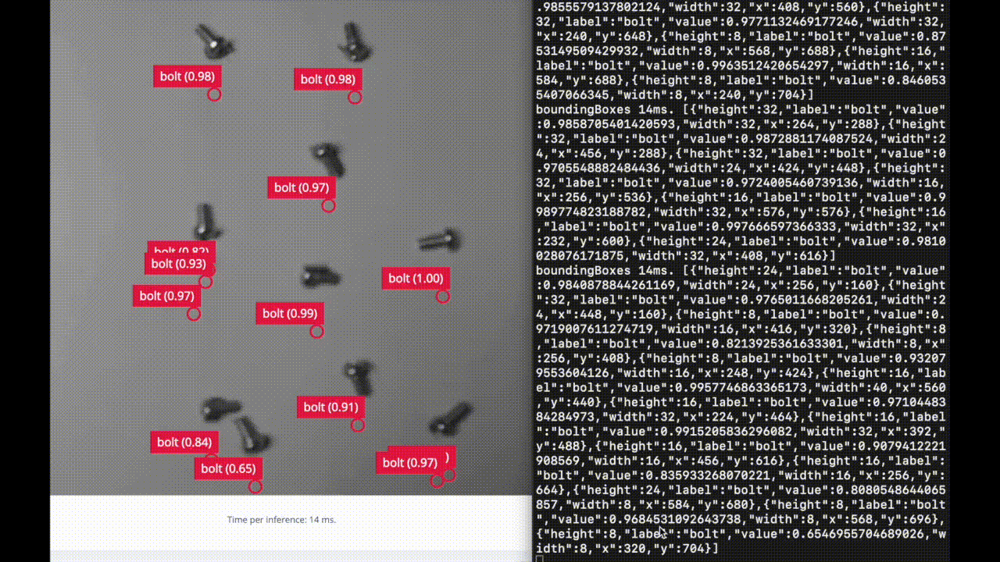

The inferencing time is around 15ms, which is an incredibly fast detection speed.

To compare these results, I have also deployed with the standard CPU-based deployment option (Linux AARCH64 model), and run with the same command above. The inferencing time is around 151ms with a Linux model that targets the CPU.

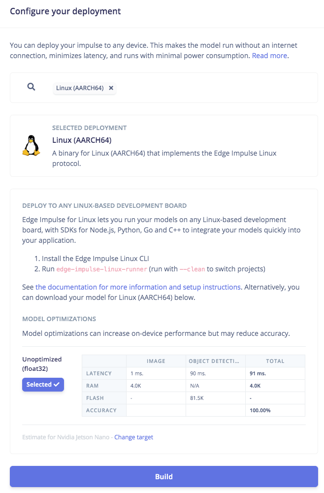

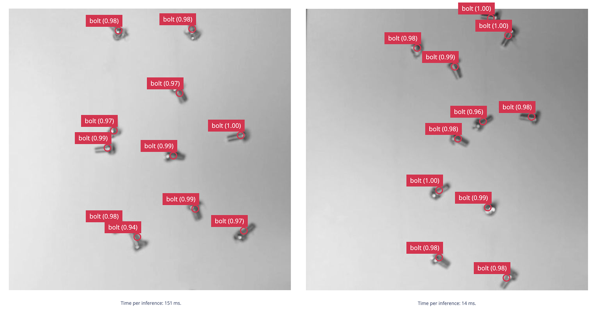

You can see the difference in inferencing time is about 10x faster when we target the GPU for the process. Impressive!

### 5. Build Cumulative Count Program (Python)

Before we start with Python, we need to install the Edge Impulse Python SDK and clone the repository from the previous Edge Impulse examples. Follow the steps here, [https://docs.edgeimpulse.com/docs/edge-impulse-for-linux/linux-python-sdk](https://docs.edgeimpulse.com/docs/edge-impulse-for-linux/linux-python-sdk).

With the impressive performance of live inferencing in the Runner, now we will create a Python program to be able to calculate the cumulative count of moving objects taken from camera capture. The program is a modification of Edge Impulse's `classify.py` in `examples/image` from the `linux-python-sdk directory`. We turned it into an object tracking program by solving a bipartite matching problem so the same object can be tracked across different frames to avoid double counting. For more detail, you can download and check the python program at this link, [https://github.com/Jallson/High\_res\_hi\_speed\_object\_counting\_FOMO\_720x720](https://github.com/Jallson/High_res_hi_speed_object_counting_FOMO_720x720)

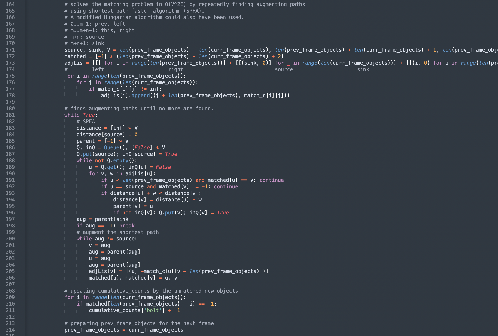

You can git clone the repo, or then run the program with the command pointing to the path where `model.eim` is located:

```
python3 count_moving_bolt.py <path to modelfile>/model.eim
```

Here is a demo video of the results:



The delay visible in the video stream display and its corresponding output calculation is caused by the OpenCV program rendering a 720x720 display resolution window, not by the inference time of the object detection model. This demo test uses 30 bolts per cycle attached to the conveyor belt to show a comparison with the output on the counter.

## Conclusion

We have successfully implemented object detection on a high-speed conveyor belt, with high-resolution video captured, and run a cumulative counting program locally on an Nvidia Jetson Nano. With the speed and accuracy obtained, we are confident in the scalability of this project to various scenarios, including high-speed conveyor belts, multiple object classes, and sorting systems.
